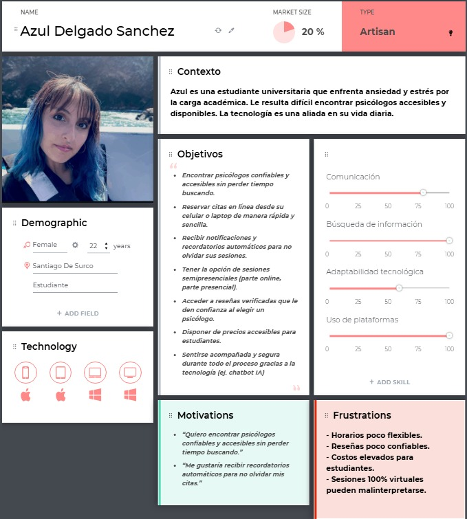
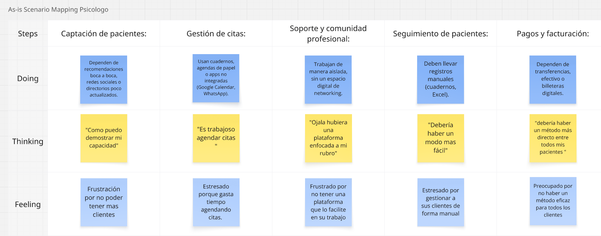
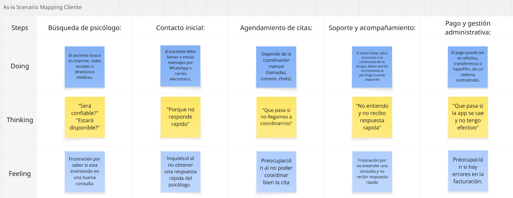
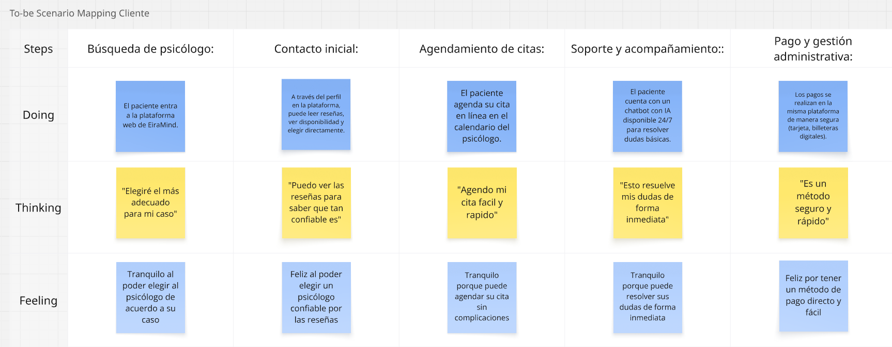
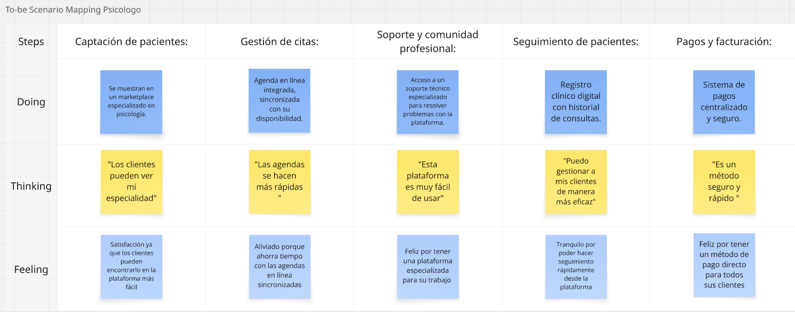
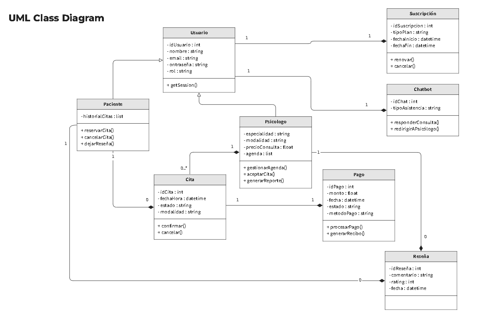

<h3 align="center"> Universidad Peruana de Ciencias Aplicadas </h3>

<h3 align="center"> Ingeniería de Software </h3>
<h3 align="center"> Ciclo 2025 - 2</h3>

 

    </img> 

 

<h1 align="center"> TF1 Report </h1>

<h3 align="center"> Aplicaciones Web - 7414 </h3>

<h3 align="center"> Docente: Alex Humberto Sánchez Ponce </h3>

<h3> Product: opendMind </h3>

<h3> Team Members: </h3>

| Member                           |    Code    |
| :------------------------------- | :--------: |
| Andy Alejandro Mio Mejia         | U202218531 |
| Rolando Andre Torres Diaz        | U202323369 |
| Liam Anderson Villugas Jeronimo  | U202211634 |
| Diego Rodrigo Pumahualcca Garcia | U202219266 |
|  |  |
|  |  |
|  |  |
<h3 align="center">2025</h3>

# Registro de Versiones del Informe

| Versión | Fecha | Autor | Descripción de modificación |
| :-------: | :---------: | :----------------: | :----------------------:|
| TB1 | 02/09/25 | Mio Mejia, Andy Alejandro | Se añadió los capítulos 1 al 5 |

# Project Report Collaboration Insights

A lo largo del desarrollo del trabajo, se ha evidenciado una participación activa, coordinada y progresiva por parte de todos los integrantes del equipo. Cada fase fue abordada de manera estructurada, siguiendo las buenas prácticas de trabajo colaborativo con control de versiones en GitHub, planificación por entregables, y asignación clara de responsabilidades según las competencias de cada integrante.

El uso de repositorios específicos por subcomponente también contribuyó a mantener una mejor trazabilidad del trabajo colaborativo, integrando ramas por entregables y controlando versiones según el avance de cada sprint.

A continuación, se detallan los repositorios utilizados a lo largo del proyecto:

#### Link del repositorio del Reporte: 

#### Link del repositorio de la Landing Page: 

# Contenido

## Tabla de Contenidos

[Registro de versiones del informe](#registro-de-versiones-del-informe)

[Project Report Collaboration Insights](#project-report-collaboration-insights)

[Contenido](#contenido)

[Student Outcome](#student-outcome-1)

[Capítulo I: Introducción](#capitulo-i-introduccion)

- [1.1. Startup Profile](#11-startup-profile)

  - [1.1.1. Descripción de la Startup](#111-description-de-la-startup)

  - [1.1.2. Perfiles de integrantes del equipo](#112-perfiles-de-integrantes-del-equipo)

- [1.2. Solution Profile](#12-solution-profile)
  - [1.2.1 Antecedentes y problemática](#121-antecedentes-y-problemática)
  - [1.2.2 Lean UX Process](#122-lean-ux-process)
    - [1.2.2.1. Lean UX Problem Statements](#1221-lean-ux-problem-statements)
    - [1.2.2.2. Lean UX Assumptions](#1222-lean-ux-assumptions)
    - [1.2.2.3. Lean UX Hypothesis Statements](#1223-lean-ux-hypothesis-statements)
    - [1.2.2.4. Lean UX Canvas](#1224-lean-ux-canvas)
- [1.3. Segmentos objetivo](#13-segmentos-objetivo)

[Capítulo II: Requirements Elicitation & Analysis](#capítulo-ii-requirements-elicitation--analysis-1)

- [2.1. Competidores](#21-competidores)
  - [2.1.1. Análisis competitivo](#211-análisis-competitivo)
  - [2.1.2. Estrategias y tácticas frente a competidores](#212-estrategias-y-tácticas-frente-a-competidores)
- [2.2. Entrevistas](#22-entrevistas)
  - [2.2.1. Diseño de entrevistas](#221-diseño-de-entrevistas)
  - [2.2.2. Registro de entrevistas](#222-registro-de-entrevistas)
  - [2.2.3. Análisis de entrevistas](#223-análisis-de-entrevistas)
- [2.3. Needfinding](#23-needfinding)
  - [2.3.1. User Personas](#231-user-personas)
  - [2.3.2. User Task Matrix](#232-user-task-matrix)
  - [2.3.3. User Journey Mapping](#233-user-journey-mapping)
  - [2.3.4. Empathy Mapping](#234-empathy-mapping)
  - [2.3.5. As-is Scenario Mapping](#235-as-is-scenario-mapping)

[Capítulo III: Requirements Specification](#capítulo-iii-requirements-specification-1)

- [3.1. To-Be Scenario Mapping](#31-to-be-scenario-mapping)
- [3.2. User Stories](#32-user-stories)
- [3.3. Impact Mapping](#33-impact-mapping)
- [3.4. Product Backlog](#34-product-backlog)

[Capítulo IV: Product Design](#capitulo-iv-product-design-1)

- [4.1. Style Guidelines](#41-style-guidelines)
  - [4.1.1. General Style Guidelines](#411-general-style-guidelines)
  - [4.1.2. Web Style Guidelines](#412-web-style-guidelines)
- [4.2. Information Architecture](#42-information-architecture)
  - [4.2.1. Organization Systems](#421-organization-systems)
  - [4.2.2. Labeling Systems](#422-labeling-systems)
  - [4.2.3. SEO Tags and Meta Tags](#423-seo-tags-and-meta-tags)
  - [4.2.4. Searching Systems](#424-searching-systems)
  - [4.2.5. Navigation Systems](#425-navigation-systems)
- [4.3. Landing Page UI Design](#43-landing-page-ui-design)
  - [4.3.1. Landing Page Wireframe](#431-landing-page-wireframe)
  - [4.3.2. Landing Page Mock-up](#432-landing-page-mock-up)
- [4.4. Web Applications UX/UI Design](#44-web-applications-uxui-design)
  - [4.4.1. Web Applications Wireframes](#441-web-applications-wireframes)
  - [4.4.2. Web Applications Wireflow Diagrams](#442-web-applications-wireflow-diagrams)
  - [4.4.3. Web Applications Mock-ups](#443-web-applications-mock-ups)
  - [4.4.4. Web Applications User Flow Diagrams](#444-web-applications-user-flow-diagrams)
- [4.5. Web Applications Prototyping](#45-web-applications-prototyping)
- [4.6. Domain-Driven Software Architecture](#46-domain-driven-software-architecture)
  - [4.6.1. Software Architecture Context Diagram](#461-software-architecture-context-diagram)
  - [4.6.2. Software Architecture Container Diagrams](#462-software-architecture-container-diagrams)
  - [4.6.3. Software Architecture Components Diagrams](#463-software-architecture-components-diagrams)
- [4.7. Software Object-Oriented Design](#47-software-object-oriented-design)
  - [4.7.1. Class Diagrams](#471-class-diagrams)
  - [4.7.2. Class Dictionary](#472-class-dictionary)
- [4.8. Database Design](#48-database-design)
  - [4.8.1. Database Diagram](#481-database-diagram)

[Capítulo V: Product Implementation, Validation & Deployment](#capitulo-v-product-implementation-validation-deployment-)
- [5.1. Software Configuration Management](#51-software-configuration)
  - [5.1.1. Software Development Enviroment Configuration](#511-software-devlopment-enviroment)
  - [5.1.2. Source Code Management](#512-source-code-management)
  - [5.1.3. Source Code Style Guide & Conventions](#513-source-code-style-guide-conventions)
  - [5.1.4. Software Deployment Configuration](#514-software-deployment-configuration)
- [5.2. Landing Page, Service & Application Implementation](#52-landing-page-service-application-implementation)
  - [5.2.1 Sprint 1](#521-sprint-1)
  - [5.2.1.1. Sprint Planning 1](#5211-sprint-planning-1)
  - [5.2.1.2. Aspect Leaders and Collaborators](#5212-aspect-leaders-and-collaborators)
  - [5.2.1.3. Sprint Backlog 1](#5213-sprint-backlog-1)
  - [5.2.1.4. Development Evidence for Sprint Review](#5214-development-evidence-for-sprint-review)
  - [5.2.1.5. Execution Evidence for Sprint Review](#5215-execution-evidence-for-sprint-review)
  - [5.2.1.6. Services Documentation Evidence for Sprint Review](#5216-services-documentation-evidence-for-sprint-review)
  - [5.2.1.7. Software Deployment Evidence for Sprint Review](#5217-software-deployment-evidence-for-sprint-review)
  - [5.2.1.8. Team Collaboration Insights during Sprint](#5218-team-collaboration-insights-during-sprint)
  - [5.2.2 Sprint 2](#522-sprint-2)
  - [5.2.2.1. Sprint Planning 2](#5221-sprint-planning-2)
  - [5.2.2.2. Aspect Leaders and Collaborators](#5222-aspect-leaders-and-collaborators)
  - [5.2.2.3. Sprint Backlog 2](#5223-sprint-backlog-2)
  - [5.2.2.4. Development Evidence for Sprint Review](#5224-development-evidence-for-sprint-review)
  - [5.2.2.5. Execution Evidence for Sprint Review](#5225-execution-evidence-for-sprint-review)
  - [5.2.2.6. Services Documentation Evidence for Sprint Review](#5226-services-documentation-evidence-for-sprint-review)
  - [5.2.2.7. Software Deployment Evidence for Sprint Review](#5227-software-deployment-evidence-for-sprint-review)
  - [5.2.2.8. Team Collaboration Insights during Sprint](#5228-team-collaboration-insights-during-sprint)
  - [5.2.3 Sprint 3](#523-sprint-3)
  - [5.2.3.1. Sprint Planning 3](#5231-sprint-planning-3)
  - [5.2.3.2. Aspect Leaders and Collaborators](#5232-aspect-leaders-and-collaborators)
  - [5.2.3.3. Sprint Backlog 3](#5233-sprint-backlog-3)
  - [5.2.3.4. Development Evidence for Sprint Review](#5234-development-evidence-for-sprint-review)
  - [5.2.3.5. Execution Evidence for Sprint Review](#5235-execution-evidence-for-sprint-review)
  - [5.2.3.6. Services Documentation Evidence for Sprint Review](#5236-services-documentation-evidence-for-sprint-review)
  - [5.2.3.7. Software Deployment Evidence for Sprint Review](#5237-software-deployment-evidence-for-sprint-review)
  - [5.2.3.8. Team Collaboration Insights during Sprint](#5238-team-collaboration-insights-during-sprint)
  - [5.2.4 Sprint 4](#524-sprint-4)
  - [5.2.4.1. Sprint Planning 4](#5241-sprint-planning-4)
  - [5.2.4.2. Aspect Leaders and Collaborators](#5242-aspect-leaders-and-collaborators)
  - [5.2.4.3. Sprint Backlog 4](#5243-sprint-backlog-4)
  - [5.2.4.4. Development Evidence for Sprint Review](#5244-development-evidence-for-sprint-review)
  - [5.2.4.5. Execution Evidence for Sprint Review](#5245-execution-evidence-for-sprint-review)
  - [5.2.4.6. Services Documentation Evidence for Sprint Review](#5246-services-documentation-evidence-for-sprint-review)
  - [5.2.4.7. Software Deployment Evidence for Sprint Review](#5247-software-deployment-evidence-for-sprint-review)
  - [5.2.4.8. Team Collaboration Insights during Sprint](#5248-team-collaboration-insights-during-sprint)
- [5.3 Validation Interviews](#53-Validation-Interviews)
  - [5.3.1 Diseño de Entrevistas](#531-Diseño-de-Entrevistas)
  - [5.3.2 Registro de Entrevistas](#532-Registro-de-Entrevistas)
  - [5.3.3 Evaluaciones según heurísticas](#533-Evaluaciones-según-heurísticas)
  - [5.4 Video About-the-Product](#54-Video-About-the-Product)
   
      
- [Conclusiones y recomendaciones](#conclusiones-y-recomendaciones)

- [Video About-the-Team](#Video-About-the-Team)
  
- [Bibliografía](#bibliografia)

- [Anexos](#anexos)

# Capitulo I: Introduccion

## 1.1. StartUp Profile 

En un mundo donde la salud mental y el bienestar emocional son cada vez más reconocidos como aspectos fundamentales para la calidad de vida, surge opendMind. Con una propuesta centrada en la accesibilidad y la innovación tecnológica, esta startup nace para transformar la manera en que pacientes y psicólogos se conectan.

A través de su primer producto, la web app opendMind, la compañía ofrece una solución integral que simplifica la reserva de citas psicológicas, optimiza la organización de profesionales y brinda a los usuarios herramientas de apoyo inteligente que fortalecen su proceso terapéutico.

Más que una aplicación, opendMind busca convertirse en un aliado estratégico para quienes desean acceder a servicios psicológicos de forma fácil, económica y confiable, reduciendo barreras de tiempo, distancia y costo, y generando nuevas oportunidades para la comunidad de la salud mental.  

### 1.1.1. Description de la StartUp  

opendMind es una empresa tecnológica dedicada a crear soluciones digitales para el ecosistema de atención psicológica.
Su primer producto, la plataforma opendMind, conecta a pacientes con psicólogos de manera sencilla y segura.

La aplicación permite a los usuarios buscar y reservar citas en tiempo real, acceder a opciones económicas con promociones, recibir recordatorios y notificaciones automáticas, y contar con un chatbot de orientación inicial; mientras que los psicólogos pueden gestionar su agenda, clientes, pagos y obtener reportes sobre el progreso de sus pacientes.

De esta manera, opendMind se convierte en un ecosistema que integra la oferta y demanda de servicios psicológicos, mientras se consolida como la empresa que impulsa la democratización y digitalización de la atención en salud mental a nivel regional. 

### 1.1.2. Perfiles de integrantes del equipo

| Integrantes | Descripción | Conocimientos |
| :---------- | :---------- | :------------ |
| 
&nbsp;&nbsp; **Andy Mio Mejia** u202218531
 | Soy estudiante de la carrera de Ingeniería de Software, puedo aportar mucho al equipo, aplicando mis conocimientos en diversos lenguajes de programación | Conocimientos en Java, C++, Python, html, css, javascrip, C# y SQL |
| 
&nbsp;&nbsp; **Diego Rodrigo Pumahualcca Garcia** u202219266
 |  |  |
| 
&nbsp;&nbsp; **Nombre del integrante** Código universitario
 |  |  |
| 
&nbsp;&nbsp; **Nombre del integrante** Código universitario
 |  |  |
| 
&nbsp;&nbsp; **Nombre del integrante** Código universitario
 |  |  |

## 1.2. Solution Profile

### 1.2.1. Antecedentes y problemática

#### Antecedentes y problemática

En los últimos años, el interés por la salud mental y el bienestar emocional ha crecido de manera sostenida como parte esencial de la vida saludable. Sin embargo, este crecimiento también ha evidenciado limitaciones en la forma en que las personas acceden a servicios psicológicos accesibles, confiables y de calidad.

Muchos pacientes se enfrentan a la dificultad de encontrar psicólogos disponibles en horarios adecuados, así como a la falta de opciones económicas y verificadas. A su vez, los psicólogos independientes carecen de herramientas digitales que les permitan gestionar reservas, pagos y visibilidad frente a grandes clínicas o centros especializados.

En este contexto, surge la necesidad de una plataforma que simplifique y centralice la conexión entre pacientes y psicólogos, brindando confianza, organización y eficiencia en un solo lugar.  

#### What?

opendMind es una plataforma digital diseñada para facilitar y optimizar la conexión entre pacientes y psicólogos, además de simplificar la reserva de citas y el seguimiento terapéutico. La aplicación proporciona herramientas que permiten gestionar horarios, pagos, notificaciones y reportes de progreso, creando un entorno seguro, confiable y accesible para todos los usuarios. 

#### Why?

Porque actualmente existe una gran dificultad para acceder a psicólogos confiables y servicios económicos de forma rápida y organizada.
Los pacientes pierden tiempo buscando opciones dispersas o poco verificadas, mientras que muchos psicólogos independientes carecen de un espacio centralizado para ofrecer sus servicios, gestionar su agenda y recibir pagos de manera segura.

#### Where?

Esta problemática se presenta en las principales ciudades de Perú y Latinoamérica, donde la demanda por servicios psicológicos supera la capacidad de organización actual. Los afectados son tanto los pacientes que buscan apoyo emocional como los psicólogos que necesitan visibilidad y oportunidades de crecimiento.  

#### When?

La necesidad se intensifica en la actualidad, en un contexto donde la salud mental se consolida como una prioridad social. La digitalización y el uso de plataformas online han generado la demanda de soluciones inmediatas y confiables para acceder a servicios psicológicos desde cualquier lugar. 

#### Who?

Las partes más afectadas son, por un lado, los psicólogos independientes y profesionales de la salud mental que desean ofrecer sus servicios de forma ordenada y profesional. Por otro lado, los pacientes, ya sean personas con problemas emocionales puntuales o usuarios que requieren terapia continua, que necesitan atención accesible, segura y personalizada. 

#### How?

opendMind resuelve esta problemática mediante una plataforma web todo-en-uno que permite a los usuarios buscar psicólogos según su especialidad y disponibilidad, reservar citas en tiempo real y realizar pagos seguros. Al mismo tiempo, los profesionales pueden gestionar su agenda, clientes y construir una reputación basada en valoraciones reales de sus pacientes.  

### 1.2.2. Lean UX Process

#### 1.2.2.1. Lean UX Problem Statements

#### opendMind – Solución al Acceso Psicológico Digital

El estado actual del acceso a servicios psicológicos se caracteriza por una oferta fragmentada, poco digitalizada y difícil de gestionar. Aunque existen directorios online o contactos informales para coordinar citas, estos no logran cubrir completamente las necesidades de los pacientes que buscan disponibilidad inmediata, confianza y accesibilidad, ni las de los psicólogos que requieren visibilidad, gestión de pagos y herramientas profesionales para crecer.

Lo que los productos y servicios existentes no logran resolver es la falta de una plataforma centralizada y especializada que integre todo el proceso de atención psicológica: desde la búsqueda de psicólogos confiables y accesibles, hasta la reserva, pago y seguimiento del progreso terapéutico. Actualmente, muchos pacientes dependen de recomendaciones informales, redes sociales o listados poco actualizados, mientras que los psicólogos deben promocionarse de manera aislada y con recursos limitados, lo que genera ineficiencias y pérdida de oportunidades para ambos lados.

Nuestro producto, opendMind, abordará esta brecha creando un ecosistema confiable que conecte a pacientes con psicólogos en un solo lugar. Permitiremos a los usuarios encontrar y reservar fácilmente citas, acceder a opciones económicas, recibir recordatorios y notificaciones, interactuar con un chatbot de orientación y valorar la experiencia. Al mismo tiempo, los profesionales podrán ofrecer sus servicios de forma organizada, gestionar su agenda y construir una reputación digital sólida que les permita aumentar su alcance y clientes.

Sabremos que hemos tenido éxito cuando los pacientes utilicen la plataforma de manera recurrente para organizar sus sesiones, cuando los psicólogos logren incrementar sus reservas e ingresos a través de la app, y cuando observemos una comunidad activa con altos niveles de retención, valoraciones positivas y recomendaciones orgánicas que fortalezcan el crecimiento de la plataforma.

#### 1.2.2.2. Lean UX Assumptions

#### PlayMatch - Información del Producto

#### ¿Quién es el usuario?

Los usuarios de opendMind son principalmente dos grupos:

1. Pacientes que buscan psicólogos confiables, accesibles y con disponibilidad para recibir atención psicológica.  
2. Psicólogos independientes que desean ofrecer sus servicios, aumentar su visibilidad, gestionar reservas y pagos de manera digital y profesional.  

#### ¿Dónde encaja nuestro producto, en su trabajo o en su vida?

- Para los pacientes, opendMind se convierte en una herramienta clave en su vida personal y emocional, al permitirles acceder a terapia de forma rápida, segura y económica.  
- Para los psicólogos, es parte esencial de su vida profesional, ayudándoles a conseguir más pacientes, administrar sus horarios, asegurar sus ingresos y construir una reputación online sólida. 

#### ¿Qué problema resuelve nuestro producto?

opendMind resuelve la dificultad de encontrar psicólogos disponibles y confiables, así como la falta de herramientas digitales que permitan a los profesionales gestionar reservas, pagos y relaciones con sus pacientes desde un solo lugar.

#### ¿Cuándo y cómo se utiliza nuestro producto?

El producto se utiliza cuando un paciente desea reservar una cita psicológica, consultar un profesional disponible o recibir recordatorios y orientación inicial.
Los usuarios ingresan a la plataforma, buscan según especialidad, disponibilidad o costo, reservan en tiempo real y realizan el pago en línea.
Por su parte, los psicólogos utilizan la plataforma para mostrar sus servicios, recibir reservas confirmadas y pagos, y dar seguimiento al progreso de sus pacientes con reportes e historial.

#### ¿Qué características son importantes?

- Buscador de psicólogos con filtros por especialidad, disponibilidad, experiencia y tarifas.
- Perfil detallado de cada psicólogo, incluyendo trayectoria, enfoque terapéutico, horarios y valoraciones.
- Sistema de reservas con calendario integrado y confirmaciones automáticas.
- Pasarela de pagos segura y confiable.
- Dashboard de gestión para psicólogos con reportes de ingresos, reservas y pacientes recurrentes.
- Chatbot de apoyo inicial para consultas rápidas y orientación antes de la sesión. 

#### ¿Cómo debe verse y comportarse nuestro producto?

opendMind debe tener una interfaz clara, accesible y amigable, transmitiendo confianza y cercanía.
El diseño debe estar enfocado en la facilidad de uso, permitiendo que tanto pacientes como psicólogos encuentren lo que necesitan en pocos clics.
La navegación debe ser sencilla, los tiempos de carga rápidos y cada interacción debe estar acompañada de mensajes empáticos y claros que guíen al usuario sin fricción.

#### 1.2.2.3. Lean UX Hypothesis Statements

#### Hipótesis 1:
Creemos que al desarrollar una plataforma web que conecte a pacientes con psicólogos independientes y confiables, lograremos facilitar el acceso a servicios psicológicos de manera más rápida, económica y organizada. Esto resultará en una mayor continuidad terapéutica y en un aumento de la satisfacción de los usuarios.

**Business Outcome**: Aumento en el número de reservas confirmadas y pagos procesados en la plataforma. 
**Users**: Pacientes que buscan atención psicológica accesible y confiable.  
**User Outcome**: Mayor acceso a psicólogos disponibles y a costos más bajos, mejorando la experiencia de atención.
**Feature**: Buscador de psicólogos con filtros, sistema de reservas y pagos integrados. 

---

#### Hipótesis 2:
Consideramos que si proporcionamos a los psicólogos independientes una plataforma para ofrecer sus servicios con herramientas de gestión de agenda, pagos y visibilidad, aumentará su alcance, productividad y generación de ingresos.

**Business Outcome**: Mayor cantidad de psicólogos registrados y mayor recurrencia en el uso de la plataforma.  
**Users**: Psicólogos independientes y profesionales de la salud mental.
**User Outcome**: Más oportunidades de captar pacientes y mejor gestión de sus servicios.
**Feature**: Panel de administración para psicólogos, perfiles detallados, integración con calendario y sistema de pago seguro.

---

#### Hipótesis 3:
Suponemos que al permitir valoraciones y reseñas públicas de psicólogos, se generará un ecosistema de confianza que incentive a más pacientes a utilizar la plataforma y a los profesionales a mantener altos estándares de calidad.

**Business Outcome**: Incremento en la tasa de conversión de reservas y en la retención de usuarios.
**Users**: Pacientes que buscan psicólogos y psicólogos que ofrecen sus servicios. 
**User Outcome**: Mayor confianza al elegir profesionales y mejor reputación para quienes brindan un servicio de calidad.  
**Feature**: Sistema de calificaciones, comentarios y reseñas públicas en los perfiles.

---

#### Hipótesis 4:
Creemos que si incorporamos funciones de apoyo interactivo como un chatbot y recordatorios automáticos, mejorará la experiencia del paciente y fortalecerá la relación terapéutica, aumentando la continuidad de las sesiones.

**Business Outcome**: Aumento en la fidelización de pacientes, mayor tiempo de uso en la plataforma y reducción en la tasa de abandono.
**Users**: Pacientes que requieren acompañamiento constante y psicólogos que desean optimizar la adherencia al tratamiento.
**User Outcome**: Más opciones de apoyo inmediato, mejor organización y mayor compromiso con la terapia.
**Feature**: Chatbot de orientación inicial, recordatorios de citas y notificaciones automáticas.

#### 1.2.2.4. Lean UX Canvas

## 1.3. Segmentos objetivo 
**Segmento 1 – Pacientes digitales jóvenes-adultos**  
- Personas entre 18 y 40 años que buscan apoyo psicológico por ansiedad, estrés o problemas emocionales.  
- Necesitan acceso rápido y confiable a psicólogos, con opción de agendar citas en horarios flexibles y recibir recordatorios digitales.  

**Segmento 2 – Psicólogos independientes y pequeñas clínicas**  
- Profesionales de la salud mental que requieren mayor visibilidad digital y herramientas para gestionar citas y pagos.  
- Necesitan optimizar su práctica y diferenciarse mediante ranking, reseñas verificadas e innovación (IoT, chatbot IA).

# Capítulo II: Requirements Elicitation & Analysis
## 2.1. Competidores
### 2.1.1. Análisis competitivo

En el mercado existen diversas plataformas digitales que buscan conectar a pacientes con profesionales de la salud mental. Sin embargo, la mayoría presenta limitaciones en cuanto a accesibilidad, confianza o integración de servicios. A continuación, se presentan algunos de los principales competidores:

<table>
  <tr>
    <th colspan="8" valign="top"><b>Competitive Analysis</b></th>
  </tr>
  <tr>
    <td colspan="2" rowspan="2">Objetivo del análisis</td>
    <td colspan="6">¿Cómo analiza, produce y enfrenta el mercado mi competencia?</td>
  </tr>
  <tr>
    <td colspan="6">Este análisis se realizó con la finalidad de poder identificar a nuestros potenciales competidores e idear estrategias y tácticas para diferenciarnos de estos.</td>
  </tr>
  <tr>
    <td colspan="3">Nombre y logo</td>
    <td colspan="1" valign="top" style="font-weight: bold;">
        OpenMind
         
        

                
        

    </td>
    <td colspan="1" valign="top" style="font-weight: bold;">
        Doctoralia
         
        

                
        

    </td>
    <td colspan="1" valign="top" style="font-weight: bold;">
      PsicólogosPerú
        

                
        

    </td>
    <td colspan="1" valign="top" style="font-weight: bold;">
      Talkspace
        

                
            

        </td>
    <td colspan="1" valign="top" style="font-weight: bold;" >
      MiSalud
        

                
        

    </td>
  </tr>
  <tr>
    <td colspan="1" rowspan="2">
Perfil
</td>
    <td colspan="2">Overview</td>
    <td colspan="1" valign="top">Startup enfocada en la digitalización de la salud mental. Conecta a pacientes con psicólogos de manera rápida, confiable y accesible, busca reducir las barreras de tiempo, distancia y costo que dificultan la atención psicológica en la región.</td>
    <td colspan="1" valign="top">Gran marketplace global para pacientes y profesionales de salud (citas, reseñas, software de gestión), presente en múltiples países tras integrar mercados europeos/latinoamericanos.</td>
    <td colspan="1" valign="top">Directorios/plataformas locales que reúnen psicólogos y servicios de salud mental orientados a Perú (perfiles de terapeutas, contacto/agenda).</td>
    <td colspan="1" valign="top">Plataforma de terapia online (mensajería, video, audio) con modelo por suscripción, focalizada principalmente en EE. UU. y con integración de servicios de psiquiatría.</td>
    <td colspan="1" valign="top">Servicio de telemedicina bilingüe (español/inglés) orientado a atención rápida, coaching y consulta médica/mental — modelo B2B (beneficio para empleados) y B2C vía app.</td>
  </tr>
  <tr>
    <td colspan="2">Ventaja competitiva</td>
    <td colspan="1" valign="top">Integra reservas en tiempo real, pagos digitales, recordatorios, chatbot de apoyo inicial y dashboards para profesionales, lo que le da un mayor valor frente a competidores que solo ofrecen sesiones virtuales.</td>
    <td colspan="1" valign="top">Marca reconocida, red amplia de profesionales y herramientas administrativas para clínicas.</td>
    <td colspan="1" valign="top">Enfoque local y culturalmente ajustado, conocimiento del mercado peruano y canales locales (WhatsApp, referencias).</td>
    <td colspan="1" valign="top">Escala en EE. UU., acuerdos con pagadores/empleadores y oferta combinada (terapia + psiquiatría).</td>
    <td colspan="1" valign="top">Enfoque en población hispana y modelo employer-sponsored.</td>
  </tr>
  <tr>
    <td colspan="1" rowspan="2">
Perfil de Marketing
</td>
    <td colspan="2">Mercado objetivo</td>
    <td colspan="1" valign="top">Pacientes jóvenes y adultos en Perú y Latinoamérica que necesitan atención psicológica accesible, así como psicólogos independientes que buscan visibilidad y herramientas digitales para profesionalizar su servicio.</td>
    <td colspan="1" valign="top">Pacientes generales y profesionales/consultorios que necesitan gestión de citas.</td>
    <td colspan="1" valign="top">Personas en Perú que buscan psicoterapia/servicios psicológicos; psicólogos independientes que buscan visibilidad.</td>
    <td colspan="1" valign="top">Adultos en EE. UU. que buscan terapia flexible; también empleadores y aseguradoras.</td>
    <td colspan="1" valign="top">Empleadores con fuerza laboral hispanohablante y pacientes que prefieren atención en español.</td>
  </tr>
  <tr>
    <td colspan="2">Estrategias de marketing</td>
    <td colspan="1" valign="top">Campañas de marketing digital con foco en redes sociales, alianzas con universidades y empresas para programas corporativos de bienestar, estrategias de marketing de contenidos y programas de referidos que incentiven el crecimiento orgánico de la comunidad.</td>
    <td colspan="1" valign="top">SEO local (por especialidad y ciudad), alianzas con clínicas, marketing de contenido, reseñas y presencia móvil/web.</td>
    <td colspan="1" valign="top">Marketing en redes locales (Facebook, grupos), SEO local, alianzas con colegios profesionales y directorios locales.</td>
    <td colspan="1" valign="top">Publicidad digital, acuerdos con empresas/aseguradoras, PR y campañas sobre salud mental.</td>
    <td colspan="1" valign="top">Ventas B2B a empresas, promoción en app stores, outreach comunitario y materiales en español.</td>
  </tr>
  <tr>
    <td colspan="1" rowspan="3">
Perfil de Producto
</td>
    <td colspan="2">Productos & Servicios</td>
    <td colspan="1" valign="top">Buscador de psicólogos filtrados por especialidad, agenda en tiempo real, sistema de notificaciones, pagos integrados, chatbot de orientación inicial y dashboards con métricas de ingresos y progreso.</td>
    <td colspan="1" valign="top">Reserva de citas, perfiles de profesionales, telemedicina, software de gestión de clínicas.</td>
    <td colspan="1" valign="top">Directorio de psicólogos, fichas profesionales, contacto directo y gestión de citas.</td>
    <td colspan="1" valign="top">Mensajería continua con terapeuta, sesiones por video, psiquiatría/medicación según plan.</td>
    <td colspan="1" valign="top">Citas médicas y de salud mental, health coaches, manejo de condiciones crónicas, recetas y pruebas.</td>
  </tr>
  <tr>
      <td colspan="2">Precios & Costos</td>
      <td colspan="1" valign="top">Modelo mixto con comisión por sesión (15–20%), planes de suscripción premium para psicólogos (mayor visibilidad y herramientas adicionales) y tarifas promocionales para atraer a nuevos pacientes.</td>
      <td colspan="1" valign="top">Pacientes generalmente usan gratuito; profesionales/centros pagan planes/servicios premium (freemium/paquetes).</td>
      <td colspan="1" valign="top">Tarifas fijadas por cada profesional (no hay precio estándar de plataforma).</td>
      <td colspan="1" valign="top">Suscripción mensual (planes con/sin sesiones en vivo); precios más altos que directorios locales.</td>
      <td colspan="1" valign="top">Modelos B2B (suscripción para empleadores) y planes en la app; costes varían según contrato.</td>
  </tr>
  <tr>
    <td colspan="2">Canales de distribución (Web y/o Móvil)</td>
    <td colspan="1" valign="top">Web app responsive, redes sociales como canal de captación, WhatsApp para atención al cliente y alianzas institucionales para expandir la base de usuarios.</td>
    <td colspan="1" valign="top">Web + apps móviles.</td>
    <td colspan="1" valign="top">Web y contacto por WhatsApp/llamada (poca app nativa).</td>
    <td colspan="1" valign="top">Web + apps iOS/Android.</td>
    <td colspan="1" valign="top">App móvil (iOS/Android) y web.</td>
  </tr>
  <tr>
    <td colspan="1" rowspan="4">
Análisis SWOT
</td>
    <td colspan="2">Fortalezas</td>
    <td colspan="1" valign="top">Plataforma integral, enfoque en accesibilidad, propuesta tecnológica escalable, visión regional.</td>
    <td colspan="1" valign="top">Gran red global, reconocimiento de marca, producto integrado (reserva + gestión).</td>
    <td colspan="1" valign="top">Conexión local y conocimiento cultural; relaciones con psicólogos locales.</td>
    <td colspan="1" valign="top">Oferta integral (mensajería + video + psiquiatría), acuerdos empresariales, reconocimiento en EE. UU.</td>
    <td colspan="1" valign="top">Servicio bilingüe y enfoque en población hispana; modelo B2B escalable.</td>
  </tr>
  <tr>
    <td colspan="2">Debilidades</td>
    <td colspan="1" valign="top">Startup emergente con poca trayectoria, necesidad de generar confianza en un sector sensible.</td>
    <td colspan="1" valign="top">Competencia local más ágil en ciertos países; dependencia de reputación/reseñas.</td>
    <td colspan="1" valign="top">Alcance y tecnología limitados vs. jugadores globales; fragmentación de oferta.</td>
    <td colspan="1" valign="top">Críticas sobre privacidad/calidad y precio alto.</td>
    <td colspan="1" valign="top">Menor escala y visibilidad frente a grandes telehealth; dependencia de contratos empresariales.</td>
  </tr>
  <tr>
    <td colspan="2">Oportunidades</td>
    <td colspan="1" valign="top">Demanda creciente de salud mental post-pandemia, digitalización acelerada en LATAM, posibilidad de alianzas con seguros y empresas.</td>
    <td colspan="1" valign="top">Expansión de telemedicina y alianzas con aseguradoras/SS.</td>
    <td colspan="1" valign="top">Aumento de demanda por salud mental en Perú; posibilidad de profesionalizar pagos/reservas.</td>
    <td colspan="1" valign="top">Cobertura por aseguradoras y expansión a población hispana/empleadores.</td>
    <td colspan="1" valign="top">Expansión a mercados latinoamericanos; alianzas con empleadores y redes comunitarias.</td>
  </tr>
  <tr>
    <td colspan="2">Amenazas</td>
    <td colspan="1" valign="top">Competidores internacionales con más capital, cambios regulatorios en salud, barreras de adopción tecnológica en ciertos segmentos.</td>
    <td colspan="1" valign="top">Regulación sanitaria local, competencia regional o verticales especializadas.</td>
    <td colspan="1" valign="top">Entrada de apps internacionales adaptadas al español; falta de confianza/reputación.</td>
    <td colspan="1" valign="top">Competidores (BetterHelp, etc.), escrutinio regulatorio y litigios.</td>
    <td colspan="1" valign="top">Grandes players de telemedicina en nicho hispano; requerimientos regulatorios.</td>
  </tr>
</table>

---

### 2.1.2. Estrategias y tácticas frente a competidores
- **Especialización en salud mental:** A diferencia de apps generales, nos enfocamos 100% en psicología.  
- **Integración tecnológica:** Incorporamos **IoT en consultorios** para monitoreo ambiental y **chatbot con IA** para orientación inicial.  
- **Modelo de suscripción flexible:** Diseñado para psicólogos independientes y clínicas pequeñas, con planes accesibles.  
- **Confianza y transparencia:** Sistema de **reseñas verificadas y ranking confiable**, que aumenta la seguridad de los pacientes al elegir un profesional.  
- **Enfoque local con visión global:** Adaptamos precios, funciones y métodos de pago a la realidad latinoamericana (ej. Culqi, Yape), pero con escalabilidad para LATAM.  

Con estas estrategias, buscamos superar las limitaciones de los competidores actuales y posicionarnos como la plataforma de referencia para la atención psicológica digital en Perú y la región.  

---

## 2.2. Entrevistas
### 2.2.1. Diseño de entrevistas
El propósito de las entrevistas es validar las necesidades, problemas y expectativas de los usuarios en relación con la plataforma **EiraMind**. Se plantean preguntas diferenciadas para los dos segmentos objetivos principales.

---

### Segmento 1 – Pacientes digitales jóvenes-adultos

**Objetivo:** Conocer las dificultades y expectativas de los pacientes al buscar y acceder a servicios psicológicos.

**Preguntas:**
1. ¿Alguna vez buscaste un psicólogo y te resultó difícil encontrar uno disponible?  
2. ¿Qué tan importante es para ti poder reservar una cita en línea desde tu celular o laptop?  
3. ¿Qué factores influyen más al elegir un psicólogo (precio, reseñas, ubicación, especialidad)?  
4. ¿Confías en las reseñas online a la hora de escoger un especialista de salud mental?  
5. ¿Qué prefieres: sesiones presenciales, virtuales o una combinación de ambas?  
6. ¿Qué problemas has tenido al intentar acceder a servicios de psicología (costos, tiempo, disponibilidad, desconfianza)?  
7. ¿Te gustaría recibir recordatorios automáticos de tus citas por WhatsApp, correo o notificación en app?  
8. ¿Qué tan útil crees que sería un chatbot con IA que te oriente antes de una sesión o te sugiera ejercicios de relajación?  
9. ¿Con qué frecuencia estarías dispuesto a pagar por sesiones de psicología?  
10. ¿Cuánto considerarías un precio razonable para una sesión en línea de 45-60 minutos?  

---

### Segmento 2 – Psicólogos independientes y pequeñas clínicas

**Objetivo:** Identificar las necesidades tecnológicas de los psicólogos en la gestión de citas, pagos y visibilidad profesional.

**Preguntas:**
1. ¿Cómo gestionas actualmente tus citas y horarios con pacientes?  
2. ¿Has tenido problemas con ausencias o cancelaciones de último minuto?  
3. ¿Qué tan relevante es para ti aparecer en una plataforma que te dé visibilidad frente a nuevos pacientes?  
4. ¿Qué herramientas digitales usas hoy (Zoom, Google Calendar, WhatsApp, otras)?  
5. ¿Qué dificultades enfrentas al cobrar tus servicios de manera digital?  
6. ¿Te interesaría que tus pacientes puedan dejar reseñas verificadas que mejoren tu reputación profesional?  
7. ¿Cuánto valoras que una plataforma te ofrezca reportes (número de sesiones, ingresos, satisfacción de pacientes)?  
8. ¿Pagarías una suscripción mensual por una herramienta que te brinde agenda, pagos y promoción digital? ¿Qué rango de precio te parecería justo?  
9. ¿Qué opinas de integrar dispositivos IoT en el consultorio para medir condiciones ambientales (ej. calidad de aire, ruido, temperatura)?  
10. ¿Qué expectativas tendrías respecto al soporte técnico y acompañamiento de la plataforma?

### 2.2.2. Registro de entrevistas

| Entrevistado 2 | Nombre y Apellido  | Edad | Distrito | Inicio de Entrevista | Resumen |
|----------------|--------------------|-----------|-------------|-------------|------------|
| | Azul Delgado Sanchez | 22 años | Santiago de Surco | 5:50 - 5:56 | Azul es una estudiante de 22 años que tuvo dificultades para encontrar un psicólogo. Ella afirma que es muy importante poder reservar citas en línea, y considera que hacerlo por WhatsApp resulta muy útil. También señala que, al momento de elegir un psicólogo, el costo debe ser accesible para los estudiantes. Además, presta atención a las reseñas en línea, ya que pueden ayudar a orientarse, aunque reconoce que algunas pueden ser falsas. Prefiere las citas semipresenciales, porque en algunas sesiones virtuales el diálogo puede malinterpretarse. Le encantaría recibir notificaciones a través de una aplicación, pues revisa sus redes sociales con frecuencia. Cree que la idea de contar con un chatbot como orientación sería muy útil, aunque aclara que no reemplazaría a un psicólogo. Finalmente, estaría dispuesta a pagar 70 soles por cita y asistir dos veces por semana. |
### 2.2.3. Análisis de entrevistas
## 2.3. Needfinding
### 2.3.1. User Personas

---

## User Persona – Azul Delgado Sánchez  

</img> 

---

### 2.3.2. User Task Matrix  

---

## User Task Matrix – Pacientes Digitales Jóvenes-Adultos  

| **Objetivo del Usuario** | **Tareas principales** | **Dificultades actuales** | **Oportunidad de diseño (opendMind)** |
|---------------------------|------------------------|----------------------------|---------------------------------------|
| Encontrar psicólogos accesibles y confiables | - Buscar psicólogos en internet o redes sociales. - Revisar reseñas online. - Preguntar a amigos por recomendaciones. | - Reseñas poco confiables. - Información dispersa. - Psicólogos sin disponibilidad clara. | - Perfiles detallados y verificados. - Sistema de reseñas confiables. - Filtros de búsqueda (precio, disponibilidad, especialidad). |
| Reservar citas de forma rápida | - Contactar por WhatsApp o llamadas. - Coordinar horarios manualmente. - Esperar confirmaciones lentas. | - Horarios limitados. - Falta de confirmación inmediata. - Riesgo de cancelaciones. | - Calendario integrado en tiempo real. - Confirmación automática de reservas. - Recordatorios digitales. |
| Acceder a precios justos | - Comparar tarifas en diferentes plataformas o anuncios. - Ajustarse al presupuesto estudiantil. | - Costos elevados en algunas plataformas. - Falta de promociones visibles. | - Tarifas accesibles desde 70 soles. - Promociones y descuentos especiales para estudiantes. |
| Mantener continuidad en la terapia | - Anotar citas en su agenda personal. - Recordar manualmente próximos encuentros. | - Olvido de citas. - Desmotivación por falta de seguimiento. | - Notificaciones automáticas. - Chatbot de orientación. - Reportes de progreso accesibles. |
| Tener sesiones confiables | - Buscar entre opciones presenciales o virtuales. - Probar distintos métodos de atención. | - Sesiones 100% virtuales pueden malinterpretarse. - Dudas sobre profesionalismo de algunos psicólogos. | - Opciones semipresenciales. - Transparencia en perfiles. - Validación de psicólogos colegiados. |

---

### 2.3.3. User Journey Mapping

</img> 

### 2.3.4. Empathy Mapping

</img> 

### 2.3.5. As-is Scenario Mapping

</img> 
</img> 

### 3.1 To-be Scenario Mapping

</img> 
</img> 

### 3.2 User Stories
| Epic ID | Título                                         | Descripción |
|---------|------------------------------------------------|-------------|
| EPIC-01 | Información del producto               | Presentar de forma clara qué es EiraMind, cómo funciona y qué lo hace diferente. |
| EPIC-02 | Registro y conversión             | Permitir que pacientes y psicólogos se registren fácilmente en la plataforma. |
| EPIC-03 | Beneficios para pacientes         | Mostrar las ventajas para quienes buscan atención psicológica. |
| EPIC-04 | Beneficios para psicólogos                   |Resaltar cómo EiraMind facilita la práctica profesional y atrae pacientes. |
| EPIC-05 | Confianza y credibilidad                   | Generar confianza en usuarios nuevos con elementos de prueba social y transparencia. |
| EPIC-06 |Educación y soporte             | Proveer contenido adicional que ayude a resolver dudas y acompañar al usuario. |
| EPIC-07 | Captación de leads            | Habilitar espacios para que visitantes interesados dejen sus datos de contacto. |

| ID   | Título                                                   | Descripción                                                                                                                                      | Criterios de aceptación | EpicID |
|------|----------------------------------------------------------|--------------------------------------------------------------------------------------------------------------------------------------------------|--------------------------|--------|
| US01 |Explicación clara del producto | Como visitante, quiero entender de forma clara qué ofrece EiraMind, para decidir si me conviene usar la plataforma. | **Escenario 1:** Dado que ingreso a la landing, cuando veo la sección inicial, entonces encuentro una explicación breve y clara de qué es EiraMind. **Escenario 2:** Dado que navego por la landing, cuando hago scroll, entonces encuentro secciones que explican cómo funciona y qué lo hace diferente. | EPIC-01 |
| US02 | Botones de registro visibles |Como paciente o psicólogo, quiero acceder fácilmente a un botón de registro, para comenzar a usar la plataforma.  |**Escenario 1:** Dado que estoy en la landing, cuando visualizo el encabezado o secciones principales, entonces encuentro botones de “Regístrate” visibles y funcionales. **Escenario 2:** Dado que hago clic en el botón, cuando me redirige, entonces llego al formulario de registro adecuado (paciente o psicólogo). | EPIC-02 |
| US03 | Listado de beneficios para pacientes |Como paciente, quiero ver un listado de beneficios claros, para sentir confianza en usar la plataforma. | **Escenario 1:** Dado que soy paciente, cuando reviso la landing, entonces veo beneficios como: agenda de citas, ranking de psicólogos, chatbot de soporte. **Escenario 2:** Dado que navego en la sección de beneficios, cuando hago scroll, entonces cada beneficio tiene un ícono o elemento visual que lo refuerza.| EPIC-03 |
| US04 | Testimonios de pacientes | Como paciente, quiero leer testimonios de otros usuarios, para confirmar la calidad del servicio. |**Escenario 1:** Dado que llego a la sección de testimonios, cuando la reviso, entonces encuentro al menos 3 testimonios con nombre y rol. **Escenario 2:** Dado que leo los testimonios, cuando los comparo, entonces noto que son diversos y transmiten confianza. | EPIC-03 |
| US05 |Planes de suscripción claros | Como psicólogo, quiero ver información clara sobre los planes de suscripción, para elegir el que más se adapte a mi práctica. | **Escenario 1:** Dado que soy psicólogo, cuando entro en la sección de planes, entonces veo al menos tres planes con precios y beneficios resumidos. **Escenario 2:** Dado que reviso los planes, cuando hago scroll, entonces encuentro un CTA debajo de cada opción para registrarme.| EPIC-04 |
| US06 | Diferenciales tecnológicos destacados | Como psicólogo, quiero conocer los diferenciales tecnológicos, para diferenciar EiraMind de otras plataformas. |**Escenario 1:** Dado que reviso la sección para profesionales, cuando leo la descripción, entonces encuentro información sobre IoT, gestión de pagos y ranking validado. **Escenario 2:** Dado que soy psicólogo, cuando comparo la información, entonces puedo identificar claramente qué hace única a la plataforma.| EPIC-04 |
| US07 | Sección de confianza y credibilidad | Como visitante, quiero ver elementos que me generen confianza, para decidir registrarme. | **Escenario 1:** Dado que navego en la landing, cuando paso por la sección de confianza, entonces encuentro testimonios, logotipos de aliados o premios (si aplica). **Escenario 2:** Dado que reviso esa sección, cuando la analizo, entonces me transmite seguridad y respaldo profesional. | EPIC-05 |
| US08 | Preguntas frecuentes (FAQ) | Como visitante, quiero acceder a preguntas frecuentes, para resolver mis dudas sin necesidad de registrarme. | **Escenario 1:** Dado que llego al final de la landing, cuando busco soporte, entonces encuentro una sección de FAQ con al menos 5 preguntas y respuestas clave.  **Escenario 2:** Dado que leo las preguntas, cuando interactúo con ellas, entonces obtengo respuestas claras y concisas. | EPIC-06 |
| US09 | Recursos de bienestar mental | Como paciente, quiero acceder a recursos de bienestar mental, para obtener acompañamiento adicional. |**Escenario 1:** Dado que soy paciente, cuando llego a la sección de recursos, entonces encuentro artículos, tips o guías breves de salud mental. **Escenario 2:** Dado que interactúo con esta sección, cuando hago clic, entonces se abre un recurso completo en otra página o pop-up. | EPIC-06 |
| US10 | Formulario de suscripción / Newsletter | Como visitante, quiero dejar mis datos de contacto, para recibir actualizaciones de la startup. | **Escenario 1:** Dado que estoy en la landing, cuando llego al footer o sección de newsletter, entonces encuentro un formulario para ingresar mi correo electrónico. **Escenario 2:** Dado que ingreso mi correo, cuando hago clic en “Suscribirme”, entonces recibo un mensaje de confirmación de registro exitoso.| EPIC-07 |

### 3.3 Impact Map

</img> 

# Capítulo IV: Product Design
## 4.1. Style Guidelines
### 4.1.1. General Style Guidelines

Las guías generales de estilo de **opendMind** establecen la identidad visual y los principios de diseño que guiarán la experiencia en todas sus versiones (web y futuras aplicaciones móviles). Su propósito es transmitir confianza, accesibilidad y profesionalismo, asegurando coherencia en la interacción de pacientes y psicólogos.  

**Paleta de colores**  
- **Primarios:** Azul (#1E88E5) y Verde (#43A047), asociados a confianza, calma y bienestar.  
- **Secundarios:** Tonos grises (#F5F5F5, #9E9E9E) para fondos y textos secundarios.  
- **Alerta:** Rojo (#E53935) para errores críticos y Amarillo (#FDD835) para advertencias o recordatorios importantes.  

**Tipografía**  
- Fuente principal: *Roboto* o *Open Sans*, seleccionadas por su legibilidad y compatibilidad en dispositivos móviles y escritorio.  
- Jerarquía tipográfica clara:  
  - **Títulos (H1, H2):** negrita, mayor tamaño, color azul.  
  - **Subtítulos (H3, H4):** semi-negrita, gris oscuro.  
  - **Texto base:** entre 14–16px, color negro o gris oscuro.  
  - **Notas/contexto:** cursiva, gris medio.  

**Iconografía y gráficos**  
- Íconos minimalistas y lineales, consistentes en estilo.  
- Siempre acompañados de etiquetas descriptivas claras.  
- Gráficos estadísticos con contrastes adecuados y colores accesibles.  

**Accesibilidad**  
- Contraste mínimo 4.5:1 entre texto y fondo.  
- Textos alternativos (alt-text) en imágenes.  
- Compatibilidad con lectores de pantalla y navegación por teclado.  
- Uso de lenguaje inclusivo, claro y empático.  

**Estilo de interacción**  
- Botones principales con esquinas redondeadas, color azul/verde y texto blanco.  
- Efecto hover y feedback visual en todos los elementos interactivos.  
- Transiciones suaves (0.2–0.3s) en menús, botones y cambios de estado.  

**Consistencia visual**  
- Unificación en botones, formularios, tarjetas y paneles.  
- Diseño minimalista, priorizando el contenido más relevante.  
- Uso estratégico de espacios en blanco para mejorar legibilidad.  

### 4.1.2. Web Style Guidelines

La versión web de opendMind está diseñada para ofrecer una experiencia simple, confiable e intuitiva, tanto para pacientes como para psicólogos. Su diseño es responsivo y accesible, pensado para adaptarse a las necesidades de quienes buscan organizar o brindar servicios de atención psicológica desde cualquier lugar.

- Diseño responsivo: La plataforma se adapta de manera óptima a dispositivos de escritorio, tabletas y móviles, garantizando una experiencia consistente y accesible, ya sea que el usuario se conecte desde casa, el trabajo o en movimiento.

- Hover effects: Los elementos interactivos como botones, tarjetas de psicólogos y enlaces cambian sutilmente de color al pasar el cursor, reforzando la sensación de interacción. Por ejemplo, los botones de llamada a la acción en tonos verdes o azules se oscurecen ligeramente para indicar que son seleccionables.

- Barra de navegación superior: La barra de navegación principal se ubica en la parte superior e incluye accesos clave como: Inicio, Buscar psicólogos, Mis citas, Pagos, Chatbot y Perfil. Esto asegura que tanto pacientes como profesionales puedan acceder rápidamente a las secciones más importantes.

- Animaciones sutiles: Se implementan transiciones suaves para mejorar la experiencia de usuario. Ejemplos: deslizamiento de paneles al abrir un menú, transición de tarjetas en la búsqueda de psicólogos y cambios visuales en los botones al ser presionados. Estas animaciones aportan fluidez y profesionalismo sin distraer de la experiencia principal.

- Paneles modulares: El contenido clave como perfiles de psicólogos, resultados de búsqueda, historial de citas y reportes se organiza en paneles modulares y tarjetas. Este diseño facilita la lectura, el escaneo de información y la adaptación a diferentes tamaños de pantalla.

## 4.2. Information Architecture

En esta sección se definen las decisiones de arquitectura de información que guiarán la organización del contenido en la experiencia web de **opendMind**, incluyendo la Landing Page y las futuras aplicaciones.

El objetivo principal es garantizar que tanto pacientes como psicólogos se adapten de manera intuitiva a la funcionalidad del producto, encuentren fácilmente lo que necesitan y disfruten de una navegación fluida y satisfactoria.

Las propuestas de arquitectura están diseñadas siguiendo principios de usabilidad, claridad y accesibilidad, considerando los siguientes componentes:

- **Organization Systems**
- **Labeling Systems**
- **SEO Tags and Meta Tags**
- **Searching Systems**
- **Navigation Systems**

### 4.2.1. Organization Systems

**Visual Hierarchy**

Se aplicará una jerarquía visual clara en todas las páginas, priorizando los accesos más importantes:

- “Buscar Psicólogos”
- “Mis Citas”
- “Pagos”
- “Chatbot de Orientación”
- “Perfil”

El tamaño, color y peso de los elementos gráficos guiarán la atención del usuario hacia lo más relevante, como botones de reserva o mensajes de confirmación.

**Secuencial Organization**

En procesos clave, como:

- “Registro de Psicólogos”
- “Proceso de Reserva de Cita”
- “Gestión de Pagos”

Se usará una organización paso a paso, facilitando que los usuarios completen acciones en orden lógico.

Ejemplo del proceso de reserva de cita:

1. Seleccionar especialidad (ansiedad, terapia de pareja, estrés, etc.).
2. Escoger psicólogo disponible (según horario y tarifa).
3. Confirmar detalles (fecha, modalidad presencial/virtual, costo).
4. Realizar pago y recibir confirmación con recordatorio automático.

**Matricial Organization**
Para listas de psicólogos disponibles, se aplicará un modelo matricial que permita comparar opciones en un mismo nivel.

Los filtros incluirán:
- Precio
- Especialidad
- Disponibilidad horaria
- Modalidad (presencial/virtual)
- Calificaciones y reseñas de pacientes

Esto permitirá a los pacientes tomar decisiones rápidas y bien informadas.

**Esquemas de Categorización**
Según el tipo de contenido, se aplicarán distintos esquemas:

- **Por tópicos**: especialidades (terapia cognitivo-conductual, infantil, pareja, etc.).
- **Por audiencia**: psicólogos recomendados para “Estudiantes”, “Adultos jóvenes”, “Parejas” o “Empresas”.
- **Cronológico**: próximas citas y sesiones pasadas.
- **Alfabético**: listado de psicólogos por nombre en catálogos amplios.

Esto asegura un acceso eficiente, adaptado a las diferentes formas en que los usuarios buscan atención psicológica.

### 4.2.2. Labeling Systems

La representación de los datos en la plataforma busca ser clara, intuitiva y sin ambigüedades. Para ello se establecen las siguientes directrices de etiquetado:

#### Principios de Etiquetado

- Utilizar un **mínimo número de palabras**.
- Preferir términos **comunes en el ámbito psicológicos** y **fáciles de comprender**.
- Mantener **consistencia** en la terminología a lo largo de la aplicacion.

#### Etiquetas principales propuestas

| Área                    | Etiqueta asignada          | Propósito                           |
| ----------------------- | -------------------------- | ----------------------------------- |
| Exploración             | "Buscar Psicólogos"         | Navegar y explorar psicólogos disponibles.         |
| Citas                   | "Mis Citas"                 | Ver historial y próximas reservas confirmadas. |
| Pagos                   | "Pagos"                     | Gestionar métodos de pago, comprobantes y promociones. |
| Chatbot                 | "Asistente Virtual"         | Acceso al chatbot de orientación inicial.|
| Perfil                  | "Mi Perfil"                 | Datos personales, historial terapéutico y configuración.      |
| Registro Psicólogos     | "Unirme como Psicólogo"     | Proceso de registro para profesionales.  |
| Soporte                 | "Ayuda"                     | Acceso a FAQs y soporte técnico.       |

Dentro de los filtros se emplearán palabras clave simples como:

- "Especialidad" (ansiedad, terapia de pareja, infantil, estrés, etc.).
- "Modalidad" (presencial, virtual).
- "Disponibilidad" (fecha y hora).
- "Precio" (por sesión, con rango ajustable).
- "Experiencia del psicólogo" (años de práctica, formación).
- "Valoración" (por estrellas o reseñas de pacientes).

Esto facilita que tanto pacientes como psicólogos interpreten de inmediato las opciones disponibles, sin necesidad de explicaciones adicionales.

### 4.2.3. SEO Tags and Meta Tags

Para optimizar la visibilidad y accesibilidad de opendMind en motores de búsqueda, se establecen los siguientes **SEO Tags** y **Meta Tags** que serán implementados tanto en el **Landing Page** como en la **Web Application**:

TODO: Agregar meta tags para páginas adicionales (no app). Blog, Noticias, Precio, Log In, Sign Up, etc.

| Página                           | Title                                            | Meta Description            | Meta Keywords            | Author         |
| -------------------------------- | ------------------------------------------------ | ----------------------------------------------------------------------------------------------- | --------------------------------------------------------------------- | -------------- |
| Landing Page                     | Terapia Psicológica Online y Presencial en Perú - opendMind         | opendMind es la plataforma digital para reservar citas psicológicas de forma rápida, segura y accesible. Encuentra psicólogos especializados en ansiedad, estrés, depresión, pareja y más. | terapia psicológica online, psicólogos en Perú, reservar cita psicológica, psicólogo ansiedad, depresión, terapia pareja, psicología accesible | Equipo opendMind |
| Web Application - Home           | opendMind App - Psicólogos y Terapia Online a tu Alcance | Con opendMind organiza tus sesiones, encuentra psicólogos disponibles y gestiona tus citas en un solo lugar.            | psicólogos online, terapia psicológica Perú, citas psicológicas, salud mental digital | Equipo opendMind |
| Web Application - Perfil Usuario | opendMind - Mi Perfil                              | Gestiona tus datos personales, historial de citas, pagos y preferencias de terapia con opendMind.                               | perfil usuario opendMind, historial citas psicológicas, pagos terapia, psicología personalizada                    | Equipo openMind |
| Página de perfil de entrenadores | Psicólogo [[Especialidad]] en [[Ciudad]] - [[Nombre del Psicólogo]] - opendMind | Encuentra al psicólogo especializado en [[Especialidad]], [[Nombre del Psicólogo]] en [[Ciudad]]. Horarios flexibles, tarifas accesibles y valoraciones verificadas. | psicólogos cerca de mí, psicólogo [[especialidad]], psicólogo en [[ciudad]], terapia accesible | Equipo opendMind |

### 4.2.4. Searching Systems

Para mejorar la capacidad de búsqueda dentro del sitio web y la aplicación, se implementarán sistemas claros, efectivos y centrados en la experiencia psicológica y terapéutica.

#### Tipos de búsqueda ofrecidos

- **Búsqueda Global (Header Search Box):**

  - Visible en todas las páginas principales.
  - Permite buscar psicólogos, especialidades o tipos de terapia.
  - Incluye autocompletado con sugerencias relevantes (ejemplo: “Ansiedad”, “Terapia de pareja en Miraflores”, “Psicólogo infantil”).

- **Filtros de búsqueda en "Explorar experiencias":**

  - **Especialidad** (Ansiedad, Depresión, Estrés laboral, Terapia infantil, Terapia de pareja, etc.).
  - **Ubicación** (distrito, ciudad, consulta virtual/presencial).
  - **Disponibilidad horaria** (mañana, tarde, noche, fecha específica).
  - **Precio** (rango económico ajustable).
  - **Modalidad de atención** (Virtual o Presencial).
  - **Experiencia del psicólogo** (Años de práctica, nivel académico).
  - **Valoración** (reseñas y calificaciones de pacientes).

- **Búsqueda específica en el perfil de entrenadores/canchas:**
  - Por nombre del psicólogo.
  - Por especialidad o método terapéutico (ej. cognitivo-conductual).
  - Por calificación promedio de usuarios.

#### Presentación de resultados

- **Resultados dinámicos:** el listado se actualizará en tiempo real al aplicar filtros o modificar criterios de búsqueda.
- **Organización matricial:** cada resultado se mostrará en forma de card con:

  - Foto del psicólogo.
  - Nombre, especialidad y modalidad (virtual/presencial).
  - Valoración promedio.
  - Botón de acción destacado (Agendar cita, Ver disponibilidad).

- **Resultados ordenables:** por:
  - relevancia
  - precio
  - valoración
  - Disponibilidad más próxima.
 
Con este sistema, opendMind ofrece búsquedas rápidas, comparaciones claras y filtros relevantes que permiten a los pacientes encontrar al psicólogo ideal sin complicaciones.

### 4.2.5. Navigation Systems
## 4.3. Landing Page UI Design
### 4.3.1. Landing Page Wireframe
### 4.3.2. Landing Page Mock-up
## 4.4. Web Applications UX/UI Design
### 4.4.1. Web Applications Wireframes
### 4.4.2. Web Applications Wireflow Diagrams
### 4.4.3. Web Applications Mock-ups
### 4.4.4. Web Applications User Flow Diagrams
## 4.5. Web Applications Prototyping
## 4.6. Domain-Driven Software Architecture
### 4.6.1. Software Architecture Context Diagram
### 4.6.2. Software Architecture Container Diagrams
### 4.6.3. Software Architecture Components Diagrams

## 4.7. Software Object-Oriented Design
### 4.7.1. Class Diagrams

</img>

### 4.7.2. Class Dictionary

#### 1. Clase: User
- Atributos:
  - userId: int → Identificador único del usuario
  - name: String → Nombre del usuario
  - email: String → Correo electrónico
  - password: String → Contraseña
  - rol: String → Rol asignado (ej. Sportsman, Coach, Admin)

- Métodos:
  - register() → Registra un nuevo usuario
  - login() → Autentica al usuario en el sistema
  - updateProfile() → Actualiza datos personales
 
#### 2. Clase: Paciente
- Atributos:
  - historialCitas: List<Cita> → Lista de citas del paciente

- Métodos:
  - reservarCita() → Reserva una nueva cita con un psicólogo
  - cancelarCita() → Cancela una cita previamente reservada
  - dejarReseña() → Publica una reseña de un psicólogo
 
#### 3. Clase: Psicólogo
- Atributos:
  - especialidad: String → Área de especialización (ej. ansiedad, terapia de pareja)
  - modalidad: String → Tipo de consulta (Virtual, Presencial)
  - precioConsulta: double → Tarifa de la consulta
  - agenda: List<Cita> → Citas programadas del psicólogo
 
- Métodos:
  - gestionarAgenda() → Organiza y actualiza disponibilidad
  - aceptarCita() → Confirma una cita solicitada
  - generarReporte() → Crea un reporte del progreso del paciente
 
#### 4. Clase: Cita
- Atributos:
  - citaId: int → Identificador único de la cita
  - fechaHora: DateTime → Fecha y hora de la cita
  - estado: String → Estado de la cita (Pendiente, Confirmada, Cancelada)
  - modalidad: String → Modalidad de la cita (Virtual, Presencial)

- Métodos:
  - confirmar() → Cambia estado de la cita a confirmada
  - cancelar() → Cancela la cita
 
#### 5. Clase: Pago
- Atributos:
  - pagoId: int → Identificador único del pago
  - amount: double → Monto pagado
  - date: Date → Fecha del pago
  - paymentMethod: String → Método de pago (Tarjeta, Yape, Plin, etc.)
  - state: String → Estado del pago (Pendiente, Confirmado, Reembolsado)
 
- Métodos:
  - processPayment() → Procesa el pago
  - generateReceipt() → Genera comprobante de pago
  - refund() → Realiza reembolso del pago
 
#### 6. Clase: Reseña
- Atributos:
  - reviewId: int → Identificador único de la reseña
  - comentario: String → Texto de la opinión del paciente
  - rating: int → Puntuación (1 a 5)
  - fecha: Date → Fecha de publicación

- Métodos:
  - publicar() → Envía la reseña al perfil del psicólogo
  - editar() → Modifica una reseña existente
  - eliminar() → Elimina la reseña publicad
 
#### 7. Clase: Chatbot
- Atributos:
  - chatId: int → Identificador único del chat
  - tipoAsistencia: String → Tipo de asistencia (FAQ, orientación inicial)

- Métodos:
  - responderConsulta() → Responde preguntas frecuentes
  - redirigirAPsicólogo() → Deriva al usuario hacia un psicólogo disponible

#### 8. Clase: Suscripción
- Atributos:
  - suscripcionId: int → Identificador único de la suscripción
  - tipoPlan: String → Plan contratado (Básico, Premium)
  - fechaInicio: Date → Inicio de la suscripción
  - fechaFin: Date → Fin de la suscripción

- Métodos:
  - renovar() → Extiende la suscripción
  - cancelar() → Cancela la suscripción activa

## 4.8. Database Design
### 4.8.1. Database Diagram

## Bibliografía

- MiSalud. (s. f.). *Los doctores de MiSalud son profesionales…* Recuperado septiembre 2025, de https://www.misalud.ai  
- Talkspace. (s. f.). *Talkspace – #1 Rated Online Therapy…* Recuperado septiembre 2025, de https://www.talkspace.com  
- Doctoralia Perú. (s. f.). *Encuentra especialista – Agenda cita médica*. Recuperado septiembre 2025, de https://www.doctoralia.pe  
- Psicologos.pe. (s. f.). *Terapia… Agenda fácil y rápido. Profesionales colegiados y habilitados…* Recuperado septiembre 2025, de https://psicologos.pe  

