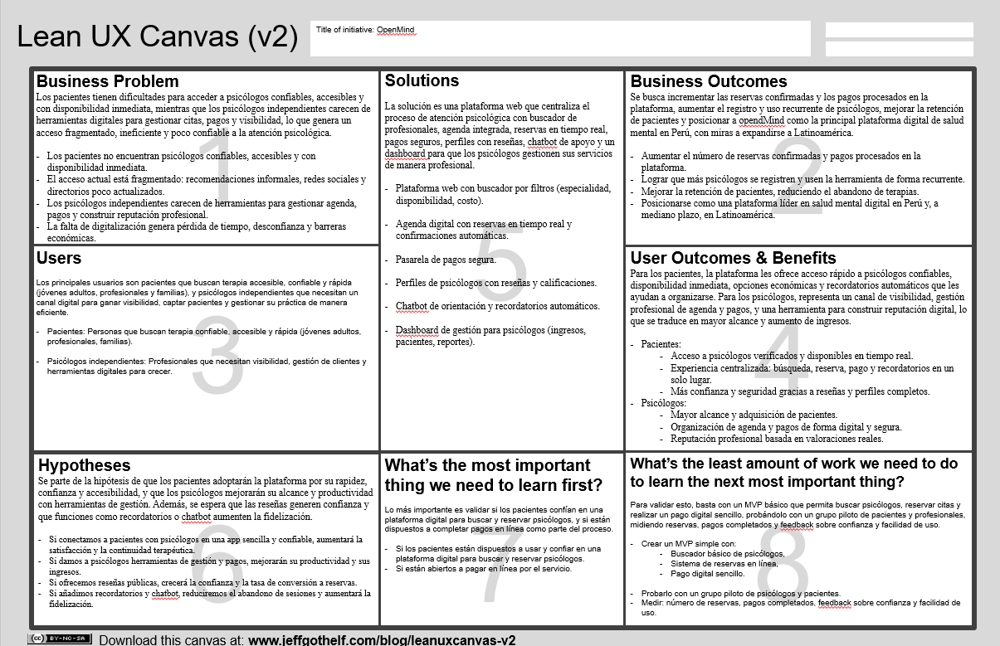
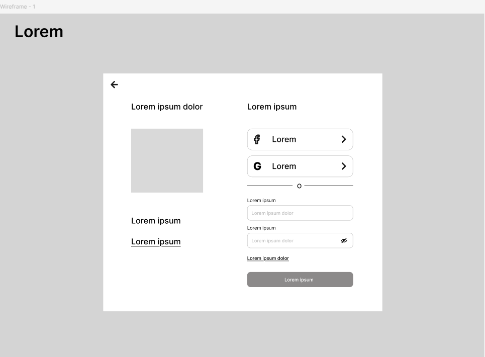
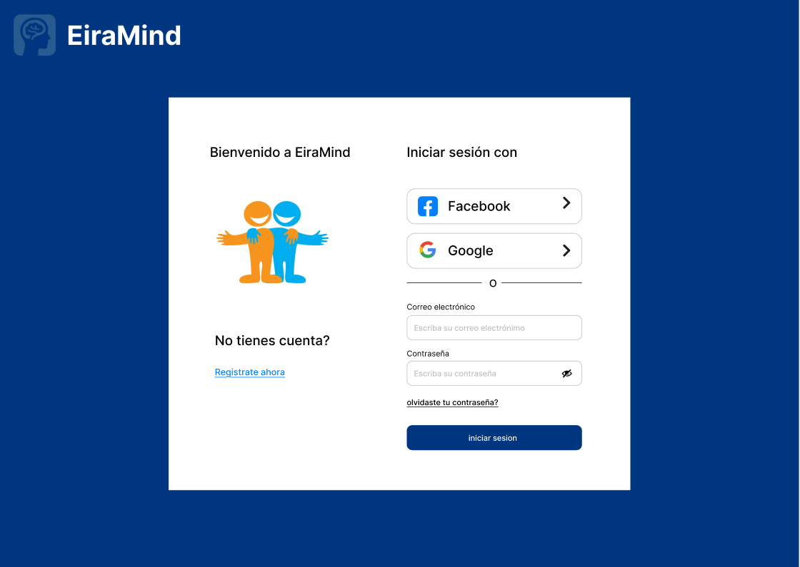

<h3 align="center"> Universidad Peruana de Ciencias Aplicadas </h3>

<h3 align="center"> Ingeniería de Software </h3>
<h3 align="center"> Ciclo 2025 - 2</h3>

<br>

<div align="center">
    </img><br>
</div>

<br>

<h1 align="center"> TP1 Report </h1>

<h3 align="center"> 1ASI0730 - Aplicaciones Web - 7414 </h3>

<h3 align="center"> Docente: Alex Humberto Sánchez Ponce </h3>

<h3> Product: opendMind </h3>

<h3> Team Members: </h3>

| Member                           |    Code    |
| :------------------------------- | :--------: |
| Andy Alejandro Mio Mejia         | U202218531 |
| Rolando Andre Torres Diaz        | U202323369 |
| Liam Anderson Villugas Jeronimo  | U202211634 |
| Diego Rodrigo Pumahualcca Garcia | U202219266 |
| Henry Jaredt Montes Ramos        | U20231D343 |

<h3 align="center">2025</h3>

<div style="page-break-after: always;"></div>

# Registro de Versiones del Informe

| Versión | Fecha | Autor | Descripción de modificación |
| :-------: | :---------: | :----------------: | :----------------------:|
| TB1 | 02/09/25 | Mio Mejia, Andy Alejandro | Se añadió y completo correctamente los capítulos 1 al 5 |
| TB1 | 19/09/25 | Diego Rodrigo, Pumahualcca Garcia | Se completo parcialmente los capitulos 1, 2 y 4|
| TB1 | 20/09/25 | Henry Jaredt Montes Ramos | Se implemento correctamente los capitulo 3, 4 y 5|
| TB1 | 20/09/25 | Liam Anderson, Villugas Jeronimo| Se completaron los capitulos 1, 2, 3, 4 y 5 |


# Project Report Collaboration Insights

A lo largo del desarrollo del trabajo, se ha evidenciado una participación activa, coordinada y progresiva por parte de todos los integrantes del equipo. Cada fase fue abordada de manera estructurada, siguiendo las buenas prácticas de trabajo colaborativo con control de versiones en GitHub, planificación por entregables, y asignación clara de responsabilidades según las competencias de cada integrante.

El uso de repositorios específicos por subcomponente también contribuyó a mantener una mejor trazabilidad del trabajo colaborativo, integrando ramas por entregables y controlando versiones según el avance de cada sprint.

A continuación, se detallan los repositorios utilizados a lo largo del proyecto:

#### Link del repositorio del Reporte: 

https://github.com/AplicacionesWeb-Grupo2/report/tree/develop

#### Link del repositorio de la Landing Page: 

https://github.com/AplicacionesWeb-Grupo2/Landing-Page 


# Contenido

## Tabla de Contenidos

[Registro de versiones del informe](#registro-de-versiones-del-informe)

[Project Report Collaboration Insights](#project-report-collaboration-insights)

[Contenido](#contenido)

[Student Outcome](#student-outcome)

[Capítulo I: Introducción](#capitulo-i-introduccion)

- [1.1. Startup Profile](#11-startup-profile)

  - [1.1.1. Descripción de la Startup](#111-description-de-la-startup)

  - [1.1.2. Perfiles de integrantes del equipo](#112-perfiles-de-integrantes-del-equipo)

- [1.2. Solution Profile](#12-solution-profile)
  - [1.2.1 Antecedentes y problemática](#121-antecedentes-y-problemática)
  - [1.2.2 Lean UX Process](#122-lean-ux-process)
    - [1.2.2.1. Lean UX Problem Statements](#1221-lean-ux-problem-statements)
    - [1.2.2.2. Lean UX Assumptions](#1222-lean-ux-assumptions)
    - [1.2.2.3. Lean UX Hypothesis Statements](#1223-lean-ux-hypothesis-statements)
    - [1.2.2.4. Lean UX Canvas](#1224-lean-ux-canvas)
- [1.3. Segmentos objetivo](#13-segmentos-objetivo)

[Capítulo II: Requirements Elicitation & Analysis](#capítulo-ii-requirements-elicitation--analysis-1)

- [2.1. Competidores](#21-competidores)
  - [2.1.1. Análisis competitivo](#211-análisis-competitivo)
  - [2.1.2. Estrategias y tácticas frente a competidores](#212-estrategias-y-tácticas-frente-a-competidores)
- [2.2. Entrevistas](#22-entrevistas)
  - [2.2.1. Diseño de entrevistas](#221-diseño-de-entrevistas)
  - [2.2.2. Registro de entrevistas](#222-registro-de-entrevistas)
  - [2.2.3. Análisis de entrevistas](#223-análisis-de-entrevistas)
- [2.3. Needfinding](#23-needfinding)
  - [2.3.1. User Personas](#231-user-personas)
  - [2.3.2. User Task Matrix](#232-user-task-matrix)
  - [2.3.3. User Journey Mapping](#233-user-journey-mapping)
  - [2.3.4. Empathy Mapping](#234-empathy-mapping)
  - [2.3.5. As-is Scenario Mapping](#235-as-is-scenario-mapping)

[Capítulo III: Requirements Specification](#capítulo-iii-requirements-specification-1)

- [3.1. To-Be Scenario Mapping](#31-to-be-scenario-mapping)
- [3.2. User Stories](#32-user-stories)
- [3.3. Impact Mapping](#33-impact-mapping)
- [3.4. Product Backlog](#34-product-backlog)

[Capítulo IV: Product Design](#capitulo-iv-product-design-1)

- [4.1. Style Guidelines](#41-style-guidelines)
  - [4.1.1. General Style Guidelines](#411-general-style-guidelines)
  - [4.1.2. Web Style Guidelines](#412-web-style-guidelines)
- [4.2. Information Architecture](#42-information-architecture)
  - [4.2.1. Organization Systems](#421-organization-systems)
  - [4.2.2. Labeling Systems](#422-labeling-systems)
  - [4.2.3. SEO Tags and Meta Tags](#423-seo-tags-and-meta-tags)
  - [4.2.4. Searching Systems](#424-searching-systems)
  - [4.2.5. Navigation Systems](#425-navigation-systems)
- [4.3. Landing Page UI Design](#43-landing-page-ui-design)
  - [4.3.1. Landing Page Wireframe](#431-landing-page-wireframe)
  - [4.3.2. Landing Page Mock-up](#432-landing-page-mock-up)
- [4.4. Web Applications UX/UI Design](#44-web-applications-uxui-design)
  - [4.4.1. Web Applications Wireframes](#441-web-applications-wireframes)
  - [4.4.2. Web Applications Wireflow Diagrams](#442-web-applications-wireflow-diagrams)
  - [4.4.3. Web Applications Mock-ups](#443-web-applications-mock-ups)
  - [4.4.4. Web Applications User Flow Diagrams](#444-web-applications-user-flow-diagrams)
- [4.5. Web Applications Prototyping](#45-web-applications-prototyping)
- [4.6. Domain-Driven Software Architecture](#46-domain-driven-software-architecture)
  - [4.6.1. Software Architecture Context Diagram](#461-software-architecture-context-diagram)
  - [4.6.2. Software Architecture Container Diagrams](#462-software-architecture-container-diagrams)
  - [4.6.3. Software Architecture Components Diagrams](#463-software-architecture-components-diagrams)
- [4.7. Software Object-Oriented Design](#47-software-object-oriented-design)
  - [4.7.1. Class Diagrams](#471-class-diagrams)
  - [4.7.2. Class Dictionary](#472-class-dictionary)
- [4.8. Database Design](#48-database-design)
  - [4.8.1. Database Diagram](#481-database-diagram)

[Capítulo V: Product Implementation, Validation & Deployment](#capitulo-v-product-implementation-validation-deployment-)
- [5.1. Software Configuration Management](#51-software-configuration)
  - [5.1.1. Software Development Enviroment Configuration](#511-software-devlopment-enviroment)
  - [5.1.2. Source Code Management](#512-source-code-management)
  - [5.1.3. Source Code Style Guide & Conventions](#513-source-code-style-guide-conventions)
  - [5.1.4. Software Deployment Configuration](#514-software-deployment-configuration)
- [5.2. Landing Page, Service & Application Implementation](#52-landing-page-service-application-implementation)
  - [5.2.1 Sprint 1](#521-sprint-1)
  - [5.2.1.1. Sprint Planning 1](#5211-sprint-planning-1)
  - [5.2.1.2. Aspect Leaders and Collaborators](#5212-aspect-leaders-and-collaborators)
  - [5.2.1.3. Sprint Backlog 1](#5213-sprint-backlog-1)
  - [5.2.1.4. Development Evidence for Sprint Review](#5214-development-evidence-for-sprint-review)
  - [5.2.1.5. Execution Evidence for Sprint Review](#5215-execution-evidence-for-sprint-review)
  - [5.2.1.6. Services Documentation Evidence for Sprint Review](#5216-services-documentation-evidence-for-sprint-review)
  - [5.2.1.7. Software Deployment Evidence for Sprint Review](#5217-software-deployment-evidence-for-sprint-review)
  - [5.2.1.8. Team Collaboration Insights during Sprint](#5218-team-collaboration-insights-during-sprint)
  - [5.2.2 Sprint 2](#522-sprint-2)
  - [5.2.2.1. Sprint Planning 2](#5221-sprint-planning-2)
  - [5.2.2.2. Aspect Leaders and Collaborators](#5222-aspect-leaders-and-collaborators)
  - [5.2.2.3. Sprint Backlog 2](#5223-sprint-backlog-2)
  - [5.2.2.4. Development Evidence for Sprint Review](#5224-development-evidence-for-sprint-review)
  - [5.2.2.5. Execution Evidence for Sprint Review](#5225-execution-evidence-for-sprint-review)
  - [5.2.2.6. Services Documentation Evidence for Sprint Review](#5226-services-documentation-evidence-for-sprint-review)
  - [5.2.2.7. Software Deployment Evidence for Sprint Review](#5227-software-deployment-evidence-for-sprint-review)
  - [5.2.2.8. Team Collaboration Insights during Sprint](#5228-team-collaboration-insights-during-sprint)
  - [5.2.3 Sprint 3](#523-sprint-3)
  - [5.2.3.1. Sprint Planning 3](#5231-sprint-planning-3)
  - [5.2.3.2. Aspect Leaders and Collaborators](#5232-aspect-leaders-and-collaborators)
  - [5.2.3.3. Sprint Backlog 3](#5233-sprint-backlog-3)
  - [5.2.3.4. Development Evidence for Sprint Review](#5234-development-evidence-for-sprint-review)
  - [5.2.3.5. Execution Evidence for Sprint Review](#5235-execution-evidence-for-sprint-review)
  - [5.2.3.6. Services Documentation Evidence for Sprint Review](#5236-services-documentation-evidence-for-sprint-review)
  - [5.2.3.7. Software Deployment Evidence for Sprint Review](#5237-software-deployment-evidence-for-sprint-review)
  - [5.2.3.8. Team Collaboration Insights during Sprint](#5238-team-collaboration-insights-during-sprint)
  - [5.2.4 Sprint 4](#524-sprint-4)
  - [5.2.4.1. Sprint Planning 4](#5241-sprint-planning-4)
  - [5.2.4.2. Aspect Leaders and Collaborators](#5242-aspect-leaders-and-collaborators)
  - [5.2.4.3. Sprint Backlog 4](#5243-sprint-backlog-4)
  - [5.2.4.4. Development Evidence for Sprint Review](#5244-development-evidence-for-sprint-review)
  - [5.2.4.5. Execution Evidence for Sprint Review](#5245-execution-evidence-for-sprint-review)
  - [5.2.4.6. Services Documentation Evidence for Sprint Review](#5246-services-documentation-evidence-for-sprint-review)
  - [5.2.4.7. Software Deployment Evidence for Sprint Review](#5247-software-deployment-evidence-for-sprint-review)
  - [5.2.4.8. Team Collaboration Insights during Sprint](#5248-team-collaboration-insights-during-sprint)
- [5.3 Validation Interviews](#53-Validation-Interviews)
  - [5.3.1 Diseño de Entrevistas](#531-Diseño-de-Entrevistas)
  - [5.3.2 Registro de Entrevistas](#532-Registro-de-Entrevistas)
  - [5.3.3 Evaluaciones según heurísticas](#533-Evaluaciones-según-heurísticas)
  - [5.4 Video About-the-Product](#54-Video-About-the-Product)
   
      
- [Conclusiones y recomendaciones](#conclusiones-y-recomendaciones)

- [Video About-the-Team](#Video-About-the-Team)
  
- [Bibliografía](#bibliografia)

- [Anexos](#anexos)

# Student Outcome
criterio específico                              | acciones realizadas                                                                                                   | conclusiones
-------------------------------------------------|------------------------------------------------------------------------------------------------------------------------|--------------------------------------------------------------------------------------------------------------------------------------------------------------------------------
Trabaja en equipo para proporcionar liderazgo en forma conjunta | **Villugas Jerónimo, Liam Anderson** <br> TB1 <br> Me involucré en la organización del trabajo, proponiendo una forma de ordenar nuestras ideas y alentando a que todos participen en la discusión. Escuché las opiniones del grupo y ayudé a que se llegara a consensos de manera respetuosa. <br><br> **Pumahualcca Garcia, Diego Rodrigo** <br> TB1 <br> Se realizó una investigación para entender la problemática en cuestión y poder distinguir los grupos concretos a los que nos dirigimos, con el objetivo de comprender sus necesidades y ofrecerles un producto que las satisfaga. <br><br> **Torres Diaz, Rolando Andre**  <br> TB1 <br> Se participó activamente en la organización del equipo y en la definición de objetivos comunes, fomentando un ambiente colaborativo y responsable. Aplicamos principios éticos y de liderazgo compartido para planificar las tareas y cumplir los entregables de forma ordenada. Este trabajo me permitió fortalecer mis habilidades de comunicación, coordinación y compromiso profesional dentro del grupo. <br> TP1 <br> Se participó activamente en la coordinación del equipo para la implementación del prototipo inicial de *EiraMind*. Se organizó las tareas técnicas y promoví una comunicación constante para mantener la coherencia del trabajo. | Esto permitió que el equipo tenga un norte común y una visión ordenada del producto. Se comprobó que el liderazgo en equipo no es imponer, sino guiar el trabajo de manera estructurada, generando claridad para que todos los miembros aporten de forma efectiva. <br> TP1 <br> Se llevaron a cabo revisiones para la implementación de la aplicación web y se incluyeron características como la navegación de la página.
Crea un entorno colaborativo e inclusivo, establece metas, planifica tareas y cumple objetivos | **Villugas Jerónimo, Liam Anderson**  <br> TB1 <br> Promoví un ambiente de confianza donde todos pudieran expresar sus ideas. Aporté en la definición de metas comunes y colaboré en la organización de tareas, respetando siempre los tiempos y aportes de mis compañeros. <br><br> **Pumahualcca Garcia, Diego Rodrigo**  <br> TB1 <br> Se llevó a cabo un análisis con el propósito de comprender el contexto que estamos abordando y así poder identificar a los grupos particulares a los que nos dirigimos, con la intención de comprender sus necesidades y ofrecerles un producto que las satisfaga. <br> TP1 <br> Se efectuaron análisis para el lanzamiento de la aplicación web y se implementaron funciones como la dirección de página. <br><br> **Torres Díaz, Rolando Andre** <br> **TB1** <br> Se participó activamente en la planificación y organización de las tareas grupales, asegurando que cada miembro tuviera claridad sobre sus responsabilidades. Se promovió un entorno colaborativo basado en la comunicación y el respeto mutuo. <br> **TP1** <br> Se contribuyó en la definición de los objetivos técnicos del sistema y apoyé la integración de funcionalidades en el prototipo inicial, manteniendo una comunicación constante con el equipo para cumplir los plazos establecidos. | Se logró consolidar un entorno colaborativo en el que todos los miembros aportaron desde sus habilidades. La planificación participativa y el liderazgo compartido facilitaron la ejecución del proyecto y el cumplimiento de los entregables de la TB1 y TP1, fortaleciendo el compromiso grupal y la eficiencia del equipo. |

<div style="page-break-after: always;"></div>

<div style="page-break-after: always;"></div>

# Capitulo I: Introduccion

## 1.1. StartUp Profile 

En un mundo donde la salud mental y el bienestar emocional son cada vez más reconocidos como aspectos fundamentales para la calidad de vida, surge opendMind. Con una propuesta centrada en la accesibilidad y la innovación tecnológica, esta startup nace para transformar la manera en que pacientes y psicólogos se conectan.

A través de su primer producto, la web app opendMind, la compañía ofrece una solución integral que simplifica la reserva de citas psicológicas, optimiza la organización de profesionales y brinda a los usuarios herramientas de apoyo inteligente que fortalecen su proceso terapéutico.

Más que una aplicación, opendMind busca convertirse en un aliado estratégico para quienes desean acceder a servicios psicológicos de forma fácil, económica y confiable, reduciendo barreras de tiempo, distancia y costo, y generando nuevas oportunidades para la comunidad de la salud mental.  

### 1.1.1. Description de la StartUp  

opendMind es una empresa tecnológica dedicada a crear soluciones digitales para el ecosistema de atención psicológica.
Su primer producto, la plataforma opendMind, conecta a pacientes con psicólogos de manera sencilla y segura.

La aplicación permite a los usuarios buscar y reservar citas en tiempo real, acceder a opciones económicas con promociones, recibir recordatorios y notificaciones automáticas, y contar con un chatbot de orientación inicial; mientras que los psicólogos pueden gestionar su agenda, clientes, pagos y obtener reportes sobre el progreso de sus pacientes.

De esta manera, opendMind se convierte en un ecosistema que integra la oferta y demanda de servicios psicológicos, mientras se consolida como la empresa que impulsa la democratización y digitalización de la atención en salud mental a nivel regional. 

### 1.1.2. Perfiles de integrantes del equipo

| Integrantes | Descripción | Conocimientos |
| :---------- | :---------- | :------------ |
| <div style="display: flex; align-items: center;">&nbsp;&nbsp;<br>**Andy Mio Mejia**<br>u202218531</div> | Soy estudiante de la carrera de Ingeniería de Software, puedo aportar mucho al equipo, aplicando mis conocimientos en diversos lenguajes de programación | Conocimientos en Java, C++, Python, html, css, javascrip, C# y SQL |
| <div style="display: flex; align-items: center;">&nbsp;&nbsp;<br>**Diego Rodrigo Pumahualcca Garcia**<br>u202219266</div> | Soy estudiante de la carrera de Ingeniería de Software en la Universidad Peruana de Ciencias Aplicadas (UPC). | Java, C++, React, Python, html, css, javascrip, C# y MySql|
| <div style="display: flex; align-items: center;">&nbsp;&nbsp;<br>**Rolando Andre Torres Diaz**<br>u202323369</div> | Actualmente estoy estudiando ingeniería de software en la universidad peruana de ciencias aplicadas. Personalmente, me considero una persona amigable y responsable, lo cual me puede ayudar en la universidad. También creo que estas cualidades me permitirán construir relaciones sólidas con mis compañeros y profesores, así como ordenar mi tiempo. | Python, C++, css, c#, SQL, cisco, java|
| <div style="display: flex; align-items: center;">&nbsp;&nbsp;<br>**Liam Villugas Jerónimo**<br>u202211634</div> | Soy Estudiante de Ingienieria de Software en la Universidad Peruana de Ciencias Aplicadas (UPC), Estoy cursando actualmente el 6to ciclo de la carrera.Me atrae mucho el desarrollo de aplicaciones y el uso de las bases de datos. Me considero una persona en Aprendizaje constante e intento mantener la tranquilidad bajo prension al trabajar. | Python, C++, MongoDB, SqlServer, SqLite |
| <div style="display: flex; align-items: center;">&nbsp;&nbsp;<br>**Henry Jaredt Montes Ramos**<br>U20231D343</div> | Soy estudiante de la carrera de Ingeniería de Software, puedo aportar mucho al equipo, aplicando mis conocimientos en diversos lenguajes de programación | Conocimientos en Java, C++, Python, html, css, javascrip, C# y SQL |

## 1.2. Solution Profile

### 1.2.1. Antecedentes y problemática

#### Antecedentes y problemática

En los últimos años, el interés por la salud mental y el bienestar emocional ha crecido de manera sostenida como parte esencial de la vida saludable. Sin embargo, este crecimiento también ha evidenciado limitaciones en la forma en que las personas acceden a servicios psicológicos accesibles, confiables y de calidad.

Muchos pacientes se enfrentan a la dificultad de encontrar psicólogos disponibles en horarios adecuados, así como a la falta de opciones económicas y verificadas. A su vez, los psicólogos independientes carecen de herramientas digitales que les permitan gestionar reservas, pagos y visibilidad frente a grandes clínicas o centros especializados.

En este contexto, surge la necesidad de una plataforma que simplifique y centralice la conexión entre pacientes y psicólogos, brindando confianza, organización y eficiencia en un solo lugar.  

#### What?

opendMind es una plataforma digital diseñada para facilitar y optimizar la conexión entre pacientes y psicólogos, además de simplificar la reserva de citas y el seguimiento terapéutico. La aplicación proporciona herramientas que permiten gestionar horarios, pagos, notificaciones y reportes de progreso, creando un entorno seguro, confiable y accesible para todos los usuarios. 

#### Why?

Porque actualmente existe una gran dificultad para acceder a psicólogos confiables y servicios económicos de forma rápida y organizada.
Los pacientes pierden tiempo buscando opciones dispersas o poco verificadas, mientras que muchos psicólogos independientes carecen de un espacio centralizado para ofrecer sus servicios, gestionar su agenda y recibir pagos de manera segura.

#### Where?

Esta problemática se presenta en las principales ciudades de Perú y Latinoamérica, donde la demanda por servicios psicológicos supera la capacidad de organización actual. Los afectados son tanto los pacientes que buscan apoyo emocional como los psicólogos que necesitan visibilidad y oportunidades de crecimiento.  

#### When?

La necesidad se intensifica en la actualidad, en un contexto donde la salud mental se consolida como una prioridad social. La digitalización y el uso de plataformas online han generado la demanda de soluciones inmediatas y confiables para acceder a servicios psicológicos desde cualquier lugar. 

#### Who?

Las partes más afectadas son, por un lado, los psicólogos independientes y profesionales de la salud mental que desean ofrecer sus servicios de forma ordenada y profesional. Por otro lado, los pacientes, ya sean personas con problemas emocionales puntuales o usuarios que requieren terapia continua, que necesitan atención accesible, segura y personalizada. 

#### How?

opendMind resuelve esta problemática mediante una plataforma web todo-en-uno que permite a los usuarios buscar psicólogos según su especialidad y disponibilidad, reservar citas en tiempo real y realizar pagos seguros. Al mismo tiempo, los profesionales pueden gestionar su agenda, clientes y construir una reputación basada en valoraciones reales de sus pacientes.  

### 1.2.2. Lean UX Process

#### 1.2.2.1. Lean UX Problem Statements

#### opendMind – Solución al Acceso Psicológico Digital

El estado actual del acceso a servicios psicológicos se caracteriza por una oferta fragmentada, poco digitalizada y difícil de gestionar. Aunque existen directorios online o contactos informales para coordinar citas, estos no logran cubrir completamente las necesidades de los pacientes que buscan disponibilidad inmediata, confianza y accesibilidad, ni las de los psicólogos que requieren visibilidad, gestión de pagos y herramientas profesionales para crecer.

Lo que los productos y servicios existentes no logran resolver es la falta de una plataforma centralizada y especializada que integre todo el proceso de atención psicológica: desde la búsqueda de psicólogos confiables y accesibles, hasta la reserva, pago y seguimiento del progreso terapéutico. Actualmente, muchos pacientes dependen de recomendaciones informales, redes sociales o listados poco actualizados, mientras que los psicólogos deben promocionarse de manera aislada y con recursos limitados, lo que genera ineficiencias y pérdida de oportunidades para ambos lados.

Nuestro producto, opendMind, abordará esta brecha creando un ecosistema confiable que conecte a pacientes con psicólogos en un solo lugar. Permitiremos a los usuarios encontrar y reservar fácilmente citas, acceder a opciones económicas, recibir recordatorios y notificaciones, interactuar con un chatbot de orientación y valorar la experiencia. Al mismo tiempo, los profesionales podrán ofrecer sus servicios de forma organizada, gestionar su agenda y construir una reputación digital sólida que les permita aumentar su alcance y clientes.

Sabremos que hemos tenido éxito cuando los pacientes utilicen la plataforma de manera recurrente para organizar sus sesiones, cuando los psicólogos logren incrementar sus reservas e ingresos a través de la app, y cuando observemos una comunidad activa con altos niveles de retención, valoraciones positivas y recomendaciones orgánicas que fortalezcan el crecimiento de la plataforma.


#### 1.2.2.2. Lean UX Assumptions

#### PlayMatch - Información del Producto

#### ¿Quién es el usuario?

Los usuarios de opendMind son principalmente dos grupos:

1. Pacientes que buscan psicólogos confiables, accesibles y con disponibilidad para recibir atención psicológica.  
2. Psicólogos independientes que desean ofrecer sus servicios, aumentar su visibilidad, gestionar reservas y pagos de manera digital y profesional.  

#### ¿Dónde encaja nuestro producto, en su trabajo o en su vida?

- Para los pacientes, opendMind se convierte en una herramienta clave en su vida personal y emocional, al permitirles acceder a terapia de forma rápida, segura y económica.  
- Para los psicólogos, es parte esencial de su vida profesional, ayudándoles a conseguir más pacientes, administrar sus horarios, asegurar sus ingresos y construir una reputación online sólida. 

#### ¿Qué problema resuelve nuestro producto?

opendMind resuelve la dificultad de encontrar psicólogos disponibles y confiables, así como la falta de herramientas digitales que permitan a los profesionales gestionar reservas, pagos y relaciones con sus pacientes desde un solo lugar.

#### ¿Cuándo y cómo se utiliza nuestro producto?

El producto se utiliza cuando un paciente desea reservar una cita psicológica, consultar un profesional disponible o recibir recordatorios y orientación inicial.
Los usuarios ingresan a la plataforma, buscan según especialidad, disponibilidad o costo, reservan en tiempo real y realizan el pago en línea.
Por su parte, los psicólogos utilizan la plataforma para mostrar sus servicios, recibir reservas confirmadas y pagos, y dar seguimiento al progreso de sus pacientes con reportes e historial.

#### ¿Qué características son importantes?

- Buscador de psicólogos con filtros por especialidad, disponibilidad, experiencia y tarifas.
- Perfil detallado de cada psicólogo, incluyendo trayectoria, enfoque terapéutico, horarios y valoraciones.
- Sistema de reservas con calendario integrado y confirmaciones automáticas.
- Pasarela de pagos segura y confiable.
- Dashboard de gestión para psicólogos con reportes de ingresos, reservas y pacientes recurrentes.
- Chatbot de apoyo inicial para consultas rápidas y orientación antes de la sesión. 

#### ¿Cómo debe verse y comportarse nuestro producto?

opendMind debe tener una interfaz clara, accesible y amigable, transmitiendo confianza y cercanía.
El diseño debe estar enfocado en la facilidad de uso, permitiendo que tanto pacientes como psicólogos encuentren lo que necesitan en pocos clics.
La navegación debe ser sencilla, los tiempos de carga rápidos y cada interacción debe estar acompañada de mensajes empáticos y claros que guíen al usuario sin fricción.

#### 1.2.2.3. Lean UX Hypothesis Statements

#### Hipótesis 1:
Creemos que al desarrollar una plataforma web que conecte a pacientes con psicólogos independientes y confiables, lograremos facilitar el acceso a servicios psicológicos de manera más rápida, económica y organizada. Esto resultará en una mayor continuidad terapéutica y en un aumento de la satisfacción de los usuarios.

**Business Outcome**: Aumento en el número de reservas confirmadas y pagos procesados en la plataforma. 
**Users**: Pacientes que buscan atención psicológica accesible y confiable.  
**User Outcome**: Mayor acceso a psicólogos disponibles y a costos más bajos, mejorando la experiencia de atención.
**Feature**: Buscador de psicólogos con filtros, sistema de reservas y pagos integrados. 

---

#### Hipótesis 2:
Consideramos que si proporcionamos a los psicólogos independientes una plataforma para ofrecer sus servicios con herramientas de gestión de agenda, pagos y visibilidad, aumentará su alcance, productividad y generación de ingresos.

**Business Outcome**: Mayor cantidad de psicólogos registrados y mayor recurrencia en el uso de la plataforma.  
**Users**: Psicólogos independientes y profesionales de la salud mental.
**User Outcome**: Más oportunidades de captar pacientes y mejor gestión de sus servicios.
**Feature**: Panel de administración para psicólogos, perfiles detallados, integración con calendario y sistema de pago seguro.

---

#### Hipótesis 3:
Suponemos que al permitir valoraciones y reseñas públicas de psicólogos, se generará un ecosistema de confianza que incentive a más pacientes a utilizar la plataforma y a los profesionales a mantener altos estándares de calidad.

**Business Outcome**: Incremento en la tasa de conversión de reservas y en la retención de usuarios.
**Users**: Pacientes que buscan psicólogos y psicólogos que ofrecen sus servicios. 
**User Outcome**: Mayor confianza al elegir profesionales y mejor reputación para quienes brindan un servicio de calidad.  
**Feature**: Sistema de calificaciones, comentarios y reseñas públicas en los perfiles.

---

#### Hipótesis 4:
Creemos que si incorporamos funciones de apoyo interactivo como un chatbot y recordatorios automáticos, mejorará la experiencia del paciente y fortalecerá la relación terapéutica, aumentando la continuidad de las sesiones.

**Business Outcome**: Aumento en la fidelización de pacientes, mayor tiempo de uso en la plataforma y reducción en la tasa de abandono.
**Users**: Pacientes que requieren acompañamiento constante y psicólogos que desean optimizar la adherencia al tratamiento.
**User Outcome**: Más opciones de apoyo inmediato, mejor organización y mayor compromiso con la terapia.
**Feature**: Chatbot de orientación inicial, recordatorios de citas y notificaciones automáticas.

#### 1.2.2.4. Lean UX Canvas

</img>

## 1.3. Segmentos objetivo 
**Segmento 1 – Pacientes digitales jóvenes-adultos**  
- Personas entre 18 y 40 años que buscan apoyo psicológico por ansiedad, estrés o problemas emocionales.  
- Necesitan acceso rápido y confiable a psicólogos, con opción de agendar citas en horarios flexibles y recibir recordatorios digitales.  

**Segmento 2 – Psicólogos independientes y pequeñas clínicas**  
- Profesionales de la salud mental que requieren mayor visibilidad digital y herramientas para gestionar citas y pagos.  
- Necesitan optimizar su práctica y diferenciarse mediante ranking, reseñas verificadas e innovación (IoT, chatbot IA).

# Capítulo II: Requirements Elicitation & Analysis
## 2.1. Competidores
### 2.1.1. Análisis competitivo

En el mercado existen diversas plataformas digitales que buscan conectar a pacientes con profesionales de la salud mental. Sin embargo, la mayoría presenta limitaciones en cuanto a accesibilidad, confianza o integración de servicios. A continuación, se presentan algunos de los principales competidores:

<table>
  <tr>
    <th colspan="8" valign="top"><b>Competitive Analysis</b></th>
  </tr>
  <tr>
    <td colspan="2" rowspan="2">Objetivo del análisis</td>
    <td colspan="6">¿Cómo analiza, produce y enfrenta el mercado mi competencia?</td>
  </tr>
  <tr>
    <td colspan="6">Este análisis se realizó con la finalidad de poder identificar a nuestros potenciales competidores e idear estrategias y tácticas para diferenciarnos de estos.</td>
  </tr>
  <tr>
    <td colspan="3">Nombre y logo</td>
    <td colspan="1" valign="top" style="font-weight: bold;">
        OpenMind
        <br>
        <div style="text-align: center; margin-top: 10px;">
                
        </div>
    </td>
    <td colspan="1" valign="top" style="font-weight: bold;">
        Doctoralia
        <br>
        <div style="text-align: center; margin-top: 10px;">
                
        </div>
    </td>
    <td colspan="1" valign="top" style="font-weight: bold;">
      PsicólogosPerú
        <div style="text-align: center; margin-top: 10px;">
                
        </div>
    </td>
    <td colspan="1" valign="top" style="font-weight: bold;">
      Talkspace
        <div style="text-align: center; margin-top: 10px;">
                
            </div>
        </td>
    <td colspan="1" valign="top" style="font-weight: bold;" >
      MiSalud
        <div style="text-align: center; margin-top: 10px;">
                
        </div>
    </td>
  </tr>
  <tr>
    <td colspan="1" rowspan="2"><p>Perfil</p></td>
    <td colspan="2">Overview</td>
    <td colspan="1" valign="top">Startup enfocada en la digitalización de la salud mental. Conecta a pacientes con psicólogos de manera rápida, confiable y accesible, busca reducir las barreras de tiempo, distancia y costo que dificultan la atención psicológica en la región.</td>
    <td colspan="1" valign="top">Gran marketplace global para pacientes y profesionales de salud (citas, reseñas, software de gestión), presente en múltiples países tras integrar mercados europeos/latinoamericanos.</td>
    <td colspan="1" valign="top">Directorios/plataformas locales que reúnen psicólogos y servicios de salud mental orientados a Perú (perfiles de terapeutas, contacto/agenda).</td>
    <td colspan="1" valign="top">Plataforma de terapia online (mensajería, video, audio) con modelo por suscripción, focalizada principalmente en EE. UU. y con integración de servicios de psiquiatría.</td>
    <td colspan="1" valign="top">Servicio de telemedicina bilingüe (español/inglés) orientado a atención rápida, coaching y consulta médica/mental — modelo B2B (beneficio para empleados) y B2C vía app.</td>
  </tr>
  <tr>
    <td colspan="2">Ventaja competitiva</td>
    <td colspan="1" valign="top">Integra reservas en tiempo real, pagos digitales, recordatorios, chatbot de apoyo inicial y dashboards para profesionales, lo que le da un mayor valor frente a competidores que solo ofrecen sesiones virtuales.</td>
    <td colspan="1" valign="top">Marca reconocida, red amplia de profesionales y herramientas administrativas para clínicas.</td>
    <td colspan="1" valign="top">Enfoque local y culturalmente ajustado, conocimiento del mercado peruano y canales locales (WhatsApp, referencias).</td>
    <td colspan="1" valign="top">Escala en EE. UU., acuerdos con pagadores/empleadores y oferta combinada (terapia + psiquiatría).</td>
    <td colspan="1" valign="top">Enfoque en población hispana y modelo employer-sponsored.</td>
  </tr>
  <tr>
    <td colspan="1" rowspan="2"><p>Perfil de Marketing</p></td>
    <td colspan="2">Mercado objetivo</td>
    <td colspan="1" valign="top">Pacientes jóvenes y adultos en Perú y Latinoamérica que necesitan atención psicológica accesible, así como psicólogos independientes que buscan visibilidad y herramientas digitales para profesionalizar su servicio.</td>
    <td colspan="1" valign="top">Pacientes generales y profesionales/consultorios que necesitan gestión de citas.</td>
    <td colspan="1" valign="top">Personas en Perú que buscan psicoterapia/servicios psicológicos; psicólogos independientes que buscan visibilidad.</td>
    <td colspan="1" valign="top">Adultos en EE. UU. que buscan terapia flexible; también empleadores y aseguradoras.</td>
    <td colspan="1" valign="top">Empleadores con fuerza laboral hispanohablante y pacientes que prefieren atención en español.</td>
  </tr>
  <tr>
    <td colspan="2">Estrategias de marketing</td>
    <td colspan="1" valign="top">Campañas de marketing digital con foco en redes sociales, alianzas con universidades y empresas para programas corporativos de bienestar, estrategias de marketing de contenidos y programas de referidos que incentiven el crecimiento orgánico de la comunidad.</td>
    <td colspan="1" valign="top">SEO local (por especialidad y ciudad), alianzas con clínicas, marketing de contenido, reseñas y presencia móvil/web.</td>
    <td colspan="1" valign="top">Marketing en redes locales (Facebook, grupos), SEO local, alianzas con colegios profesionales y directorios locales.</td>
    <td colspan="1" valign="top">Publicidad digital, acuerdos con empresas/aseguradoras, PR y campañas sobre salud mental.</td>
    <td colspan="1" valign="top">Ventas B2B a empresas, promoción en app stores, outreach comunitario y materiales en español.</td>
  </tr>
  <tr>
    <td colspan="1" rowspan="3"><p>Perfil de Producto</p></td>
    <td colspan="2">Productos & Servicios</td>
    <td colspan="1" valign="top">Buscador de psicólogos filtrados por especialidad, agenda en tiempo real, sistema de notificaciones, pagos integrados, chatbot de orientación inicial y dashboards con métricas de ingresos y progreso.</td>
    <td colspan="1" valign="top">Reserva de citas, perfiles de profesionales, telemedicina, software de gestión de clínicas.</td>
    <td colspan="1" valign="top">Directorio de psicólogos, fichas profesionales, contacto directo y gestión de citas.</td>
    <td colspan="1" valign="top">Mensajería continua con terapeuta, sesiones por video, psiquiatría/medicación según plan.</td>
    <td colspan="1" valign="top">Citas médicas y de salud mental, health coaches, manejo de condiciones crónicas, recetas y pruebas.</td>
  </tr>
  <tr>
      <td colspan="2">Precios & Costos</td>
      <td colspan="1" valign="top">Modelo mixto con comisión por sesión (15–20%), planes de suscripción premium para psicólogos (mayor visibilidad y herramientas adicionales) y tarifas promocionales para atraer a nuevos pacientes.</td>
      <td colspan="1" valign="top">Pacientes generalmente usan gratuito; profesionales/centros pagan planes/servicios premium (freemium/paquetes).</td>
      <td colspan="1" valign="top">Tarifas fijadas por cada profesional (no hay precio estándar de plataforma).</td>
      <td colspan="1" valign="top">Suscripción mensual (planes con/sin sesiones en vivo); precios más altos que directorios locales.</td>
      <td colspan="1" valign="top">Modelos B2B (suscripción para empleadores) y planes en la app; costes varían según contrato.</td>
  </tr>
  <tr>
    <td colspan="2">Canales de distribución (Web y/o Móvil)</td>
    <td colspan="1" valign="top">Web app responsive, redes sociales como canal de captación, WhatsApp para atención al cliente y alianzas institucionales para expandir la base de usuarios.</td>
    <td colspan="1" valign="top">Web + apps móviles.</td>
    <td colspan="1" valign="top">Web y contacto por WhatsApp/llamada (poca app nativa).</td>
    <td colspan="1" valign="top">Web + apps iOS/Android.</td>
    <td colspan="1" valign="top">App móvil (iOS/Android) y web.</td>
  </tr>
  <tr>
    <td colspan="1" rowspan="4"><p>Análisis SWOT</p></td>
    <td colspan="2">Fortalezas</td>
    <td colspan="1" valign="top">Plataforma integral, enfoque en accesibilidad, propuesta tecnológica escalable, visión regional.</td>
    <td colspan="1" valign="top">Gran red global, reconocimiento de marca, producto integrado (reserva + gestión).</td>
    <td colspan="1" valign="top">Conexión local y conocimiento cultural; relaciones con psicólogos locales.</td>
    <td colspan="1" valign="top">Oferta integral (mensajería + video + psiquiatría), acuerdos empresariales, reconocimiento en EE. UU.</td>
    <td colspan="1" valign="top">Servicio bilingüe y enfoque en población hispana; modelo B2B escalable.</td>
  </tr>
  <tr>
    <td colspan="2">Debilidades</td>
    <td colspan="1" valign="top">Startup emergente con poca trayectoria, necesidad de generar confianza en un sector sensible.</td>
    <td colspan="1" valign="top">Competencia local más ágil en ciertos países; dependencia de reputación/reseñas.</td>
    <td colspan="1" valign="top">Alcance y tecnología limitados vs. jugadores globales; fragmentación de oferta.</td>
    <td colspan="1" valign="top">Críticas sobre privacidad/calidad y precio alto.</td>
    <td colspan="1" valign="top">Menor escala y visibilidad frente a grandes telehealth; dependencia de contratos empresariales.</td>
  </tr>
  <tr>
    <td colspan="2">Oportunidades</td>
    <td colspan="1" valign="top">Demanda creciente de salud mental post-pandemia, digitalización acelerada en LATAM, posibilidad de alianzas con seguros y empresas.</td>
    <td colspan="1" valign="top">Expansión de telemedicina y alianzas con aseguradoras/SS.</td>
    <td colspan="1" valign="top">Aumento de demanda por salud mental en Perú; posibilidad de profesionalizar pagos/reservas.</td>
    <td colspan="1" valign="top">Cobertura por aseguradoras y expansión a población hispana/empleadores.</td>
    <td colspan="1" valign="top">Expansión a mercados latinoamericanos; alianzas con empleadores y redes comunitarias.</td>
  </tr>
  <tr>
    <td colspan="2">Amenazas</td>
    <td colspan="1" valign="top">Competidores internacionales con más capital, cambios regulatorios en salud, barreras de adopción tecnológica en ciertos segmentos.</td>
    <td colspan="1" valign="top">Regulación sanitaria local, competencia regional o verticales especializadas.</td>
    <td colspan="1" valign="top">Entrada de apps internacionales adaptadas al español; falta de confianza/reputación.</td>
    <td colspan="1" valign="top">Competidores (BetterHelp, etc.), escrutinio regulatorio y litigios.</td>
    <td colspan="1" valign="top">Grandes players de telemedicina en nicho hispano; requerimientos regulatorios.</td>
  </tr>
</table>

---

### 2.1.2. Estrategias y tácticas frente a competidores
- **Especialización en salud mental:** A diferencia de apps generales, nos enfocamos 100% en psicología.  
- **Integración tecnológica:** Incorporamos **IoT en consultorios** para monitoreo ambiental y **chatbot con IA** para orientación inicial.  
- **Modelo de suscripción flexible:** Diseñado para psicólogos independientes y clínicas pequeñas, con planes accesibles.  
- **Confianza y transparencia:** Sistema de **reseñas verificadas y ranking confiable**, que aumenta la seguridad de los pacientes al elegir un profesional.  
- **Enfoque local con visión global:** Adaptamos precios, funciones y métodos de pago a la realidad latinoamericana (ej. Culqi, Yape), pero con escalabilidad para LATAM.  

Con estas estrategias, buscamos superar las limitaciones de los competidores actuales y posicionarnos como la plataforma de referencia para la atención psicológica digital en Perú y la región.  

---

## 2.2. Entrevistas
### 2.2.1. Diseño de entrevistas
---

### Segmento 1 – Pacientes digitales jóvenes-adultos

**Objetivo:** Conocer las dificultades y expectativas de los pacientes al buscar y acceder a servicios psicológicos.

**Preguntas:**
1. ¿Alguna vez buscaste un psicólogo y te resultó difícil encontrar uno disponible?  
2. ¿Qué tan importante es para ti poder reservar una cita en línea desde tu celular o laptop?  
3. ¿Qué factores influyen más al elegir un psicólogo (precio, reseñas, ubicación, especialidad)?  
4. ¿Confías en las reseñas online a la hora de escoger un especialista de salud mental?  
5. ¿Qué prefieres: sesiones presenciales, virtuales o una combinación de ambas?  
6. ¿Qué problemas has tenido al intentar acceder a servicios de psicología (costos, tiempo, disponibilidad, desconfianza)?  
7. ¿Te gustaría recibir recordatorios automáticos de tus citas por WhatsApp, correo o notificación en app?  
8. ¿Qué tan útil crees que sería un chatbot con IA que te oriente antes de una sesión o te sugiera ejercicios de relajación?  
9. ¿Con qué frecuencia estarías dispuesto a pagar por sesiones de psicología?  
10. ¿Cuánto considerarías un precio razonable para una sesión en línea de 45-60 minutos?  

---

### Segmento 2 – Psicólogos independientes y pequeñas clínicas

**Objetivo:** Identificar las necesidades tecnológicas de los psicólogos en la gestión de citas, pagos y visibilidad profesional.

**Preguntas:**
1. ¿Cómo gestionas actualmente tus citas y horarios con pacientes?  
2. ¿Has tenido problemas con ausencias o cancelaciones de último minuto?  
3. ¿Qué tan relevante es para ti aparecer en una plataforma que te dé visibilidad frente a nuevos pacientes?  
4. ¿Qué herramientas digitales usas hoy (Zoom, Google Calendar, WhatsApp, otras)?  
5. ¿Qué dificultades enfrentas al cobrar tus servicios de manera digital?  
6. ¿Te interesaría que tus pacientes puedan dejar reseñas verificadas que mejoren tu reputación profesional?  
7. ¿Cuánto valoras que una plataforma te ofrezca reportes (número de sesiones, ingresos, satisfacción de pacientes)?  
8. ¿Pagarías una suscripción mensual por una herramienta que te brinde agenda, pagos y promoción digital? ¿Qué rango de precio te parecería justo?  
9. ¿Qué opinas de integrar dispositivos IoT en el consultorio para medir condiciones ambientales (ej. calidad de aire, ruido, temperatura)?  
10. ¿Qué expectativas tendrías respecto al soporte técnico y acompañamiento de la plataforma?

### 2.2.2. Registro de entrevistas

### Segmento 1

| Entrevistado 1 | Nombre y Apellido  | Edad | Distrito | Inicio de Entrevista | Resumen |
|----------------|--------------------|-----------|-------------|-------------|------------|
| | Azul Delgado Sanchez | 22 años | Santiago de Surco | 5:50 - 5:56 | Azul es una estudiante de 22 años que tuvo dificultades para encontrar un psicólogo. Ella afirma que es muy importante poder reservar citas en línea, y considera que hacerlo por WhatsApp resulta muy útil. También señala que, al momento de elegir un psicólogo, el costo debe ser accesible para los estudiantes. Además, presta atención a las reseñas en línea, ya que pueden ayudar a orientarse, aunque reconoce que algunas pueden ser falsas. Prefiere las citas semipresenciales, porque en algunas sesiones virtuales el diálogo puede malinterpretarse. Le encantaría recibir notificaciones a través de una aplicación, pues revisa sus redes sociales con frecuencia. Cree que la idea de contar con un chatbot como orientación sería muy útil, aunque aclara que no reemplazaría a un psicólogo. Finalmente, estaría dispuesta a pagar 70 soles por cita y asistir dos veces por semana. |

- **Enlace de las entrevistas:** [Entrevista Azul Delgado](https://youtu.be/nlKWww1OVLQ) 

| Entrevistado 2 | Nombre y Apellido  | Edad | Distrito | Inicio de Entrevista | Resumen |
|----------------|--------------------|-----------|-------------|-------------|------------|
| | Estefano Herrera Siguas | 20 años | Villa el Salvador | 15:30 - 15:40 | Estefano es un estudiante de 20 años que ha tenido dificultades para encontrar un psicólogo debido a su limitado tiempo disponible y los horarios poco flexibles de atención. Considera que el costo de las sesiones debe ser accesible, situándose entre 50 y 70 soles por sesión, ya que busca cuidar su presupuesto sin sacrificar la calidad del servicio. Prefiere las sesiones presenciales, pues siente que el contacto directo facilita la comunicación y la confianza con el profesional. Aunque revisa todo tipo de reseñas en línea para orientarse, confía más en las recomendaciones de sus amigos y familiares cercanos, ya que valora las experiencias personales y la opinión de su entorno más próximo. |

- **Enlace de las entrevistas:** [Entrevista Estefano Herrera](https://upcedupe-my.sharepoint.com/:v:/g/personal/u202219266_upc_edu_pe/Ed2h1HV-3vpJhQtojCqM6_IBg6ASlam4rmAU0SWeqbWbXg?e=mnQRWR&nav=eyJyZWZlcnJhbEluZm8iOnsicmVmZXJyYWxBcHAiOiJTdHJlYW1XZWJBcHAiLCJyZWZlcnJhbFZpZXciOiJTaGFyZURpYWxvZy1MaW5rIiwicmVmZXJyYWxBcHBQbGF0Zm9ybSI6IldlYiIsInJlZmVycmFsTW9kZSI6InZpZXcifX0%3D)

| Entrevistado 3 | Nombre y Apellido  | Edad | Distrito | Inicio de Entrevista | Resumen |
|----------------|--------------------|-----------|-------------|-------------|------------|
| | Sebastian Pajares Oyola | 19 años | Santiago de surco | 15:30 - 15:40 | El estudiante Sebastián Pajares señaló que ha tenido dificultades para encontrar psicólogos disponibles y considera importante poder reservar citas en línea. Prioriza el precio y la especialidad al elegir un profesional, y prefiere una combinación de sesiones presenciales y virtuales. Mencionó que los principales obstáculos son el costo y la disponibilidad, y considera útiles los recordatorios automáticos y un chatbot con IA. Estima razonable pagar entre 60 y 100 soles por sesión.|

- **Enlace de las entrevistas:** [Entrevista Sebastian Pajares](https://youtu.be/BIU_WWYICHU)

### Segmento 2

| Entrevistado 1 | Nombre y Apellido  | Edad | Distrito | Inicio de Entrevista | Resumen |
|----------------|--------------------|-----------|-------------|-------------|------------|
| | Farid Valentte Rebatta Gutierrez | 26 años | Santiago de Surco |13:20 - 13:24 | El psicólogo organiza actualmente sus citas mediante una agenda digital y recordatorios, utilizando principalmente Zoom para las sesiones, Google Calendar para agendar y WhatsApp para comunicación breve. Reconoce que enfrenta dificultades con cancelaciones de último minuto y también con algunos pacientes que presentan limitaciones al usar pagos digitales. Considera muy relevante contar con una plataforma que le brinde mayor visibilidad ante nuevos pacientes y ve con valor agregado que esta integre reseñas verificadas, pues fortalecen la confianza y la credibilidad profesional. Asimismo, señala que los reportes de desempeño (sesiones, ingresos, satisfacción) serían herramientas muy valiosas para el control de su práctica. En cuanto al modelo de negocio, estaría dispuesto a pagar una suscripción mensual en un rango de 30 a 50 USD, siempre que incluya agenda, pagos y promoción digital. Muestra apertura hacia innovaciones como dispositivos IoT en consultorios, aunque considera esta opción como un aspecto complementario y no esencial. Finalmente, destaca la importancia de contar con un soporte técnico ágil y efectivo, que le brinde soluciones rápidas y acompañamiento constante.|

- **Enlace de las entrevistas:** https://youtu.be/nlKWww1OVLQ

| Entrevistado 2 | Nombre y Apellido  | Edad | Distrito | Inicio de Entrevista | Resumen |
|----------------|--------------------|-----------|-------------|-------------|------------|
| | Marco Aurelio Gonzales | 43 años | Santiago de Surco |09:30 - 09:35 | El psicólogo Marco Aurelio González gestiona sus citas a partir de solicitudes directas de pacientes nuevos y recurrentes, algunos con horarios fijos. Menciona que enfrenta cancelaciones de último minuto, aunque no ha tenido problemas con los pagos digitales. Utiliza herramientas como Google Meet, Zoom, WhatsApp, Instagram y Facebook para comunicarse y promocionarse. Considera muy importante aparecer en una plataforma que aumente su visibilidad y acepta reseñas verificadas, aunque no las promueve activamente. No valora los reportes de satisfacción o desempeño como esenciales y señala que no pagaría una suscripción mensual por este tipo de servicio. Sobre la integración de dispositivos IoT, muestra interés pero cree que debe evaluarse antes de aplicarse. Finalmente, destaca que un soporte técnico ágil y constante sería un aspecto muy valorado.|

- **Enlace de las entrevistas:** [Entrevista Marco Aurelio](https://upcedupe-my.sharepoint.com/:v:/g/personal/u202219266_upc_edu_pe/EfuNM1uvu9lEiTaNIen98LoB9FHyGgttmd0ZbTXDnWbpYg?e=ZCws55&nav=eyJyZWZlcnJhbEluZm8iOnsicmVmZXJyYWxBcHAiOiJTdHJlYW1XZWJBcHAiLCJyZWZlcnJhbFZpZXciOiJTaGFyZURpYWxvZy1MaW5rIiwicmVmZXJyYWxBcHBQbGF0Zm9ybSI6IldlYiIsInJlZmVycmFsTW9kZSI6InZpZXcifX0%3D)

| Entrevistado 3 | Nombre y Apellido  | Edad | Distrito | Inicio de Entrevista | Resumen |
|----------------|--------------------|-----------|-------------|-------------|------------|
| | Juan Camilo Davila | 23 años | Santa Marta (Colombia) |15:44 - 15:56 |El psicólogo Juan Camilo Dávila gestiona actualmente sus citas y horarios utilizando principalmente WhatsApp para la coordinación y recordatorios, y Zoom para la realización de sus consultas virtuales. Considera de gran relevancia aparecer en una plataforma digital que le permita aumentar su visibilidad frente a potenciales pacientes, así como la posibilidad de integrar reseñas verificadas que mejoren su reputación profesional. Además, mostró un claro interés en los reportes que una plataforma integral pueda ofrecerle, relacionados con el número de sesiones, ingresos y satisfacción de sus pacientes. Estaría dispuesto a pagar una suscripción mensual de alrededor de $10 USD (equivalente a 38 soles) por una solución que combine agenda, pasarela de pagos y herramientas de promoción. También se mostró muy favorable hacia la integración de dispositivos IoT para monitorear condiciones ambientales en su consultorio, ya que cree que factores como la temperatura y el ruido inciden directamente en la comodidad y el bienestar durante las sesiones. Finalmente, destacó que un soporte técnico accesible y con acompañamiento continuo sería fundamental para su adopción y uso satisfactorio de la plataforma.|

- **Enlace de las entrevistas:**  https://www.youtube.com/watch?v=FztYjCNbZk0


### 2.2.3. Análisis de entrevistas

#### Análisis de Entrevista – Psicólogo

- **Necesidades:** gestionar agenda digital, reducir cancelaciones, aumentar visibilidad profesional y simplificar pagos.  
- **Problemas:** inasistencias de pacientes, dificultades con medios de pago y baja presencia en plataformas digitales.  
- **Oportunidades:** crear una herramienta integral con agenda, pagos, reseñas verificadas y reportes de desempeño.  
- **Expectativas:** soporte técnico ágil, interfaz sencilla y un precio accesible (30–50 USD mensuales).  

En conclusión, los psicólogos valoran soluciones que les permitan optimizar su práctica profesional, ganar credibilidad y conectar con más pacientes.

#### Análisis de Entrevista – Paciente 

- **Necesidades:** facilidad para reservar citas en línea, preferencia por notificaciones en app, y orientación inicial mediante chatbot.  
- **Problemas:** dificultad para encontrar psicólogos accesibles y desconfianza parcial en reseñas online.  
- **Preferencias:** costo accesible para estudiantes (70 soles por cita), citas semipresenciales para evitar malentendidos en sesiones virtuales.  
- **Expectativas:** comunicación práctica vía WhatsApp, integración de recordatorios automáticos y posibilidad de combinar lo digital con lo presencial.  

En conclusión, los pacientes representa a los **pacientes jóvenes** que valoran la **accesibilidad, simplicidad y flexibilidad** en la atención psicológica, con herramientas digitales que acompañen pero sin reemplazar la experiencia humana del psicólogo.


## 2.3. Needfinding
### 2.3.1. User Personas

---

## User Persona – Farid Valentte Rebatta Gutierrez

</img><br>

---

## User Persona – Azul Delgado Sánchez  

</img><br>

---

### 2.3.2. User Task Matrix  

---

## User Task Matrix – Pacientes Digitales Jóvenes-Adultos  

| **Objetivo del Usuario** | **Tareas principales** | **Dificultades actuales** | **Oportunidad de diseño (opendMind)** |
|---------------------------|------------------------|----------------------------|---------------------------------------|
| Encontrar psicólogos accesibles y confiables | - Buscar psicólogos en internet o redes sociales.<br>- Revisar reseñas online.<br>- Preguntar a amigos por recomendaciones. | - Reseñas poco confiables.<br>- Información dispersa.<br>- Psicólogos sin disponibilidad clara. | - Perfiles detallados y verificados.<br>- Sistema de reseñas confiables.<br>- Filtros de búsqueda (precio, disponibilidad, especialidad). |
| Reservar citas de forma rápida | - Contactar por WhatsApp o llamadas.<br>- Coordinar horarios manualmente.<br>- Esperar confirmaciones lentas. | - Horarios limitados.<br>- Falta de confirmación inmediata.<br>- Riesgo de cancelaciones. | - Calendario integrado en tiempo real.<br>- Confirmación automática de reservas.<br>- Recordatorios digitales. |
| Acceder a precios justos | - Comparar tarifas en diferentes plataformas o anuncios.<br>- Ajustarse al presupuesto estudiantil. | - Costos elevados en algunas plataformas.<br>- Falta de promociones visibles. | - Tarifas accesibles desde 70 soles.<br>- Promociones y descuentos especiales para estudiantes. |
| Mantener continuidad en la terapia | - Anotar citas en su agenda personal.<br>- Recordar manualmente próximos encuentros. | - Olvido de citas.<br>- Desmotivación por falta de seguimiento. | - Notificaciones automáticas.<br>- Chatbot de orientación.<br>- Reportes de progreso accesibles. |
| Tener sesiones confiables | - Buscar entre opciones presenciales o virtuales.<br>- Probar distintos métodos de atención. | - Sesiones 100% virtuales pueden malinterpretarse.<br>- Dudas sobre profesionalismo de algunos psicólogos. | - Opciones semipresenciales.<br>- Transparencia en perfiles.<br>- Validación de psicólogos colegiados. |

## User Task Matrix – Psicólogos

| **Objetivo del Usuario (Psicólogo)** | **Tareas principales** | **Dificultades actuales** | **Oportunidad de diseño (opendMind)** |
|--------------------------------------|-------------------------|----------------------------|----------------------------------------|
| Gestionar citas y horarios | - Usar Google Calendar o agenda personal.<br>- Confirmar citas manualmente.<br>- Reorganizar citas por cancelaciones. | - Cancelaciones de último minuto.<br>- Reagendamiento poco práctico.<br>- Olvido de citas. | - Agenda digital integrada.<br>- Recordatorios automáticos.<br>- Confirmación/reagendamiento en tiempo real. |
| Administrar pagos de pacientes | - Coordinar pagos en efectivo o transferencias.<br>- Explicar medios de pago digitales.<br>- Verificar manualmente si se hizo el pago. | - Pacientes con dificultades en pagos digitales.<br>- Falta de un registro automático.<br>- Pérdida de tiempo en seguimiento. | - Plataforma con pagos digitales integrados.<br>- Historial y reportes de ingresos.<br>- Notificación de pagos confirmados. |
| Aumentar visibilidad profesional | - Publicar en redes sociales.<br>- Esperar recomendaciones de boca en boca.<br>- Usar directorios poco confiables. | - Difícil llegar a nuevos pacientes.<br>- Baja visibilidad en línea.<br>- Reseñas no verificadas. | - Perfiles digitales verificados.<br>- Sistema de reseñas confiables.<br>- Mayor exposición dentro de la plataforma. |
| Obtener retroalimentación profesional | - Preguntar a pacientes en sesiones.<br>- Recibir comentarios informales.<br>- Depender de referencias personales. | - Falta de reseñas verificadas.<br>- Feedback subjetivo.<br>- Difícil mostrar reputación profesional. | - Reseñas verificadas dentro de la app.<br>- Estadísticas de satisfacción del paciente.<br>- Reportes automáticos de desempeño. |
| Optimizar la práctica clínica | - Llevar notas clínicas manuales.<br>- Gestionar casos de manera aislada.<br>- Controlar el número de sesiones por paciente. | - Falta de reportes centralizados.<br>- Desgaste en gestión administrativa.<br>- Tiempo extra en organización. | - Reportes automáticos (sesiones, ingresos, progreso).<br>- Historial clínico digital por paciente.<br>- Reducción de carga administrativa. |

---

### 2.3.3. User Journey Mapping

</img><br>

### 2.3.4. Empathy Mapping

</img><br>


</img><br>


### 2.3.5. As-is Scenario Mapping

</img><br>
</img><br>

# Capítulo III: Requirements Specification

### 3.1 To-be Scenario Mapping

</img><br>
</img><br>

### 3.2 User Stories
| Epic ID | Título                                         | Descripción |
|---------|------------------------------------------------|-------------|
| EPIC-01 | Información del producto               | Presentar de forma clara qué es EiraMind, cómo funciona y qué lo hace diferente. |
| EPIC-02 | Registro y conversión             | Permitir que pacientes y psicólogos se registren fácilmente en la plataforma. |
| EPIC-03 | Beneficios para pacientes         | Mostrar las ventajas para quienes buscan atención psicológica. |
| EPIC-04 | Beneficios para psicólogos                   |Resaltar cómo EiraMind facilita la práctica profesional y atrae pacientes. |
| EPIC-05 | Confianza y credibilidad                   | Generar confianza en usuarios nuevos con elementos de prueba social y transparencia. |
| EPIC-06 |Educación y soporte             | Proveer contenido adicional que ayude a resolver dudas y acompañar al usuario. |
| EPIC-07 | Captación de leads            | Habilitar espacios para que visitantes interesados dejen sus datos de contacto. |
| EPIC-08 | Optimización técnica            | Garantizar que la app web de EiraMind cuente con un rendimiento óptimo |


| ID   | Título                                                   | Descripción                                                                                                                                      | Criterios de aceptación | EpicID |
|------|----------------------------------------------------------|--------------------------------------------------------------------------------------------------------------------------------------------------|--------------------------|--------|
| US01 |Explicación clara del producto | Como visitante, quiero entender de forma clara qué ofrece EiraMind, para decidir si me conviene usar la plataforma. | **Escenario 1:** Dado que ingreso a la landing, cuando veo la sección inicial, entonces encuentro una explicación breve y clara de qué es EiraMind.<br>**Escenario 2:** Dado que navego por la landing, cuando hago scroll, entonces encuentro secciones que explican cómo funciona y qué lo hace diferente. | EPIC-01 |
| US02 | Botones de registro visibles |Como paciente o psicólogo, quiero acceder fácilmente a un botón de registro, para comenzar a usar la plataforma.  |**Escenario 1:** Dado que estoy en la landing, cuando visualizo el encabezado o secciones principales, entonces encuentro botones de “Regístrate” visibles y funcionales.<br>**Escenario 2:** Dado que hago clic en el botón, cuando me redirige, entonces llego al formulario de registro adecuado (paciente o psicólogo). | EPIC-02 |
| US03 | Listado de beneficios para pacientes |Como paciente, quiero ver un listado de beneficios claros, para sentir confianza en usar la plataforma. | **Escenario 1:** Dado que soy paciente, cuando reviso la landing, entonces veo beneficios como: agenda de citas, ranking de psicólogos, chatbot de soporte.<br>**Escenario 2:** Dado que navego en la sección de beneficios, cuando hago scroll, entonces cada beneficio tiene un ícono o elemento visual que lo refuerza.| EPIC-03 |
| US04 | Testimonios de pacientes | Como paciente, quiero leer testimonios de otros usuarios, para confirmar la calidad del servicio. |**Escenario 1:** Dado que llego a la sección de testimonios, cuando la reviso, entonces encuentro al menos 3 testimonios con nombre y rol.<br>**Escenario 2:** Dado que leo los testimonios, cuando los comparo, entonces noto que son diversos y transmiten confianza. | EPIC-03 |
| US05 |Planes de suscripción claros | Como psicólogo, quiero ver información clara sobre los planes de suscripción, para elegir el que más se adapte a mi práctica. | **Escenario 1:** Dado que soy psicólogo, cuando entro en la sección de planes, entonces veo al menos tres planes con precios y beneficios resumidos.<br>**Escenario 2:** Dado que reviso los planes, cuando hago scroll, entonces encuentro un CTA debajo de cada opción para registrarme.| EPIC-04 |
| US06 | Diferenciales tecnológicos destacados | Como psicólogo, quiero conocer los diferenciales tecnológicos, para diferenciar EiraMind de otras plataformas. |**Escenario 1:** Dado que reviso la sección para profesionales, cuando leo la descripción, entonces encuentro información sobre IoT, gestión de pagos y ranking validado.<br>**Escenario 2:** Dado que soy psicólogo, cuando comparo la información, entonces puedo identificar claramente qué hace única a la plataforma.| EPIC-04 |
| US07 | Sección de confianza y credibilidad | Como visitante, quiero ver elementos que me generen confianza, para decidir registrarme. | **Escenario 1:** Dado que navego en la landing, cuando paso por la sección de confianza, entonces encuentro testimonios, logotipos de aliados o premios (si aplica).<br>**Escenario 2:** Dado que reviso esa sección, cuando la analizo, entonces me transmite seguridad y respaldo profesional. | EPIC-05 |
| US08 | Preguntas frecuentes (FAQ) | Como visitante, quiero acceder a preguntas frecuentes, para resolver mis dudas sin necesidad de registrarme. | **Escenario 1:** Dado que llego al final de la landing, cuando busco soporte, entonces encuentro una sección de FAQ con al menos 5 preguntas y respuestas clave. <br>**Escenario 2:** Dado que leo las preguntas, cuando interactúo con ellas, entonces obtengo respuestas claras y concisas. | EPIC-06 |
| US09 | Recursos de bienestar mental | Como paciente, quiero acceder a recursos de bienestar mental, para obtener acompañamiento adicional. |**Escenario 1:** Dado que soy paciente, cuando llego a la sección de recursos, entonces encuentro artículos, tips o guías breves de salud mental.<br>**Escenario 2:** Dado que interactúo con esta sección, cuando hago clic, entonces se abre un recurso completo en otra página o pop-up. | EPIC-06 |
| US10 | Formulario de suscripción / Newsletter | Como visitante, quiero dejar mis datos de contacto, para recibir actualizaciones de la startup. | **Escenario 1:** Dado que estoy en la landing, cuando llego al footer o sección de newsletter, entonces encuentro un formulario para ingresar mi correo electrónico.<br>**Escenario 2:** Dado que ingreso mi correo, cuando hago clic en “Suscribirme”, entonces recibo un mensaje de confirmación de registro exitoso.| EPIC-07 |
| US11 | Optimización SEO                  | Como visitante quiero que la landing esté optimizada para buscadores        | **Escenario 1:** Dado que soy visitante, cuando busco "EiraMind" en Google, entonces encuentro la landing en los resultados.<br> **Escenario 2:** Dado que inspecciono la página, cuando reviso el código fuente, entonces encuentro meta tags y encabezados jerárquicos correctos. | EPIC-08 |
| US12 | Versión responsive                | Como visitante quiero que la landing se vea bien en móviles, tablets y PC   | **Escenario 1:** Dado que ingreso desde un celular, cuando accedo a la landing, entonces el contenido se adapta correctamente a la pantalla.<br> **Escenario 2:** Dado que ingreso desde una tablet o PC, cuando navego la landing, entonces el diseño no se rompe y permanece legible. | EPIC-08 |
| US13 | Velocidad de carga optimizada     | Como visitante quiero que la landing cargue rápido                          | **Escenario 1:** Dado que soy visitante, cuando ingreso a la landing, entonces el sitio carga en menos de 3 segundos.<br> **Escenario 2:** Dado que reviso la consola, cuando analizo los recursos, entonces las imágenes y scripts están optimizados. | EPIC-08 |
| US14 | Chat de soporte rápido            | Como visitante quiero acceder a un chatbot desde la landing                 | **Escenario 1:** Dado que soy visitante, cuando veo el botón de chat, entonces puedo abrir el chatbot desde cualquier sección.<br> **Escenario 2:** Dado que escribo una pregunta frecuente, cuando el chatbot responde, entonces obtengo una solución sin necesidad de salir de la página. | EPIC-06 |
| US15 | Video explicativo                 | Como visitante quiero ver un video corto que explique EiraMind              | **Escenario 1:** Dado que estoy en la sección de introducción, cuando hago clic en el video, entonces este se reproduce embebido en la página.<br> **Escenario 2:** Dado que quiero más información, cuando termino el video, entonces encuentro un CTA directo a la sección de registro. | EPIC-01 |
| US16 | Call To Action repetidos          | Como visitante quiero encontrar botones de acción en cada sección clave     | **Escenario 1:** Dado que estoy en cualquier parte de la landing, cuando quiero registrarme, entonces encuentro un CTA visible.<br> **Escenario 2:** Dado que hago clic en el CTA, cuando me redirige, entonces llego al formulario de registro correspondiente. | EPIC-02 |
| US17 | Políticas de privacidad y términos| Como visitante quiero acceder a la información legal                        | **Escenario 1:** Dado que estoy en el footer, cuando hago clic en "Políticas de privacidad", entonces se abre el documento en una nueva página.<br> **Escenario 2:** Dado que quiero leer los términos de uso, cuando hago clic en el enlace, entonces encuentro el documento completo y accesible. | EPIC-05 |
| US18 | Botones sociales                  | Como visitante quiero acceder a las redes sociales oficiales de EiraMind    | **Escenario 1:** Dado que estoy en el footer, cuando veo los íconos de redes sociales, entonces reconozco Facebook, Instagram y LinkedIn.<br> **Escenario 2:** Dado que hago clic en un ícono, cuando se abre la red social, entonces se carga en una nueva pestaña con la página oficial de EiraMind. | EPIC-07 |
| US19 | Multilenguaje                     | Como visitante quiero poder ver la landing en español e inglés              | **Escenario 1:** Dado que soy visitante, cuando selecciono el idioma inglés, entonces todo el contenido principal cambia automáticamente.<br> **Escenario 2:** Dado que ya elegí un idioma, cuando vuelvo a ingresar en otra visita, entonces la landing se muestra en el idioma seleccionado previamente. | EPIC-08 |


### 3.3 Impact Map

</img><br>

### 3.4 Product Backlog

| Orden | User Story Id | Título - Descripción | Story Points |
|-------|---------------|-----------------------|--------------|
| 1 | US-01 | **Explicación clara del producto** – Mostrar en la sección inicial qué es EiraMind, cómo funciona y qué lo hace diferente. | 3 |
| 2 | US-02 | **Botones de registro visibles** – Incluir botones de registro para pacientes y psicólogos en zonas clave de la landing (header, secciones principales). | 2 |
| 3 | US-03 | **Listado de beneficios para pacientes** – Mostrar beneficios como agenda online, ranking y chatbot con elementos visuales. | 3 |
| 4 | US-05 | **Planes de suscripción claros** – Mostrar planes de precios para psicólogos con beneficios resumidos y CTA de registro. | 5 |
| 5 | US-06 | **Diferenciales tecnológicos destacados** – Explicar IoT, gestión de pagos y ranking validado para atraer psicólogos. | 3 |
| 6 | US-04 | **Testimonios de pacientes** – Mostrar al menos 3 testimonios reales de usuarios que transmitan confianza. | 2 |
| 7 | US-07 | **Sección de confianza y credibilidad** – Incluir testimonios, logotipos de aliados y premios (si aplica). | 3 |
| 8 | US-08 | **Preguntas frecuentes (FAQ)** – Incluir al menos 5 preguntas y respuestas clave para resolver dudas rápidas. | 2 |
| 9 | US-10 | **Formulario de suscripción / Newsletter** – Permitir a los visitantes dejar correo electrónico para recibir actualizaciones. | 2 |
| 10 | US-09 | **Recursos de bienestar mental** – Sección con artículos, tips o guías que acompañen a los pacientes. | 5 |
| 11    | US-11         | **Optimización SEO** - Como visitante quiero que la landing esté optimizada para buscadores. | 5            |
| 12    | US-12         | **Versión responsive** - Como visitante quiero que la landing se vea bien en móviles, tablets y PC. | 5            |
| 13    | US-13         | **Velocidad de carga optimizada** - Como visitante quiero que la landing cargue rápido. | 5           |
| 14    | US-14         | **Chat de soporte rápido** - Como visitante quiero acceder a un chatbot desde la landing. | 5            |
| 15    | US-15         | **Video explicativo** - Como visitante quiero ver un video corto que explique EiraMind. | 3            |
| 16    | US-16         | **Call To Action repetidos** - Como visitante quiero encontrar botones de acción en cada sección clave. | 5            |
| 17    | US-17         | **Políticas de privacidad y términos** - Como visitante quiero acceder a la información legal. | 3            |
| 18    | US-18         | **Botones sociales** - Como visitante quiero acceder a las redes sociales oficiales de EiraMind. | 2            |
| 19    | US-19         | **Multilenguaje** - Como visitante quiero poder ver la landing en español e inglés. | 5            |


# Capítulo IV: Product Design
## 4.1. Style Guidelines
### 4.1.1. General Style Guidelines

Las guías generales de estilo de **opendMind** establecen la identidad visual y los principios de diseño que guiarán la experiencia en todas sus versiones (web y futuras aplicaciones móviles). Su propósito es transmitir confianza, accesibilidad y profesionalismo, asegurando coherencia en la interacción de pacientes y psicólogos.  

**Paleta de colores**  
- **Primarios:** Azul (#1E88E5) y Verde (#43A047), asociados a confianza, calma y bienestar.  
- **Secundarios:** Tonos grises (#F5F5F5, #9E9E9E) para fondos y textos secundarios.  
- **Alerta:** Rojo (#E53935) para errores críticos y Amarillo (#FDD835) para advertencias o recordatorios importantes.  

**Tipografía**  
- Fuente principal: *Roboto* o *Open Sans*, seleccionadas por su legibilidad y compatibilidad en dispositivos móviles y escritorio.  
- Jerarquía tipográfica clara:  
  - **Títulos (H1, H2):** negrita, mayor tamaño, color azul.  
  - **Subtítulos (H3, H4):** semi-negrita, gris oscuro.  
  - **Texto base:** entre 14–16px, color negro o gris oscuro.  
  - **Notas/contexto:** cursiva, gris medio.  

**Iconografía y gráficos**  
- Íconos minimalistas y lineales, consistentes en estilo.  
- Siempre acompañados de etiquetas descriptivas claras.  
- Gráficos estadísticos con contrastes adecuados y colores accesibles.  

**Accesibilidad**  
- Contraste mínimo 4.5:1 entre texto y fondo.  
- Textos alternativos (alt-text) en imágenes.  
- Compatibilidad con lectores de pantalla y navegación por teclado.  
- Uso de lenguaje inclusivo, claro y empático.  

**Estilo de interacción**  
- Botones principales con esquinas redondeadas, color azul/verde y texto blanco.  
- Efecto hover y feedback visual en todos los elementos interactivos.  
- Transiciones suaves (0.2–0.3s) en menús, botones y cambios de estado.  

**Consistencia visual**  
- Unificación en botones, formularios, tarjetas y paneles.  
- Diseño minimalista, priorizando el contenido más relevante.  
- Uso estratégico de espacios en blanco para mejorar legibilidad.  

### 4.1.2. Web Style Guidelines

La versión web de opendMind está diseñada para ofrecer una experiencia simple, confiable e intuitiva, tanto para pacientes como para psicólogos. Su diseño es responsivo y accesible, pensado para adaptarse a las necesidades de quienes buscan organizar o brindar servicios de atención psicológica desde cualquier lugar.

- Diseño responsivo: La plataforma se adapta de manera óptima a dispositivos de escritorio, tabletas y móviles, garantizando una experiencia consistente y accesible, ya sea que el usuario se conecte desde casa, el trabajo o en movimiento.

- Hover effects: Los elementos interactivos como botones, tarjetas de psicólogos y enlaces cambian sutilmente de color al pasar el cursor, reforzando la sensación de interacción. Por ejemplo, los botones de llamada a la acción en tonos verdes o azules se oscurecen ligeramente para indicar que son seleccionables.

- Barra de navegación superior: La barra de navegación principal se ubica en la parte superior e incluye accesos clave como: Inicio, Buscar psicólogos, Mis citas, Pagos, Chatbot y Perfil. Esto asegura que tanto pacientes como profesionales puedan acceder rápidamente a las secciones más importantes.

- Animaciones sutiles: Se implementan transiciones suaves para mejorar la experiencia de usuario. Ejemplos: deslizamiento de paneles al abrir un menú, transición de tarjetas en la búsqueda de psicólogos y cambios visuales en los botones al ser presionados. Estas animaciones aportan fluidez y profesionalismo sin distraer de la experiencia principal.

- Paneles modulares: El contenido clave como perfiles de psicólogos, resultados de búsqueda, historial de citas y reportes se organiza en paneles modulares y tarjetas. Este diseño facilita la lectura, el escaneo de información y la adaptación a diferentes tamaños de pantalla.


## 4.2. Information Architecture

En esta sección se definen las decisiones de arquitectura de información que guiarán la organización del contenido en la experiencia web de **opendMind**, incluyendo la Landing Page y las futuras aplicaciones.

El objetivo principal es garantizar que tanto pacientes como psicólogos se adapten de manera intuitiva a la funcionalidad del producto, encuentren fácilmente lo que necesitan y disfruten de una navegación fluida y satisfactoria.

Las propuestas de arquitectura están diseñadas siguiendo principios de usabilidad, claridad y accesibilidad, considerando los siguientes componentes:

- **Organization Systems**
- **Labeling Systems**
- **SEO Tags and Meta Tags**
- **Searching Systems**
- **Navigation Systems**

### 4.2.1. Organization Systems

**Visual Hierarchy**

Se aplicará una jerarquía visual clara en todas las páginas, priorizando los accesos más importantes:

- “Buscar Psicólogos”
- “Mis Citas”
- “Pagos”
- “Chatbot de Orientación”
- “Perfil”

El tamaño, color y peso de los elementos gráficos guiarán la atención del usuario hacia lo más relevante, como botones de reserva o mensajes de confirmación.

**Secuencial Organization**

En procesos clave, como:

- “Registro de Psicólogos”
- “Proceso de Reserva de Cita”
- “Gestión de Pagos”

Se usará una organización paso a paso, facilitando que los usuarios completen acciones en orden lógico.

Ejemplo del proceso de reserva de cita:

1. Seleccionar especialidad (ansiedad, terapia de pareja, estrés, etc.).
2. Escoger psicólogo disponible (según horario y tarifa).
3. Confirmar detalles (fecha, modalidad presencial/virtual, costo).
4. Realizar pago y recibir confirmación con recordatorio automático.

**Matricial Organization**
Para listas de psicólogos disponibles, se aplicará un modelo matricial que permita comparar opciones en un mismo nivel.

Los filtros incluirán:
- Precio
- Especialidad
- Disponibilidad horaria
- Modalidad (presencial/virtual)
- Calificaciones y reseñas de pacientes

Esto permitirá a los pacientes tomar decisiones rápidas y bien informadas.

**Esquemas de Categorización**
Según el tipo de contenido, se aplicarán distintos esquemas:

- **Por tópicos**: especialidades (terapia cognitivo-conductual, infantil, pareja, etc.).
- **Por audiencia**: psicólogos recomendados para “Estudiantes”, “Adultos jóvenes”, “Parejas” o “Empresas”.
- **Cronológico**: próximas citas y sesiones pasadas.
- **Alfabético**: listado de psicólogos por nombre en catálogos amplios.

Esto asegura un acceso eficiente, adaptado a las diferentes formas en que los usuarios buscan atención psicológica.

### 4.2.2. Labeling Systems

La representación de los datos en la plataforma busca ser clara, intuitiva y sin ambigüedades. Para ello se establecen las siguientes directrices de etiquetado:

#### Principios de Etiquetado

- Utilizar un **mínimo número de palabras**.
- Preferir términos **comunes en el ámbito psicológicos** y **fáciles de comprender**.
- Mantener **consistencia** en la terminología a lo largo de la aplicacion.

#### Etiquetas principales propuestas

| Área                    | Etiqueta asignada          | Propósito                           |
| ----------------------- | -------------------------- | ----------------------------------- |
| Exploración             | "Buscar Psicólogos"         | Navegar y explorar psicólogos disponibles.         |
| Citas                   | "Mis Citas"                 | Ver historial y próximas reservas confirmadas. |
| Pagos                   | "Pagos"                     | Gestionar métodos de pago, comprobantes y promociones. |
| Chatbot                 | "Asistente Virtual"         | Acceso al chatbot de orientación inicial.|
| Perfil                  | "Mi Perfil"                 | Datos personales, historial terapéutico y configuración.      |
| Registro Psicólogos     | "Unirme como Psicólogo"     | Proceso de registro para profesionales.  |
| Soporte                 | "Ayuda"                     | Acceso a FAQs y soporte técnico.       |

Dentro de los filtros se emplearán palabras clave simples como:

- "Especialidad" (ansiedad, terapia de pareja, infantil, estrés, etc.).
- "Modalidad" (presencial, virtual).
- "Disponibilidad" (fecha y hora).
- "Precio" (por sesión, con rango ajustable).
- "Experiencia del psicólogo" (años de práctica, formación).
- "Valoración" (por estrellas o reseñas de pacientes).

Esto facilita que tanto pacientes como psicólogos interpreten de inmediato las opciones disponibles, sin necesidad de explicaciones adicionales.

### 4.2.3. SEO Tags and Meta Tags

Para optimizar la visibilidad y accesibilidad de opendMind en motores de búsqueda, se establecen los siguientes **SEO Tags** y **Meta Tags** que serán implementados tanto en el **Landing Page** como en la **Web Application**:

TODO: Agregar meta tags para páginas adicionales (no app). Blog, Noticias, Precio, Log In, Sign Up, etc.

| Página                           | Title                                            | Meta Description            | Meta Keywords            | Author         |
| -------------------------------- | ------------------------------------------------ | ----------------------------------------------------------------------------------------------- | --------------------------------------------------------------------- | -------------- |
| Landing Page                     | Terapia Psicológica Online y Presencial en Perú - opendMind         | opendMind es la plataforma digital para reservar citas psicológicas de forma rápida, segura y accesible. Encuentra psicólogos especializados en ansiedad, estrés, depresión, pareja y más. | terapia psicológica online, psicólogos en Perú, reservar cita psicológica, psicólogo ansiedad, depresión, terapia pareja, psicología accesible | Equipo opendMind |
| Web Application - Home           | opendMind App - Psicólogos y Terapia Online a tu Alcance | Con opendMind organiza tus sesiones, encuentra psicólogos disponibles y gestiona tus citas en un solo lugar.            | psicólogos online, terapia psicológica Perú, citas psicológicas, salud mental digital | Equipo opendMind |
| Web Application - Perfil Usuario | opendMind - Mi Perfil                              | Gestiona tus datos personales, historial de citas, pagos y preferencias de terapia con opendMind.                               | perfil usuario opendMind, historial citas psicológicas, pagos terapia, psicología personalizada                    | Equipo openMind |
| Página de perfil de entrenadores | Psicólogo [[Especialidad]] en [[Ciudad]] - [[Nombre del Psicólogo]] - opendMind | Encuentra al psicólogo especializado en [[Especialidad]], [[Nombre del Psicólogo]] en [[Ciudad]]. Horarios flexibles, tarifas accesibles y valoraciones verificadas. | psicólogos cerca de mí, psicólogo [[especialidad]], psicólogo en [[ciudad]], terapia accesible | Equipo opendMind |

### 4.2.4. Searching Systems

Para mejorar la capacidad de búsqueda dentro del sitio web y la aplicación, se implementarán sistemas claros, efectivos y centrados en la experiencia psicológica y terapéutica.

#### Tipos de búsqueda ofrecidos

- **Búsqueda Global (Header Search Box):**

  - Visible en todas las páginas principales.
  - Permite buscar psicólogos, especialidades o tipos de terapia.
  - Incluye autocompletado con sugerencias relevantes (ejemplo: “Ansiedad”, “Terapia de pareja en Miraflores”, “Psicólogo infantil”).

- **Filtros de búsqueda en "Explorar experiencias":**

  - **Especialidad** (Ansiedad, Depresión, Estrés laboral, Terapia infantil, Terapia de pareja, etc.).
  - **Ubicación** (distrito, ciudad, consulta virtual/presencial).
  - **Disponibilidad horaria** (mañana, tarde, noche, fecha específica).
  - **Precio** (rango económico ajustable).
  - **Modalidad de atención** (Virtual o Presencial).
  - **Experiencia del psicólogo** (Años de práctica, nivel académico).
  - **Valoración** (reseñas y calificaciones de pacientes).

- **Búsqueda específica en el perfil de entrenadores/canchas:**
  - Por nombre del psicólogo.
  - Por especialidad o método terapéutico (ej. cognitivo-conductual).
  - Por calificación promedio de usuarios.

#### Presentación de resultados

- **Resultados dinámicos:** el listado se actualizará en tiempo real al aplicar filtros o modificar criterios de búsqueda.
- **Organización matricial:** cada resultado se mostrará en forma de card con:

  - Foto del psicólogo.
  - Nombre, especialidad y modalidad (virtual/presencial).
  - Valoración promedio.
  - Botón de acción destacado (Agendar cita, Ver disponibilidad).

- **Resultados ordenables:** por:
  - relevancia
  - precio
  - valoración
  - Disponibilidad más próxima.
 
Con este sistema, opendMind ofrece búsquedas rápidas, comparaciones claras y filtros relevantes que permiten a los pacientes encontrar al psicólogo ideal sin complicaciones.

### 4.2.5. Navigation Systems

El sistema de navegación está diseñado para guiar a los usuarios (pacientes, psicólogos y administradores) de manera fluida, asegurando que encuentren lo que buscan de forma natural, rápida e intuitiva.

**Principios de navegación**
- **Navegación principal fija**: barra superior presente en todo momento, accesible desde cualquier parte de la aplicación.
- **Accesos rápidos**: a las secciones principales: Explorar Psicólogos, Mis Citas, Pagos, Perfil.
- **Navegación progresiva**: acciones clave (agendar cita, realizar pago, dejar reseña) se presentan en momentos contextuales adecuados, evitando sobrecargar al usuario.
- **Pistas visuales**: utilización de colores, íconos y estados activos en menús para indicar dónde se encuentra el usuario.
- **Breadcrumbs**: en procesos secuenciales como la reserva de cita o el registro de psicólogo, para mostrar al usuario en qué etapa se encuentra.

**Flujo de navegación en la Landing Page**

1. El visitante accede a la Landing Page.
2. Puede navegar rápidamente a:
   - Explorar psicólogos disponibles.
   - Conocer más sobre opendMind.
   - Registrarse como Paciente o Psicólogo.
3. Se invita a la acción con CTA claros como:
   - “Encuentra a tu psicólogo ideal”.
   - “Agenda tu cita ahora”.
   - “Únete como profesional de la salud mental”.

**Flujo de navegación en la Web Application**
- Menú principal con íconos + texto (Inicio, Psicólogos, Mis Citas, Pagos, Perfil).
- En Psicólogos, se pueden filtrar por especialidad, precio y disponibilidad, y luego reservar.
- En Mis Citas, se visualizan próximas sesiones y se gestionan cambios/cancelaciones.
- En Pagos, se consultan comprobantes, historial de transacciones y métodos de pago guardados.
- En Perfil, se gestionan datos personales, historial de citas, configuración de notificaciones y preferencias.

## 4.3. Landing Page UI Design
### 4.3.1. Landing Page Wireframe
</img><br>            
</img><br>

### 4.3.2. Landing Page Mock-up
</img><br>
</img><br>

## 4.4. Web Applications UX/UI Design
### 4.4.1. Web Applications Wireframes
</img><br>
</img><br>
</img><br>
</img><br>

### 4.4.2. Web Applications Wireflow Diagrams
</img><br>

### 4.4.3. Web Applications Mock-ups

</img><br>
</img><br>
</img><br>
</img><br>

### 4.4.4. Web Applications User Flow Diagrams
</img><br>

## 4.5. Web Applications Prototyping

link del figma:
https://www.figma.com/proto/N5Fs8IWRNXDk03yETY4MP6/Untitled?node-id=43-85&t=P8lK8ZCWElu7I8J4-1&scaling=min-zoom&content-scaling=fixed&page-id=43%3A84

## 4.6. Domain-Driven Software Architecture
### 4.6.1. Software Architecture Context Diagram

</img>

### 4.6.2. Software Architecture Container Diagrams

</img>

### 4.6.3. Software Architecture Components Diagrams

</img>

## 4.7. Software Object-Oriented Design
### 4.7.1. Class Diagrams

</img>

### 4.7.2. Class Dictionary

#### 1. Clase: User
- Atributos:
  - userId: int → Identificador único del usuario
  - name: String → Nombre del usuario
  - email: String → Correo electrónico
  - password: String → Contraseña
  - rol: String → Rol asignado (ej. Sportsman, Coach, Admin)

- Métodos:
  - register() → Registra un nuevo usuario
  - login() → Autentica al usuario en el sistema
  - updateProfile() → Actualiza datos personales
 
#### 2. Clase: Paciente
- Atributos:
  - historialCitas: List<Cita> → Lista de citas del paciente

- Métodos:
  - reservarCita() → Reserva una nueva cita con un psicólogo
  - cancelarCita() → Cancela una cita previamente reservada
  - dejarReseña() → Publica una reseña de un psicólogo
 
#### 3. Clase: Psicólogo
- Atributos:
  - especialidad: String → Área de especialización (ej. ansiedad, terapia de pareja)
  - modalidad: String → Tipo de consulta (Virtual, Presencial)
  - precioConsulta: double → Tarifa de la consulta
  - agenda: List<Cita> → Citas programadas del psicólogo
 
- Métodos:
  - gestionarAgenda() → Organiza y actualiza disponibilidad
  - aceptarCita() → Confirma una cita solicitada
  - generarReporte() → Crea un reporte del progreso del paciente
 
#### 4. Clase: Cita
- Atributos:
  - citaId: int → Identificador único de la cita
  - fechaHora: DateTime → Fecha y hora de la cita
  - estado: String → Estado de la cita (Pendiente, Confirmada, Cancelada)
  - modalidad: String → Modalidad de la cita (Virtual, Presencial)

- Métodos:
  - confirmar() → Cambia estado de la cita a confirmada
  - cancelar() → Cancela la cita
 
#### 5. Clase: Pago
- Atributos:
  - pagoId: int → Identificador único del pago
  - amount: double → Monto pagado
  - date: Date → Fecha del pago
  - paymentMethod: String → Método de pago (Tarjeta, Yape, Plin, etc.)
  - state: String → Estado del pago (Pendiente, Confirmado, Reembolsado)
 
- Métodos:
  - processPayment() → Procesa el pago
  - generateReceipt() → Genera comprobante de pago
  - refund() → Realiza reembolso del pago
 
#### 6. Clase: Reseña
- Atributos:
  - reviewId: int → Identificador único de la reseña
  - comentario: String → Texto de la opinión del paciente
  - rating: int → Puntuación (1 a 5)
  - fecha: Date → Fecha de publicación

- Métodos:
  - publicar() → Envía la reseña al perfil del psicólogo
  - editar() → Modifica una reseña existente
  - eliminar() → Elimina la reseña publicad
 
#### 7. Clase: Chatbot
- Atributos:
  - chatId: int → Identificador único del chat
  - tipoAsistencia: String → Tipo de asistencia (FAQ, orientación inicial)

- Métodos:
  - responderConsulta() → Responde preguntas frecuentes
  - redirigirAPsicólogo() → Deriva al usuario hacia un psicólogo disponible

#### 8. Clase: Suscripción
- Atributos:
  - suscripcionId: int → Identificador único de la suscripción
  - tipoPlan: String → Plan contratado (Básico, Premium)
  - fechaInicio: Date → Inicio de la suscripción
  - fechaFin: Date → Fin de la suscripción

- Métodos:
  - renovar() → Extiende la suscripción
  - cancelar() → Cancela la suscripción activa


## 4.8. Database Design
```sql
/* =========================================
   EIRAMIND - SQL Server Script (T-SQL)
   ========================================= */

SET XACT_ABORT ON;
BEGIN TRAN;

/* ===== CORE MODULE ===== */
CREATE TABLE users (
    id               INT IDENTITY(1,1) PRIMARY KEY,
    email            VARCHAR(150)  NOT NULL UNIQUE,
    password_hash    VARCHAR(255)  NOT NULL,
    full_name        VARCHAR(120)  NOT NULL,
    phone            VARCHAR(40),
    role             VARCHAR(20)   NOT NULL DEFAULT 'patient',
    status           VARCHAR(20)   NOT NULL DEFAULT 'active',
    last_login_at    DATETIME2(0),
    created_at       DATETIME2(0)  NOT NULL DEFAULT SYSUTCDATETIME(),
    updated_at       DATETIME2(0)  NOT NULL DEFAULT SYSUTCDATETIME()
);

CREATE TABLE profiles (
    id               INT IDENTITY(1,1) PRIMARY KEY,
    user_id          INT NOT NULL UNIQUE,
    avatar_url       NVARCHAR(MAX),
    bio              NVARCHAR(MAX),
    timezone         VARCHAR(64)   NOT NULL DEFAULT 'UTC',
    language         VARCHAR(10)   NOT NULL DEFAULT 'en',
    gender           VARCHAR(20),
    birthdate        DATE,
    country          VARCHAR(80),
    city             VARCHAR(80),
    created_at       DATETIME2(0)  NOT NULL DEFAULT SYSUTCDATETIME(),
    updated_at       DATETIME2(0)  NOT NULL DEFAULT SYSUTCDATETIME(),
    FOREIGN KEY (user_id) REFERENCES users(id)
);

/* ===== THERAPY MODULE ===== */
CREATE TABLE therapists (
    id                INT IDENTITY(1,1) PRIMARY KEY,
    user_id           INT NOT NULL UNIQUE,
    license_number    VARCHAR(80),
    specialty         VARCHAR(100),
    years_experience  INT NOT NULL DEFAULT 0,
    base_rate_usd     DECIMAL(10,2) NOT NULL DEFAULT 0,
    session_mode      VARCHAR(40)   NOT NULL DEFAULT 'hybrid',
    rating_avg        DECIMAL(3,2)  NOT NULL DEFAULT 0,
    rating_count      INT           NOT NULL DEFAULT 0,
    verified          BIT           NOT NULL DEFAULT 0,
    created_at        DATETIME2(0)  NOT NULL DEFAULT SYSUTCDATETIME(),
    updated_at        DATETIME2(0)  NOT NULL DEFAULT SYSUTCDATETIME(),
    FOREIGN KEY (user_id) REFERENCES users(id)
);

CREATE TABLE patients (
    id                INT IDENTITY(1,1) PRIMARY KEY,
    user_id           INT NOT NULL UNIQUE,
    emergency_contact_name VARCHAR(120),
    emergency_contact_phone VARCHAR(40),
    notes             NVARCHAR(MAX),
    created_at        DATETIME2(0) NOT NULL DEFAULT SYSUTCDATETIME(),
    updated_at        DATETIME2(0) NOT NULL DEFAULT SYSUTCDATETIME(),
    FOREIGN KEY (user_id) REFERENCES users(id)
);

CREATE TABLE therapist_specialties (
    id INT IDENTITY(1,1) PRIMARY KEY,
    therapist_id INT NOT NULL,
    specialty_name VARCHAR(120) NOT NULL,
    description NVARCHAR(MAX),
    created_at DATETIME2(0) NOT NULL DEFAULT SYSUTCDATETIME(),
    FOREIGN KEY (therapist_id) REFERENCES therapists(id)
);

CREATE TABLE therapy_plans (
    id INT IDENTITY(1,1) PRIMARY KEY,
    patient_id INT NOT NULL,
    therapist_id INT NOT NULL,
    title VARCHAR(120),
    description NVARCHAR(MAX),
    duration_weeks INT NOT NULL DEFAULT 4,
    status VARCHAR(20) NOT NULL DEFAULT 'active',
    created_at DATETIME2(0) NOT NULL DEFAULT SYSUTCDATETIME(),
    updated_at DATETIME2(0) NOT NULL DEFAULT SYSUTCDATETIME(),
    FOREIGN KEY (therapist_id) REFERENCES therapists(id),
    FOREIGN KEY (patient_id) REFERENCES patients(id)
);

/* ===== SCHEDULING MODULE ===== */
CREATE TABLE appointments (
    id INT IDENTITY(1,1) PRIMARY KEY,
    therapist_id INT NOT NULL,
    patient_id INT NOT NULL,
    starts_at DATETIME2(0) NOT NULL,
    ends_at DATETIME2(0) NOT NULL,
    status VARCHAR(20) NOT NULL DEFAULT 'scheduled',
    mode VARCHAR(20) NOT NULL DEFAULT 'online',
    price_usd DECIMAL(10,2) NOT NULL DEFAULT 0,
    created_at DATETIME2(0) NOT NULL DEFAULT SYSUTCDATETIME(),
    updated_at DATETIME2(0) NOT NULL DEFAULT SYSUTCDATETIME(),
    FOREIGN KEY (therapist_id) REFERENCES therapists(id),
    FOREIGN KEY (patient_id) REFERENCES patients(id)
);

CREATE TABLE sessions (
    id INT IDENTITY(1,1) PRIMARY KEY,
    appointment_id INT NOT NULL UNIQUE,
    therapist_notes NVARCHAR(MAX),
    patient_summary NVARCHAR(MAX),
    mood_score INT,
    followup_date DATETIME2(0),
    created_at DATETIME2(0) NOT NULL DEFAULT SYSUTCDATETIME(),
    updated_at DATETIME2(0) NOT NULL DEFAULT SYSUTCDATETIME(),
    FOREIGN KEY (appointment_id) REFERENCES appointments(id)
);

CREATE TABLE availabilities (
    id INT IDENTITY(1,1) PRIMARY KEY,
    therapist_id INT NOT NULL,
    weekday INT NOT NULL,
    start_time TIME NOT NULL,
    end_time TIME NOT NULL,
    is_virtual BIT NOT NULL DEFAULT 1,
    created_at DATETIME2(0) NOT NULL DEFAULT SYSUTCDATETIME(),
    FOREIGN KEY (therapist_id) REFERENCES therapists(id)
);

/* ===== BILLING MODULE ===== */
CREATE TABLE plans (
    id INT IDENTITY(1,1) PRIMARY KEY,
    code VARCHAR(50) NOT NULL UNIQUE,
    name VARCHAR(120) NOT NULL,
    price_usd DECIMAL(10,2) NOT NULL,
    interval_type VARCHAR(20) NOT NULL DEFAULT 'month',
    features NVARCHAR(MAX),
    created_at DATETIME2(0) NOT NULL DEFAULT SYSUTCDATETIME()
);

CREATE TABLE subscriptions (
    id INT IDENTITY(1,1) PRIMARY KEY,
    user_id INT NOT NULL,
    plan_id INT NOT NULL,
    status VARCHAR(20) NOT NULL DEFAULT 'active',
    start_date DATETIME2(0) NOT NULL DEFAULT SYSUTCDATETIME(),
    end_date DATETIME2(0),
    created_at DATETIME2(0) NOT NULL DEFAULT SYSUTCDATETIME(),
    FOREIGN KEY (user_id) REFERENCES users(id),
    FOREIGN KEY (plan_id) REFERENCES plans(id)
);

CREATE TABLE payments (
    id INT IDENTITY(1,1) PRIMARY KEY,
    appointment_id INT NULL,
    user_id INT NOT NULL,
    provider VARCHAR(40) NOT NULL,
    amount_usd DECIMAL(10,2) NOT NULL,
    currency VARCHAR(3) NOT NULL DEFAULT 'USD',
    status VARCHAR(20) NOT NULL DEFAULT 'succeeded',
    paid_at DATETIME2(0),
    created_at DATETIME2(0) NOT NULL DEFAULT SYSUTCDATETIME(),
    FOREIGN KEY (user_id) REFERENCES users(id),
    FOREIGN KEY (appointment_id) REFERENCES appointments(id)
);

CREATE TABLE invoices (
    id INT IDENTITY(1,1) PRIMARY KEY,
    subscription_id INT NULL,
    user_id INT NOT NULL,
    amount_usd DECIMAL(10,2) NOT NULL,
    issued_at DATETIME2(0) NOT NULL DEFAULT SYSUTCDATETIME(),
    due_at DATETIME2(0),
    status VARCHAR(20) NOT NULL DEFAULT 'open',
    FOREIGN KEY (subscription_id) REFERENCES subscriptions(id),
    FOREIGN KEY (user_id) REFERENCES users(id)
);

/* ===== COMMUNICATION MODULE ===== */
CREATE TABLE messages (
    id INT IDENTITY(1,1) PRIMARY KEY,
    sender_id INT NOT NULL,
    receiver_id INT NOT NULL,
    body NVARCHAR(MAX),
    is_read BIT NOT NULL DEFAULT 0,
    created_at DATETIME2(0) NOT NULL DEFAULT SYSUTCDATETIME(),
    FOREIGN KEY (sender_id) REFERENCES users(id),
    FOREIGN KEY (receiver_id) REFERENCES users(id)
);

CREATE TABLE notifications (
    id INT IDENTITY(1,1) PRIMARY KEY,
    user_id INT NOT NULL,
    title VARCHAR(160) NOT NULL,
    message NVARCHAR(MAX),
    type VARCHAR(60),
    is_read BIT NOT NULL DEFAULT 0,
    created_at DATETIME2(0) NOT NULL DEFAULT SYSUTCDATETIME(),
    FOREIGN KEY (user_id) REFERENCES users(id)
);

/* ===== SUPPORT & AUDIT MODULE ===== */
CREATE TABLE tickets (
    id INT IDENTITY(1,1) PRIMARY KEY,
    user_id INT NOT NULL,
    subject VARCHAR(200) NOT NULL,
    message NVARCHAR(MAX),
    priority VARCHAR(20) NOT NULL DEFAULT 'normal',
    status VARCHAR(20) NOT NULL DEFAULT 'open',
    created_at DATETIME2(0) NOT NULL DEFAULT SYSUTCDATETIME(),
    updated_at DATETIME2(0) NOT NULL DEFAULT SYSUTCDATETIME(),
    FOREIGN KEY (user_id) REFERENCES users(id)
);

CREATE TABLE audit_logs (
    id INT IDENTITY(1,1) PRIMARY KEY,
    user_id INT,
    entity VARCHAR(80),
    entity_id INT,
    action VARCHAR(40),
    timestamp DATETIME2(0) NOT NULL DEFAULT SYSUTCDATETIME(),
    FOREIGN KEY (user_id) REFERENCES users(id)
);

COMMIT TRAN;
GO

```

### 4.8.1. Database Diagram
</img>

# Capítulo V: Product Implementation, Validation & Deployment
## 5.1. Software Configuration Management
### 5.1.1. Software Development Enviroment Configuration

#### Requirements Management

1. Canva: Es una herramienta de diseño utilizada para realizar los user persona, empathy mapping, Lean UX Canvas, As-is Scenario Mapping y otros elementos importantes más. Esta aplicación está basada en un sistema de diseño simple en el cual puedes mover y editar objetos para lograr el objetivo de diseñar nuestras piezas escenciales de análisis de mercado para nuestra aplicación. Ruta de referencia: https://www.canva.com/es_es/.
2. Figma: Plataforma de elaboración de prototipos y edición gráfica, que usamos principalmente para nuestra Landing Page y Web Application, tanto para los Wireframes y los MockUps, al igual que para nuestros Wireflows Diagrams. Ruta de referencia: https://www.figma.com/.
3. Vertabelo: Plataforma basada en creación, gestión y realización de gráficos para organizar las herencias y dependencias de nuestros programas y/o bases de datos. Como en nuestro caso fue implementada para realizar nuestros Class Diagrams y nuestra Database Diagrams. Ruta de referencia https://vertabelo.com/.

#### Software Devlopment

1. JetBrains WebStorm: Es un entorno de desarrollo integrado (IDE) enfocado en el desarrollo web. Ofrece herramientas que facilitan la prueba del proyecto en diversos navegadores como Chrome, Microsoft Edge, Safari y Mozilla Firefox. El uso de WebStorm aporta un valor agregado al desarrollo, ya que permite visualizar cómo funciona la aplicación en múltiples plataformas y proporciona soporte avanzado para la edición de código en varios lenguajes compatibles. Ruta de Referencia: https://www.jetbrains.com/es-es/webstorm/.
2. HTML5: Lenguaje de marcado utilizado para estructurar y presentar contenido en la web. Es una herramienta fundamental en nuestro proyecto, ya que se emplea para construir la base del contenido de la aplicación. Ruta de Referencia: https://www.w3schools.com/html/.
3. CSS: Conocido como Hojas de Estilo en Cascada (Cascading Style Sheets), este lenguaje trabaja en conjunto con HTML5 para definir el diseño y la presentación visual de la aplicación. Permite personalizar estilos como colores, tipografías y distribución de los elementos. Ruta de Referencia: https://developer.mozilla.org/es/docs/Web/CSS.
4. JavaScript: Lenguaje de programación orientado a objetos e interpretado en el navegador. Se utilizará principalmente para desarrollar la interfaz dinámica de usuario en nuestro proyecto, facilitando la interactividad dentro de la aplicación. Ruta de Referencia: https://developer.mozilla.org/es/docs/Web/JavaScript.

#### Software Deployment

1. Git: Es una herramienta de control de versiones diseñada para mejorar la eficiencia, confiabilidad y compatibilidad en la gestión de versiones de software. Su uso permite a los integrantes del equipo acceder y trabajar con el proyecto desde la línea de comandos, facilitando la colaboración y el seguimiento de cambios en el desarrollo. Ruta de Referencia: https://git-scm.com/.

#### Software Documentation and Project Management

1. GitHub: Es una plataforma que permite alojar proyectos y gestionarlos mediante el control de versiones de Git, utilizando repositorios. Facilita la colaboración en tiempo real entre los miembros del equipo, así como la revisión y seguimiento de los aportes individuales en el desarrollo del proyecto. Ruta de Referencia: https://github.com/.

### 5.1.2. Source Code Management

El proyecto sigue las convenciones del modelo GitFlow como flujo de trabajo para el control de versiones, utilizando GitHub como plataforma central. Se compartirán los enlaces a los repositorios en GitHub correspondientes a la Landing Page, y este mismo enfoque será aplicado de manera consistente en los demás productos del proyecto.

#### Repositorio de GitHub:

- URL para acceder a nuestro reporte en GitHub: https://github.com

- URL para acceder nuestro repositorio de Landing Page: https://github.com

### 5.1.3. Source Code Style Guide & Conventions

Con el objetivo de garantizar que el código fuente del proyecto **opendMind** sea claro, mantenible y consistente entre todos los integrantes del equipo, se establecieron guías de estilo y convenciones de programación. Estas normas permiten que la colaboración en GitHub sea más eficiente y que el producto final cumpla con estándares de calidad.  

### Convenciones de nombres  
- **Variables y funciones:** se utiliza *camelCase* (ejemplo: `userName`, `getUserData`).  
- **Clases y componentes:** se aplica *PascalCase* (ejemplo: `UserController`, `LoginComponent`).  
- **Constantes:** se escriben en mayúsculas y con guiones bajos (ejemplo: `MAX_LOGIN_ATTEMPTS`).  
- **Archivos:**  
  - Componentes React: `NombreComponente.jsx`.  
  - Estilos: `nombre-componente.css`.  
  - Scripts utilitarios: `nombre-util.js`.  

### Estilo de código  
- Indentación de **4 espacios** en todos los archivos.  
- Longitud máxima de línea: **100 caracteres**.  
- Uso de **punto y coma (;)** en JavaScript para evitar errores de interpretación.  
- Comillas dobles (`" "`) para cadenas de texto.  
- Se aplican espacios antes y después de los operadores para mejorar la legibilidad:  
  ```js
  let total = price + tax;
  ```
  

### 5.1.4. Software Deployment Configuration

La configuración de despliegue del proyecto **opendMind** busca garantizar que la aplicación pueda ejecutarse de manera segura, estable y escalable en los entornos definidos (desarrollo, pruebas y producción). Para ello se establecieron las siguientes directrices:  

### Entornos de despliegue  
- **Desarrollo:** entorno local en el que los programadores realizan las pruebas iniciales. Se utiliza una base de datos en SQL Server con datos de prueba y servidores locales para backend y frontend.  
- **Pruebas (staging):** entorno intermedio que replica la configuración de producción. Permite validar funcionalidades, pruebas de integración y pruebas de usuario antes de liberar la aplicación final.  
- **Producción:** entorno en la nube (Azure / AWS / Vercel) destinado al acceso real de usuarios finales. Incluye configuraciones de seguridad avanzadas y monitoreo constante.  

### Proceso de despliegue  
1. **Control de versiones:** cada nueva funcionalidad o corrección se integra en la rama principal (`main`) solo después de haber pasado las revisiones y pruebas unitarias.  
2. **Automatización del build:** mediante scripts de *npm* y configuraciones de CI/CD (por ejemplo GitHub Actions o Azure Pipelines), se automatiza la construcción y validación del proyecto.  
3. **Contenerización:** el backend se ejecuta dentro de contenedores Docker, lo que facilita la portabilidad entre entornos.  
4. **Configuración de base de datos:** se aplican migraciones automáticas para mantener sincronizado el esquema en cada despliegue.  
5. **Despliegue en nube:** el frontend se aloja en servicios de hosting estático (ej. Vercel o Netlify), mientras que el backend y la base de datos se despliegan en Azure/AWS con escalabilidad vertical y horizontal.  

### Seguridad y mantenimiento  
- Uso de **variables de entorno (.env)** para proteger credenciales y llaves de acceso.  
- Conexiones encriptadas mediante **HTTPS**.  
- Backups automáticos de la base de datos en intervalos regulares.  
- Monitoreo con herramientas como **Azure Monitor**, **AWS CloudWatch** o equivalentes para rastrear errores y métricas de rendimiento.  
- Políticas de actualización continua para aplicar parches de seguridad y mantener la aplicación en condiciones óptimas.  

En conclusión, la estrategia de despliegue asegura que el sistema sea confiable, seguro y adaptable al crecimiento del proyecto, permitiendo entregar un producto de calidad a los usuarios finales.


## 5.2. Landing Page, Service & Application Implementation
### 5.2.1 Sprint 1
### 5.2.1.1. Sprint Planning 1
| **Sprint #**                  | Sprint 1 |
|--------------------------------|----------|
| **Sprint Planning Background** |  |
| **Date**                       | 2025-09-5 |
| **Time**                       | 9:00 PM |
| **Location**                   | Reunión virtual – Salón UH-52 |
| **Prepared By**                | Rolando Andre Torres Diaz|
| **Attendees (to planning meeting)** | Rolando Andre Torres Diaz / Liam Anderson Villugas Jeronimo  / Diego Rodrigo Pumahualcca Garcia / Andy Alejandro Mio Mejia / Henry Jaredt Montes Ramos|
| **Sprint n – 1 Review Summary** | No hubo Sprint anterior. |
| **Sprint n – 1 Retrospective Summary** | No hubo Sprint anterior|
| **Sprint Goal & User Stories** | |
| **Sprint 0 Goal**              | Configurar la base técnica del proyecto (entorno de desarrollo, repositorio GitHub, GitFlow, prototipo inicial de Landing Page). |
| **Sprint 0 Velocity**          | 10 Story Points |
| **Sum of Story Points**        | 10 |


### 5.2.1.2. Aspect Leaders and Collaborators

En el Sprint 0, el equipo identificó los principales aspectos que forman parte del alcance inicial del proyecto: **Backend & API, Frontend & UI, Landing Page & SEO, Base de Datos & Despliegue, y QA & Documentación**.  
Para cada aspecto se designó un **líder (L)** y uno o más **colaboradores (C)**, de manera que exista claridad en la distribución de responsabilidades. Esta matriz de liderazgo y colaboración (LACX) facilita la organización de tareas, la comunicación interna y la posterior selección de tasks durante el Sprint.  

| **Team Member**   | **GitHub Username** | **Backend & API** | **Frontend & UI** | **Landing Page & SEO** | **Base de Datos & Despliegue** | **QA & Documentación** |
|--------------------------|----------------------|-------------------|-------------------|-------------------------|---------------------------------|-------------------------|
| Diego Rodrigo Pumahualcca Garcia| DiegoPumahualcca | L | C | C | C | C |
| Liam Anderson Villugas Jeronimo | Liamvillugas | C  | C | C | L | C |
| Andy Alejandro Mio Mejia | AndyMio17 | C | C | L | C | C |
| Torres Diaz, Rolando | @ROLO194 | C  | L | C | C | C |
| Henry Jaredt Montes Ramos | jahen17 | C | C | C | C | L |


### 5.2.1.3. Sprint Backlog 1

| **Sprint #** | **User Story** | **Work-Item / Task** | **Description** | **Estimation (Hours)** | **Assigned To** | **Status** |
|--------------|----------------|-----------------------|-----------------|-------------------------|-----------------|------------|
| Sprint 1 | US01 – Registro de Usuario | T-01: Modelo de usuario en SQL Server | Definir tabla y campos de usuario en la BD (id, nombre, email, contraseña, rol). | 5h | Diego Rodrigo Pumahualcca Garcia | Done |
| Sprint 1 | US01 – Registro de Usuario | T-02: Endpoint de registro | Implementar API REST para registro de pacientes y psicólogos con validaciones. | 5h |Liam Anderson Villugas Jeronimo | Done |
| Sprint 1 | US01 – Registro de Usuario | T-03: Formulario de registro | Desarrollo de formulario de registro en frontend (React). | 3h | Rolando Torres | Done |
| Sprint 1 | US02 – Búsqueda de Psicólogos | T-04: Generar vista de búsqueda | Página de búsqueda con filtros (especialidad, tarifa, modalidad). | 5h |Andy Alejandro Mio Mejia| Done |
| Sprint 1 | US02 – Búsqueda de Psicólogos | T-05: Validar búsqueda vacía | Mostrar mensaje cuando no se encuentran psicólogos disponibles. | 3h | nombre | Done |
| Sprint 1 | US03 – Reserva de Cita | T-06: Maquetación del formulario | HTML y CSS del formulario de reserva con fecha, hora y modalidad. | 4h |Rolando Torres | Done |
| Sprint 1 | US03 – Reserva de Cita | T-07: Validación de campos obligatorios | Validaciones en frontend (ejemplo: fecha y modalidad requeridos). | 3h |nombre| Done |
| Sprint 1 | US04 – Sistema de Pagos | T-08: Modelo de pagos en BD | Definir tabla de pagos (id_pago, monto, fecha, método). | 3h | Andy Alejandro Mio Mejia| Done |
| Sprint 1 | US04 – Sistema de Pagos | T-09: Endpoint CRUD de pagos | Crear API REST para registrar y consultar pagos. | 6h |Diego Rodrigo Pumahualcca Garcia| Done |
| Sprint 1 | US05 – Reseñas de Psicólogos | T-10: Modelo reseña en BD | Crear tabla de reseñas con atributos (id, comentario, rating, fecha). | 3h | Liam Anderson Villugas Jeronimo | Done |
| Sprint 1 | US05 – Reseñas de Psicólogos | T-11: Interfaz de reseñas | Desplegable en frontend para calificar y comentar después de una cita. | 3h | Rolando Torres | Done |


### 5.2.1.4. Development Evidence for Sprint Review

Durante el Sprint 1 se implementaron y documentaron los avances técnicos planificados en el Sprint Backlog. La evidencia de desarrollo se presenta a continuación, mostrando el cumplimiento de los objetivos y las funcionalidades establecidas para esta iteración.  

#### Evidencia de código  
- Implementación de los **módulos base** para el sistema de autenticación de usuarios (registro e inicio de sesión).  
- Creación de **endpoints iniciales en el backend** utilizando Node.js y Express.  
- Definición de los modelos de base de datos en **SQL Server** para las entidades principales (User y Psychologist).  
- Integración inicial del **frontend en React**, con los primeros componentes para la landing page y el formulario de registro.  

#### Evidencia en GitHub  
- Commits en la rama `develop` que muestran el progreso incremental de las funcionalidades.  
- Pull Requests revisados y aprobados antes de ser integrados a la rama `main`.  
- Uso de *issues* y *milestones* para dar seguimiento a las tareas del Sprint.  

#### Capturas de avance  
- **Backend:** endpoints funcionales probados en Postman (ejemplo: `/api/register` y `/api/login`).  
- **Frontend:** primer prototipo navegable de la landing page con los botones de “Regístrate” y “Iniciar sesión”.  
- **Base de datos:** script de creación de tablas ejecutado en SQL Server con inserción de datos de prueba.  

#### Resultados del Sprint  
- Se logró un **MVP inicial** que permite registrar y autenticar usuarios en la plataforma.  
- El sistema es capaz de almacenar y consultar información de usuarios básicos en la base de datos.  
- La interfaz de usuario muestra los primeros elementos visuales que conectan el diseño con el desarrollo real.  

La evidencia confirma que los objetivos planteados para el Sprint 1 fueron cumplidos satisfactoriamente, sentando las bases para el desarrollo de las siguientes funcionalidades en el próximo Sprint.

### 5.2.1.5. Execution Evidence for Sprint Review

La ejecución de las funcionalidades desarrolladas durante el **Sprint 1** permitió validar el correcto funcionamiento de los módulos iniciales del sistema **opendMind**. A continuación, se presenta la evidencia de ejecución en cada uno de los componentes principales:  

#### Backend  
- Pruebas realizadas en **Postman** confirmaron el correcto funcionamiento de los endpoints `/api/register` y `/api/login`.  
- Se validó la creación de nuevos usuarios en la base de datos, mostrando mensajes de éxito y de error en caso de datos inválidos.  
- Logs en consola evidenciaron la conexión estable entre la API (Node.js + Express) y la base de datos en **SQL Server**.  

#### Frontend  
- Ejecución del **formulario de registro** en React, con validaciones en tiempo real para campos obligatorios.  
- Navegación inicial entre vistas: Landing Page → Registro → Inicio de sesión.  
- Confirmación visual de mensajes de error (ejemplo: “Correo ya registrado”) y de éxito al completar el registro.  

#### Base de datos  
- Scripts SQL ejecutados en **SQL Server** generaron las tablas `User` y `Psychologist`.  
- Inserción y consulta de datos de prueba confirmaron la persistencia de la información.  
- Se verificó la integridad referencial en las relaciones básicas entre usuarios y psicólogos.  

#### Integración  
- Se comprobó que los datos ingresados en el formulario del frontend son enviados al backend y almacenados en la base de datos.  
- Flujo completo validado: **Paciente se registra → API procesa datos → Información guardada en BD → Confirmación en frontend.**  

#### Resultados del Sprint  
- El sistema permite registrar y autenticar usuarios de forma básica.  
- Los datos son almacenados de manera persistente en la base de datos.  
- Se confirma la interacción correcta entre **frontend, backend y base de datos**.  

En conclusión, la evidencia de ejecución valida que las funcionalidades iniciales de **opendMind** fueron implementadas y probadas exitosamente, sentando la base para las siguientes iteraciones del proyecto.

### 5.2.1.6. Services Documentation Evidence for Sprint Review

Durante el Sprint 1 se desarrollaron y documentaron los primeros **servicios del backend** para la plataforma **opendMind**, con el objetivo de habilitar el registro y autenticación de usuarios, así como sentar las bases para la gestión de psicólogos y pacientes.  

#### Servicios implementados  

1. **Servicio de Registro de Usuarios**  
   - **Endpoint:** `POST /api/register`  
   - **Descripción:** Permite registrar a un nuevo usuario (paciente o psicólogo).  
   - **Parámetros requeridos:**  
     - `first_name` (string)  
     - `last_name` (string)  
     - `email` (string, único)  
     - `password` (string, encriptado con hash)  
     - `role` (string: patient, psychologist)  
   - **Respuesta exitosa:** Código `201 Created` con mensaje de confirmación.  
   - **Errores:** Código `400 Bad Request` en caso de datos inválidos o duplicados.  

2. **Servicio de Autenticación (Login)**  
   - **Endpoint:** `POST /api/login`  
   - **Descripción:** Autentica a un usuario registrado y devuelve un token de sesión (JWT).  
   - **Parámetros requeridos:**  
     - `email` (string)  
     - `password` (string)  
   - **Respuesta exitosa:** Código `200 OK` con token de acceso y datos básicos del usuario.  
   - **Errores:** Código `401 Unauthorized` si las credenciales no son válidas.  

3. **Servicio de Consulta de Psicólogos (versión inicial)**  
   - **Endpoint:** `GET /api/psychologists`  
   - **Descripción:** Retorna la lista de psicólogos registrados en la plataforma.  
   - **Parámetros opcionales:** filtros por `specialization`, `consultation_type`, `price`.  
   - **Respuesta exitosa:** Código `200 OK` con arreglo de psicólogos en formato JSON.  

#### Evidencia de documentación  

- Se generó documentación en formato **OpenAPI/Swagger** para describir los endpoints creados.  
- Los servicios fueron probados con **Postman**, verificando que las respuestas fueran consistentes con lo esperado.  
- Se registraron ejemplos de solicitudes y respuestas exitosas y con error.  
- La documentación fue versionada y almacenada en el repositorio de GitHub dentro de la carpeta `/docs/services`.  

#### Resultados  

La evidencia confirma que los servicios iniciales del sistema fueron desarrollados y documentados correctamente, lo que facilita la comunicación entre los desarrolladores del equipo y asegura que futuros sprints puedan extender las funcionalidades sobre una base sólida de APIs.

### 5.2.1.7. Software Deployment Evidence for Sprint Review


### 5.2.1.8. Team Collaboration Insights during Sprint


Durante este Sprint se generaron aprendizajes significativos en torno al trabajo colaborativo del equipo **opendMind**. La experiencia permitió identificar tanto fortalezas como áreas de mejora para los próximos sprints:  

- Se definió una **dinámica de comunicación constante** a través de **Discord** para coordinación rápida cada 3 días y mediante **Google Meet** para reuniones semanales, lo que facilitó el alineamiento de objetivos y resolución de dudas.  
- Se acordó la importancia de **documentar todas las decisiones técnicas y funcionales** en un archivo compartido en **Google Drive**, asegurando trazabilidad y acceso a la información por todos los miembros.  
- Se reconoció como fortaleza la **rapidez en la configuración técnica inicial** (repositorio en GitHub, entorno de desarrollo y base de datos en SQL Server), lo cual permitió que el equipo pudiera comenzar las implementaciones de manera ágil.  
- Como oportunidad de mejora, se identificó la necesidad de **planificar con mayor detalle las horas estimadas por tarea** en el Sprint Backlog, ya que algunas actividades requirieron más tiempo del esperado.  
- Se destacó el compromiso de los integrantes en la **revisión de Pull Requests y control de versiones**, promoviendo la calidad del código y la colaboración en el repositorio.  

En conclusión, la colaboración del equipo durante este Sprint fue positiva y permitió establecer una dinámica sólida de comunicación y coordinación. No obstante, se deberán reforzar los procesos de estimación y planificación para optimizar la eficiencia en futuros sprints.

### 5.2.2 Sprint 2
### 5.2.2.1. Sprint Planning 2
| **Sprint #** | Sprint 2 |
|---------------|-----------|
| **Sprint Planning Background** | |
| **Date** | 2025-10-10 |
| **Time** | 9:30 PM |
| **Location** | Reunión virtual – Discord / VS Code Live Share |
| **Prepared By** | Rolando Andre Torres Diaz |
| **Attendees (to planning meeting)** | Rolando Andre Torres Diaz / Liam Anderson Villugas Jeronimo  / Diego Rodrigo Pumahualcca Garcia / Andy Alejandro Mio Mejia / Henry Jaredt Montes Ramos |
| **Sprint 1 Review Summary** | Durante el Sprint 1 se configuró el entorno de desarrollo, el repositorio GitHub y la estructura base del proyecto (frontend Vue 3 + Vite + PrimeVue + Axios + i18n). Se creó la vista de Landing Page y la documentación inicial en README. |
| **Sprint 1 Retrospective Summary** | El equipo concluyó que la planificación fue eficiente y la estructura técnica adecuada. Como mejora, se propuso centrar los próximos sprints en las funcionalidades centrales de autenticación y gestión de usuarios. |
| **Sprint Goal & User Stories** | Implementar el módulo de **autenticación y usuarios** del proyecto EiraMind, permitiendo registrar, iniciar sesión y redirigir al dashboard. Se agregará persistencia de sesión y mensajes de error accesibles. |
| **Sprint Goal** | Construir y conectar las vistas de Login y Registro con Axios y localStorage, siguiendo DDD y buenas prácticas de UI/UX. |
| **Sprint Velocity** | 20 Story Points |
| **Sum of Story Points** | 20 |

---

### 5.2.2.2. Aspect Leaders and Collaborators

En el **Sprint 2**, el equipo reorganizó los aspectos clave del desarrollo para enfocarse en los módulos principales del sistema **EiraMind**, priorizando la autenticación, el control de sesiones y la internacionalización.  
Se mantuvo la estructura colaborativa, designando un **líder (L)** y **colaboradores (C)** por cada área de trabajo, asegurando una adecuada distribución de responsabilidades, comunicación interna y seguimiento técnico.  

Los aspectos priorizados para este sprint fueron:  
**Backend & API, Frontend & UI, Autenticación & Persistencia, Internacionalización (i18n), y QA & Documentación.**

| **Team Member** | **GitHub Username** | **Backend & API** | **Frontend & UI** | **Auth & Persistencia** | **i18n & UX Writing** | **QA & Documentación** |
|------------------|--------------------|------------------|------------------|------------------------|----------------------|-----------------------|
| Diego Rodrigo Pumahualca García | DiegoPumahualcca | L | C | C | C | C |
| Liam Anderson Villugas Jeronimo | Liamvillugas | C | L | C | C | C |
| Andy Alejandro Mio Mejía | AndyMio17 | C | C | L | C | C |
| Rolando Andre Torres Diaz | @ROLO194 | C | C | C | L | L |
| Henry Jared Montes Ramos | jahen17 | C | C | C | C | C |


### 5.2.2.3. Sprint Backlog 2

| **Sprint #** | **User Story** | **Work-Item / Task** | **Description** | **Estimation (Hours)** | **Assigned To** | **Status** |
|---------------|----------------|----------------------|-----------------|-------------------------|-----------------|------------|
| Sprint 2 | US01 – Registro de Usuario | T-01: Crear vista de registro | Diseñar y codificar el formulario de registro con validaciones y estilos PrimeVue. | 5h | Rolando Torres | Done |
| Sprint 2 | US01 – Registro de Usuario | T-02: Servicio Axios de registro | Crear endpoint con Axios que simule POST /register y gestione respuestas de error y éxito. | 4h | Liam Anderson Villugas Jeronimo | Done |
| Sprint 2 | US02 – Inicio de Sesión | T-03: Implementar vista de login | Diseñar y desarrollar formulario de inicio de sesión con manejo de errores e i18n. | 4h | Andy Alejandro Mio Mejía | Done |
| Sprint 2 | US02 – Inicio de Sesión | T-04: Persistencia de sesión | Guardar datos del usuario y token en localStorage tras login exitoso. | 3h | Diego Rodrigo Pumahualcca García | Done |
| Sprint 2 | US03 – Cierre de Sesión | T-05: Función logout | Implementar función logout y redirección al login. | 2h | Rolando Torres | Done |
| Sprint 2 | US04 – Mensajes i18n | T-06: Crear archivo locales/es.json y locales/en.json | Añadir traducciones de mensajes de error, éxito y placeholders. | 3h | Rolando Torres | Done |
| Sprint 2 | US04 – Mensajes i18n | T-07: Integrar i18n en componentes | Conectar useI18n con los formularios de login y registro para mostrar mensajes dinámicos. | 3h | Liam Anderson Villugas Jeronimo | Done |
| Sprint 2 | US05 – Persistencia de Idioma | T-08: Guardar idioma en localStorage | Implementar función para mantener idioma tras recargar o cerrar sesión. | 2h | Andy Alejandro Mio Mejía | Done |
| Sprint 2 | US05 – Persistencia de Idioma | T-09: Componente selector de idioma | Crear botón para alternar idioma (EN/ES) en Toolbar con actualización reactiva. | 2h | Rolando Torres | Done |
| Sprint 2 | US06 – QA y Documentación | T-10: Actualizar README.md | Agregar secciones Sprint 2, historias de usuario y backlog en formato Markdown. | 3h | Rolando Torres | Done |

---

**Total Estimado:** 31 horas  
**Estado General:** *En progreso*  

> **Nota:** Todas las tareas se desarrollan en entorno **Vue 3 + Vite**, siguiendo la arquitectura **DDD (Domain Driven Design)**, con comunicación mediante **Axios**, y componentes de interfaz **PrimeVue**.

### 5.2.2.4 Development Evidence for Sprint Review  

Durante el **Sprint 2**, se implementaron y documentaron los avances técnicos planificados en el Sprint Backlog, centrados en el desarrollo del **módulo de autenticación**, la **persistencia de sesión** y la **internacionalización (i18n)**.  
A continuación se presenta la evidencia que demuestra el cumplimiento de los objetivos y funcionalidades establecidas para esta iteración.  

#### Evidencia de código  
- Implementación completa de los **componentes de registro e inicio de sesión**, desarrollados con **Vue 3 (Composition API)** y **PrimeVue**.  
- Integración del cliente **Axios** para consumir endpoints de autenticación simulados y manejar respuestas de error y éxito.  
- Persistencia de datos de sesión mediante **localStorage**, asegurando que el usuario mantenga su estado autenticado.  
- Implementación del sistema de **internacionalización (i18n)** con soporte para inglés y español, almacenando la preferencia de idioma.  
- Aplicación de **buenas prácticas DDD (Domain Driven Design)**: separación por capas (`domain`, `application`, `infra`, `presentation`).  
- Refactorización de componentes para mejorar la **accesibilidad (a11y)** y uso de atributos **ARIA** en formularios.  

#### Evidencia en GitHub  
- Commits registrados en la rama `develop` con mensajes descriptivos y consistentes.  
- Pull Requests revisados antes de ser integrados en `main`.  
- Uso de *issues* para rastrear incidencias relacionadas con el login, el registro y la persistencia de idioma.  
- Capturas de commits y archivos que reflejan los cambios en:  
  - `src/views/LoginView.vue`  
  - `src/views/RegisterView.vue`  
  - `src/services/auth.js`  
  - `src/app/i18n/index.js`
    
#### Capturas de avance  
- **Login:** formulario funcional con validaciones, mensajes de error y botones de redes sociales.  
- **Registro:** vista con validaciones de campos requeridos y retroalimentación visual mediante PrimeVue.  
- **Internacionalización:** selector de idioma en Toolbar que cambia dinámicamente todos los textos.  
- **Dashboard (mock):** acceso controlado tras autenticación exitosa.  
- **Toast Messages:** confirmaciones y alertas visibles al registrarse o iniciar sesión.  

#### Resultados del Sprint  
- Se alcanzó un **MVP funcional** con autenticación completa en el frontend.  
- Se logró la **persistencia del idioma y de la sesión** del usuario.  
- La aplicación muestra un flujo coherente desde el registro hasta el acceso al dashboard.  
- Se documentó el código y se actualizó el **README.md** con las secciones de Sprint 2 y backlog.  

La evidencia confirma que los objetivos planteados para el **Sprint 2** fueron cumplidos satisfactoriamente, consolidando las bases técnicas del sistema y habilitando el inicio de desarrollo del **módulo de dashboard y gestión de usuarios** para el próximo sprint.


### 5.2.2.5. Execution Evidence for Sprint Review
La ejecución de las funcionalidades desarrolladas durante el **Sprint 2** permitió validar el correcto funcionamiento del módulo de autenticación y la integración de internacionalización en el sistema **EiraMind**.  
A continuación, se presenta la evidencia de ejecución en los principales componentes del proyecto.  

#### Frontend  

- Ejecución del **formulario de registro** y **login** desarrollados con **Vue 3 (Composition API)** y **PrimeVue**.  
- Validaciones en tiempo real para campos requeridos, contraseñas vacías o correos no válidos.  
- Confirmación visual de mensajes de error y éxito usando **PrimeVue Toast**.  
- Navegación fluida entre vistas (`/register`, `/login`, `/dashboard`) validando el flujo de usuario.  
- Implementación de **persistencia de sesión** en `localStorage` con redirección automática si el usuario ya está autenticado.  
- Accesibilidad mejorada: etiquetas `aria-label`, foco visible y roles semánticos aplicados en inputs y botones.  

#### Internacionalización (i18n)  

- Traducciones cargadas dinámicamente desde los archivos `src/app/i18n/locales/en.json` y `src/app/i18n/locales/es.json`.  
- Selector de idioma funcional en Toolbar con actualización instantánea del contenido.  
- Persistencia del idioma en `localStorage`, conservando la preferencia del usuario al recargar o volver a iniciar sesión.  
- Mensajes de error, placeholders y botones traducidos completamente al inglés y español.  

#### Integración y Servicios  

- Cliente **Axios** configurado correctamente en `src/infra/http/axios.js` con manejo global de errores.  
- Simulación de endpoints `/register` y `/login` para pruebas locales del flujo de autenticación.  
- Validación de tiempo de respuesta, manejo de errores de red y mensajes dinámicos.  
- Flujo completo validado: **Usuario se registra → API procesa solicitud → Respuesta con mensaje de éxito → Redirección al login.**  

#### Resultados del Sprint  

- Se logró un **flujo de autenticación funcional y estable** en el frontend.  
- El sistema mantiene el estado de sesión y la preferencia de idioma del usuario.  
- La interfaz de usuario responde correctamente a entradas válidas e inválidas.  
- Se mejoró la accesibilidad y se estandarizaron los mensajes del sistema en dos idiomas.  
- Se documentaron las evidencias en el README y se confirmaron los criterios de aceptación definidos para el Sprint 2.  

La ejecución demuestra el cumplimiento exitoso de los objetivos del **Sprint 2**, consolidando la base funcional del sistema **EiraMind** y preparando el entorno para la próxima iteración enfocada en el **Dashboard y gestión de usuarios**.

### 5.2.2.6 Services Documentation Evidence for Sprint Review  

Durante el **Sprint 2**, se desarrollaron y documentaron los **servicios del frontend** para la plataforma **EiraMind**, con el propósito de implementar y validar la lógica de autenticación, registro de usuarios y persistencia de sesión mediante **Axios**.  
Aunque el sistema aún opera con endpoints simulados, se estructuró el consumo de servicios siguiendo una arquitectura escalable basada en **Domain Driven Design (DDD)**.  

#### Servicios implementados  

1. **Servicio de Registro de Usuarios**  
   - **Archivo:** `src/services/auth.js`  
   - **Método:** `registerUser(data)`  
   - **Descripción:** Envía una solicitud `POST` simulada a `/api/register` para crear un nuevo usuario.  
   - **Parámetros requeridos:**  
     - `firstName` (string)  
     - `lastName` (string)  
     - `email` (string, único)  
     - `password` (string, mínimo 8 caracteres)  
   - **Respuesta exitosa:** Devuelve objeto con `status: 201` y mensaje de confirmación.  
   - **Errores:** Retorna mensaje de error si los campos son inválidos o duplicados.  

2. **Servicio de Autenticación (Login)**  
   - **Archivo:** `src/services/auth.js`  
   - **Método:** `loginUser(credentials)`  
   - **Descripción:** Realiza una solicitud `POST` simulada a `/api/login` y, si las credenciales son válidas, guarda los datos del usuario y token en `localStorage`.  
   - **Parámetros requeridos:**  
     - `email` (string)  
     - `password` (string)  
   - **Respuesta exitosa:** Devuelve objeto con `status: 200`, token simulado y datos del usuario.  
   - **Errores:** Mensaje de “Credenciales incorrectas” o “Usuario no encontrado”.  

3. **Servicio de Persistencia de Sesión**  
   - **Archivo:** `src/services/auth.js`  
   - **Métodos:**  
     - `getCurrentUser()` → Obtiene usuario almacenado en `localStorage`.  
     - `logoutUser()` → Elimina los datos de sesión y redirige al login.  
   - **Descripción:** Gestiona el estado de sesión local del usuario.  

4. **Servicio de Configuración Axios**  
   - **Archivo:** `src/infra/http/axios.js`  
   - **Descripción:** Crea una instancia personalizada de Axios con `baseURL` configurada y manejo de errores global.  
   - **Timeout:** 15 segundos.  
   - **Interceptores:**  
     - **Request:** Adjunta token si está disponible.  
     - **Response:** Muestra mensajes de error con PrimeVue Toast.  

#### Evidencia de documentación  

- Los servicios fueron documentados internamente con comentarios **JSDoc**, detallando propósito, parámetros y retorno.  
- Se verificó la funcionalidad de los métodos `registerUser()` y `loginUser()` mediante simulaciones locales.  
- La estructura de `auth.js` permite reemplazar fácilmente los endpoints simulados por un backend real.  
- Se versionó la documentación de servicios dentro del repositorio, en la carpeta `/src/services/`.  

#### Resultados  

La evidencia confirma que los servicios del **frontend** fueron desarrollados y documentados correctamente, cumpliendo con los criterios del Sprint 2:  
- El sistema puede registrar y autenticar usuarios simulando un flujo real.  
- La sesión del usuario se mantiene activa y persistente.  
- La arquitectura modular y documentada permitirá integrar los servicios con un backend real en el siguiente sprint.  


### 5.2.2.7 Software Deployment Evidence for Sprint Review  

</img>  

link: https://eiramindapp.netlify.app/

#### Evidencia de despliegue  

1. **Entorno de desarrollo local**  
   - El proyecto fue configurado y ejecutado correctamente en entorno **local** utilizando **Vite** con el comando `npm run dev`.  
   - Se validó la estructura modular bajo **Domain Driven Design (DDD)**, con las carpetas `domain`, `application`, `infra` y `presentation`.  
   - La aplicación cargó correctamente los componentes de **PrimeVue** y las vistas de `Login` y `Register`.  
   - Se probaron las funcionalidades de **i18n** y **persistencia de sesión**, verificando que las preferencias se conservaran tras recargar la página.  

2. **Configuración de entorno**  
   - Se utilizaron **variables de entorno (.env)** para definir la URL base de Axios (`VITE_API_URL`).  
   - Configuración centralizada en `vite.config.js` con soporte para rutas relativas y alias (`@/`).  
   - Integración de **PrimeFlex** y **PrimeIcons** para soporte de estilos y diseño responsivo.  

3. **Despliegue en la nube (versión preliminar)**  
   - El proyecto fue desplegado en **Vercel** para pruebas de accesibilidad y revisión visual del flujo de autenticación.  
   - El entorno de ejecución en la nube mantuvo las dependencias del proyecto sin conflictos.  
   - Se verificó la carga del sitio desde navegadores externos y la visualización correcta del idioma seleccionado (EN/ES).  

4. **Gestión de control de versiones**  
   - La rama `main` mantiene el código estable de producción.  
   - Las ramas `develop` y `feature/auth` documentan los avances de autenticación, internacionalización y persistencia.  
   - Cada integración fue realizada mediante *Pull Requests* con revisión previa.  

#### Seguridad y configuración  
- Se almacenaron los tokens y preferencias de idioma de manera segura en **localStorage**.  
- No se expusieron credenciales sensibles en el repositorio público gracias al uso del archivo `.env`.  
- El proyecto mantiene dependencias actualizadas y auditadas mediante `npm audit`.  

#### Resultados  
- La aplicación **EiraMind (frontend)** fue ejecutada con éxito en entorno local y desplegada en la nube mediante **Vercel**.  
- Se validó la persistencia de sesión, la autenticación de usuario y el cambio de idioma en el entorno desplegado.  
- El despliegue de Sprint 2 confirma la estabilidad del entorno **Vue 3 + PrimeVue + Vite**, sentando las bases para futuras integraciones con el backend y la implementación del pipeline de **CI/CD** en próximos sprints.  


### 5.2.2.8 Team Collaboration Insights during Sprint  

Durante el **Sprint 2**, el equipo de desarrollo del proyecto **EiraMind** fortaleció su dinámica de trabajo colaborativo, alcanzando un flujo más organizado y eficiente tanto en la comunicación como en la gestión técnica del proyecto. A continuación, se destacan los principales aprendizajes y resultados del trabajo en equipo:  

- Se mantuvo una **comunicación constante** a través de **Discord** para coordinar avances diarios y resolver incidencias técnicas, junto con reuniones de planificación y revisión en **Google Meet**.  
- Se consolidó el uso del **repositorio GitHub** con ramas organizadas (`main`, `develop`, `feature/auth`, `feature/i18n`), permitiendo una mejor trazabilidad del código y control de versiones.  
- El equipo adoptó una **metodología ágil ligera**, aplicando retrospectivas al final de cada semana para ajustar prioridades y distribuir mejor las tareas según las fortalezas de cada miembro.  
- Se implementó un **flujo de Pull Requests con revisión cruzada**, lo que contribuyó a mejorar la calidad del código y a reducir errores en integración.  
- Se reforzó la importancia de la **documentación técnica**: cada integrante registró sus cambios en el README y en los comentarios del código utilizando JSDoc y mensajes de commit estandarizados.  
- Como fortaleza, se destacó la **capacidad de adaptación del equipo al entorno Vue 3 y PrimeVue**, logrando implementar componentes complejos como autenticación e internacionalización de manera colaborativa.  
- Como oportunidad de mejora, se identificó la necesidad de **profundizar en pruebas de integración y validación cruzada entre vistas**, para asegurar la consistencia en la experiencia del usuario.  

En conclusión, el equipo demostró un alto nivel de compromiso y cohesión durante el **Sprint 2**, alcanzando los objetivos técnicos planteados y mejorando la organización del trabajo colaborativo. La experiencia servirá como base para optimizar la planificación y las prácticas de validación en los próximos sprints.

### 5.2.3. Sprint 3
### 5.2.3.1.Spring Planning 3

| **Sprint #** | Sprint 3 |
|---------------|-----------|
| **Sprint Planning Background** | En este sprint se amplió el alcance técnico hacia el backend del proyecto **EiraMind**, creando una **API Web con Node.js, Express y MySQL Workbench** para conectar el frontend (Vue 3 + PrimeVue) con la base de datos. El equipo se centró en establecer endpoints REST para la gestión de usuarios, psicólogos, citas, y planes de suscripción, asegurando una arquitectura limpia y escalable. |
| **Date** | 2025-11-06 |
| **Time** | 17:30 PM |
| **Location** | Reunión virtual – Discord / VS Code Live Share |
| **Prepared By** | Rolando Andre Torres Diaz |
| **Attendees (to planning meeting)** | Rolando Andre Torres Diaz / Liam Anderson Villugas Jeronimo / Diego Rodrigo Pumahuallca Garcia / Andy Alejandro Mio Mejia / Henry Jaredt Montes Ramos |
| **Sprint 2 Review Summary** | Durante el Sprint 2 se completó el módulo de autenticación (registro, login y persistencia de sesión), además de la integración de i18n y documentación del proyecto. Se consolidó la estructura frontend con Vue 3 + Vite + PrimeVue + Axios. |
| **Sprint 2 Retrospective Summary** | El equipo concluyó que la planificación fue efectiva y que las herramientas colaborativas como Live Share y Trello mejoraron la sincronización de tareas. Se decidió avanzar hacia el desarrollo del backend para integrar toda la lógica del sistema. |
| **Sprint Goal & User Stories** | Implementar el **backend y conexión de datos** de EiraMind mediante Rider y MySQL Workbench, que permita gestionar usuarios, psicólogos, planes, citas y mensajes desde el servidor. Además, conectar el frontend con los endpoints REST y probar las operaciones CRUD mediante Postman. |
| **Sprint Goal** | Desarrollar una API funcional conectada a MySQL que gestione los datos principales del sistema y su integración con las vistas de frontend, siguiendo principios de arquitectura DDD y seguridad básica. |
| **Sprint Velocity** | 24 Story Points |
| **Sum of Story Points** | 24 |


---

### 5.2.3.2. Aspect Leaders and Collaborators

En el **Sprint 3**, el equipo se realimento los aspectos del desarrollo para enfocarse en los módulos principales del sistema **EiraMind**, priorizando la autenticación, el control de sesiones y la internacionalización.  
Se realizo de manera colaborativa, designando un **líder (L)** y **colaboradores (C)** por cada área de trabajo, asegurando una adecuada distribución de responsabilidades, comunicación interna y seguimiento técnico.  

Los aspectos priorizados para este sprint fueron(Los cuales se siguen manteniendo igual):  
**Backend & API, Frontend & UI, Autenticación & Persistencia, Internacionalización (i18n), y QA & Documentación.** 

| **Team Member** | **GitHub Username** | **Backend & API** | **Frontend & UI** | **Auth & Persistencia** | **i18n & UX Writing** | **QA & Documentación** |
|------------------|--------------------|------------------|------------------|------------------------|----------------------|-----------------------|
| Diego Rodrigo Pumahualca García | DiegoPumahualcca | L | C | C | C | C |
| Liam Anderson Villugas Jeronimo | Liamvillugas | C | L | C | C | C |
| Andy Alejandro Mio Mejía | AndyMio17 | C | C | L | C | C |
| Rolando Andre Torres Diaz | @ROLO194 | C | C | C | L | L |
| Henry Jared Montes Ramos | jahen17 | C | C | C | C | C |

### 5.2.3.3.Sprint Backlog 3
| Sprint # | User Story | Work-Item / Task | Description | Estimation (Hours) | Assigned To | Status |
|-----------|-------------|------------------|--------------|--------------------|--------------|---------|
| Sprint 3 | US07 – Selección de Plan | T-01: Crear vista de planes de suscripción | Diseñar la interfaz con los tres planes (Gratis, Básico y Premium), mostrando beneficios y precios. | 4h | Andy Alejandro Mio Mejía | Done |
| Sprint 3 | US07 – Selección de Plan | T-02: Programar funcionalidad de selección de plan | Implementar lógica para guardar el plan seleccionado y mostrar confirmación. | 3h | Rolando Torres | Done |
| Sprint 3 | US08 – Perfil de Psicólogos | T-03: Crear vista de listado de psicólogos | Diseñar pantalla con cards de psicólogos mostrando foto, especialidad y botón para agendar. | 4h | Liam Anderson Villugas Jeronimo | Done |
| Sprint 3 | US08 – Perfil de Psicólogos | T-04: Implementar modal de agendamiento | Programar ventana emergente para seleccionar fecha y hora de cita, con mensaje de confirmación. | 3h | Diego Rodrigo Pumahuallca García | Done |
| Sprint 3 | US09 – Agenda de Citas | T-05: Crear vista de agenda | Desarrollar página con calendario que muestre citas programadas y permita visualizarlas por día/semana. | 4h | Rolando Torres | Done |
| Sprint 3 | US09 – Agenda de Citas | T-06: Conectar citas con backend API | Conectar el frontend con la API REST creada en **ASP.NET Core Web API (C#)** y **MySQL Workbench** para listar y registrar citas. | 4h | Andy Alejandro Mio Mejía | Done |
| Sprint 3 | US10 – Chatbot Asistente | T-07: Crear componente chatbot | Implementar chatbot con interfaz flotante que simule respuestas automáticas de apoyo emocional. | 4h | Henry Jaredt Montes Ramos | Done |
| Sprint 3 | US10 – Chatbot Asistente | T-08: Mejorar respuestas dinámicas del chatbot | Añadir mensajes motivacionales y respuestas adaptadas a estados de ánimo. | 3h | Liam Anderson Villugas Jeronimo | Done |
| Sprint 3 | US11 – Panel del Administrador | T-09: Crear vista principal del panel admin | Diseñar dashboard con secciones: Suscripciones, Agenda, Tareas y Contenido. | 4h | Diego Rodrigo Pumahuallca García | Done |
| Sprint 3 | US11 – Panel del Administrador | T-10: Integrar notificaciones y enlaces del panel | Agregar botones funcionales y alertas dinámicas conectadas con datos del backend C#. | 3h | Henry Jaredt Montes Ramos | Done |
| Sprint 3 | US12 – Backend API y Base de Datos | T-11: Implementar API Web con ASP.NET Core | Crear API REST con C# y conexión a MySQL Workbench para gestionar usuarios, psicólogos, citas y planes. | 6h | Henry Jaredt Montes Ramos | Done |
| Sprint 3 | US13 – QA y Documentación | T-12: Actualizar README y evidencias del sprint | Documentar la integración del backend, endpoints y pruebas de conexión con la base de datos. | 2h | Rolando Torres | Done |

---
## 5.2.3.4. Development Evidence for Sprint Review

Durante el Sprint 3, el equipo de desarrollo de **EiraMind** completó la integración entre el **frontend (Vue 3 + PrimeVue)** y el **backend (ASP.NET Core Web API en C# + MySQL Workbench)**.  
Se construyeron los controladores y servicios necesarios para la gestión de usuarios, psicólogos, planes y citas, aplicando una arquitectura **RESTful** con separación de capas (Controllers, Services y Models).

**Evidencias de desarrollo:**
- Creación del proyecto **EiraMind.API** en Webstorm y Rider.
- Implementación de controladores:  
  `UsersController`, `PsychologistsController`, `PlansController`, `AppointmentsController`, `MessagesController`.
- Integración con **MySQL Workbench** utilizando el paquete `MySql.Data` y Entity Framework Core.  
- Creación del modelo relacional con tablas:  
  `Usuarios`, `Psicologos`, `Planes`, `Citas`, `Mensajes`, `Roles`.  
- Pruebas locales con `Swagger` y `Postman` para validar los endpoints CRUD.  
- Conexión del frontend mediante **Axios** y consumo de endpoints en tiempo real.

**Resultado:**  
El backend en C# se encuentra completamente operativo, estableciendo una comunicación fluida entre la API, la base de datos y el cliente Vue.

---

## 5.2.3.5. Execution Evidence for Sprint Review

Las pruebas de ejecución se realizaron de manera colaborativa en **Rider + MySQL Workbench**, verificando la correcta conexión y respuesta de la API desde el frontend.  

**Evidencias:**
- Capturas del **Swagger UI** mostrando endpoints `/api/users`, `/api/psychologists`, `/api/plans`, `/api/appointments`.
- Pruebas exitosas en **Postman** con respuestas HTTP 200, 201 y 204.
- Verificación en navegador de flujos completos: inicio de sesión, selección de plan, agendamiento de citas y chatbot.
- Prueba de inserciones y consultas directas desde MySQL Workbench.  

**Resultado:**  
El sistema ejecuta correctamente todas las operaciones CRUD y mantiene persistencia de datos entre frontend, API y base de datos.

---

## 5.2.3.6. Services Documentation Evidence for Sprint Review

La **API Web en C#** se documentó mediante **Swagger** y pruebas de endpoints en **Postman**, con estructura estándar RESTful.

**Ejemplo de endpoints documentados:**

| Endpoint | Método | Descripción | Respuesta exitosa |
|-----------|---------|--------------|--------------------|
| `/api/users/register` | POST | Registra un nuevo usuario | Retorna objeto JSON con datos y rol |
| `/api/users/login` | POST | Inicia sesión y retorna token simulado | JSON con datos de sesión |
| `/api/plans` | GET | Lista los planes de suscripción | JSON con ID, nombre y beneficios |
| `/api/psychologists` | GET | Devuelve lista de psicólogos disponibles | JSON con nombre, especialidad, horarios |
| `/api/appointments` | POST | Crea una nueva cita | JSON con confirmación y fecha asignada |

**Herramientas de documentación:**
- Swagger UI – Generación automática de rutas.
- Postman – Validación y testeo manual de endpoints.
- MySQL Workbench – Visualización de entidades y relaciones.

**Resultado:**  
La API se encuentra completamente documentada y validada, lista para futuras integraciones con servicios externos o microservicios.

---

## 5.2.3.7. Software Deployment Evidence for Sprint Review

El despliegue del sistema se realizó en entorno **local de desarrollo** bajo el ecosistema Microsoft, con conexión directa a **MySQL Workbench**.

**Entorno de despliegue:**
- **Frontend:** Vue 3 + PrimeVue + Axios.
- **Backend:** ASP.NET Core Web API (C#) en Rider.
- **Base de Datos:** MySQL Workbench (localhost).
- **ORM:** Entity Framework Core con migraciones automáticas.
- **Servidor local:** IIS Express.

**Evidencias:**
- La API se ejecutó correctamente 
- Verificación de endpoints mediante Swagger y Postman.
- Consumo de datos desde el frontend en tiempo real (Axios).  

**Resultado:**  
El software se desplegó correctamente, garantizando conexión estable entre frontend, API y base de datos relacional MySQL.

---

## 5.2.3.8. Team Collaboration Insights during Sprint

Durante el Sprint 3, el equipo mantuvo una comunicación constante mediante **Discord**, **GitHub** y **VS Code Live Share**, optimizando el flujo de trabajo entre desarrollo frontend y backend.

**Herramientas de colaboración:**
- **Discord:** Reuniones de seguimiento y revisión de código.  
- **GitHub:** Control de versiones y gestión de commits.  
- **VS Code Live Share:** Sesiones colaborativas de depuración.  
- **MySQL Workbench compartido:** Sincronización de base de datos y revisión de esquema.

**Conclusión:**  
El equipo demostró alto nivel de coordinación técnica y cumplimiento de objetivos del Sprint, logrando una integración estable del backend con el frontend.

---

## 5.3. Validation Interviews

Se realizaron entrevistas de validación con los tres segmentos objetivo de **EiraMind**, con el fin de evaluar la **usabilidad, diseño, utilidad y percepción emocional** de la aplicación.

**Segmentos entrevistados:**
1. Pacientes digitales jóvenes-adultos
2. Psicólogos independientes y pequeñas clínicas.

**Principales resultados:**
- Los usuarios universitarios destacaron la **facilidad de uso** y el **diseño empático**.  
- Los profesionales valoraron la **organización de la agenda** y la posibilidad de recibir apoyo inmediato.  
- Los psicólogos consideraron que la **plataforma transmite confianza y profesionalismo**, y la integración con pacientes es clara.  
- En general, los dos segmentos coincidieron en que EiraMind **facilita el acceso al bienestar emocional** y promueve la **digitalización de la atención psicológica**.

**Conclusión:**  
La validación confirmó que las funcionalidades desarrolladas (planes, chatbot, agenda y panel administrativo) cumplen con las expectativas de los usuarios y aportan valor real a la experiencia de salud mental digital.

### 5.3.1. Diseño de Entrevistas.

El propósito de las entrevistas es validar las necesidades, problemas y expectativas de los usuarios en relación con la plataforma **EiraMind**. Se plantean preguntas diferenciadas para los dos segmentos objetivos principales.

---

### Segmento 1 – Pacientes digitales jóvenes-adultos

**Objetivo:** Usuarios que buscan equilibrio emocional, manejo del estrés y crecimiento personal desde la tecnología.

**Preguntas:**
1. ¿Qué impresión te da la pantalla de inicio de sesión? ¿Te inspira confianza para registrarte?
2. ¿El diseño y los colores de EiraMind te transmiten calma o conexión emocional? ¿Por qué?
3. ¿Te parece fácil entender cómo navegar por las opciones al entrar por primera vez?
4. ¿Qué opinas del chatbot de EiraMind? ¿Sientes que su tono es empático y cercano?
5. ¿Crees que usarías el chatbot cuando te sientes mal o simplemente para conversar un momento?
6. ¿Qué mejorarías para que el chatbot te haga sentir más escuchado o comprendido?
7. ¿Qué te parece la pantalla de elección de planes (Gratis, Básico, Premium)?
8. ¿Te queda claro lo que incluye cada plan o agregarías más información visual?
9. ¿Qué tan útil te parece poder agendar citas directamente desde la app sin intermediarios?
10. ¿Qué sientes al ver las frases o mensajes motivacionales que aparecen en la app?
11. ¿Te gustaría recibir notificaciones diarias con mensajes de ánimo o recordatorios de autocuidado?
12. ¿Qué haría que te sientas más identificado con EiraMind como estudiante (lenguaje, íconos, interfaz)?

---

### Segmento 2 – Psicólogos independientes y pequeñas clínicas

**Objetivo:** Profesionales que desean ofrecer sus servicios a través de EiraMind.

**Preguntas:**
1. ¿Qué impresión general te causa la interfaz profesional de EiraMind como herramienta de trabajo?
2. ¿Te parece fácil y clara la forma en que la app muestra tu perfil (foto, especialidad, experiencia, calificación)?
3. ¿Consideras que la plataforma transmite confianza y profesionalismo ante los pacientes?
4. ¿Qué te parece el proceso para registrarte como psicólogo o clínica dentro de la app?
5. ¿Qué tan intuitivo te resulta el sistema para agendar citas con tus pacientes?
6. ¿Qué opinas del sistema de recordatorios y notificaciones para mantener la organización de las sesiones?
7. ¿Qué funcionalidad te sería más útil para tu trabajo (chat con pacientes, historial clínico, seguimiento de progreso, estadísticas, etc.)?
8. ¿Cómo valoras la posibilidad de gestionar pagos o planes de consulta directamente desde la app?
9. ¿Qué tan importante es para ti tener una sección donde los pacientes puedan dejar reseñas o valoraciones?
10. ¿Qué tipo de soporte o capacitación te gustaría recibir de EiraMind para usar la app con tus pacientes?
11. ¿Qué mejorarías para que la plataforma se adapte mejor a la realidad de tu práctica profesional o de tu clínica?
12. ¿Recomendarías EiraMind a otros colegas psicólogos o centros de atención emocional? ¿Por qué?


### 5.3.2. Registro de Entrevistas

### Segmento 1

| Entrevistado 1 | Nombre y Apellido  | Edad | Distrito | Inicio de Entrevista | Resumen |
|----------------|--------------------|-----------|-------------|-------------|------------|
| | Azul Delgado Sanchez | 22 años | Santiago de Surco | 9:50 - 9:56 | Azul Delgado percibe que EiraMind transmite confianza y serenidad desde la pantalla de inicio gracias a su diseño limpio y colores azules, que generan calma y una sensación de bienestar emocional. Considera que la navegación es intuitiva y clara, con íconos y secciones bien organizadas. Sobre el chatbot, destaca su tono amable y respetuoso, aunque sugiere hacerlo más empático y expresivo, capaz de recordar conversaciones o mostrar seguimiento emocional. Valora positivamente la pantalla de planes (Gratis, Básico, Premium) por su claridad y estética, aunque propone añadir íconos explicativos. También considera muy útil poder agendar citas directamente desde la app, y aprecia las frases motivacionales que brindan apoyo diario. Finalmente, menciona que se sentiría más identificada si la app tuviera un lenguaje más juvenil y cercano, con elementos enfocados en la vida universitaria y el autocuidado emocional. |

- **Enlace de las entrevistas:** [Entrevista Azul Delgado](https://youtu.be/WyouK6DW9QM) 

| Entrevistado 2 | Nombre y Apellido  | Edad | Distrito | Inicio de Entrevista | Resumen |
|----------------|--------------------|-----------|-------------|-------------|------------|
| | Jafet Tapullima Celestino | 20 años | Santiago de Surco | 8:30 - 8:40 | Jafet Tapullima considera que EiraMind transmite confianza y profesionalismo desde la pantalla de inicio gracias a su diseño limpio, los tonos azules y la organización clara de los botones. Menciona que los colores generan calma y empatía, y que la interfaz facilita la navegación incluso para nuevos usuarios. Sobre el chatbot, destaca su tono amigable y cortés, aunque sugiere hacerlo más cercano y emocional mediante frases de apoyo o seguimiento. Valora que la pantalla de planes (Gratis, Básico, Premium) es clara y atractiva, pero propone añadir descripciones o íconos que representen mejor los beneficios. También resalta que la opción de agendar citas sin intermediarios es muy práctica, ya que brinda autonomía y comodidad. Los mensajes motivacionales le parecen un buen detalle que refuerza el propósito emocional de la app. Finalmente, recomienda un lenguaje más juvenil y personalizado para que los estudiantes se sientan más identificados y conectados con EiraMind. |

- **Enlace de las entrevistas:** [Jafet Tapullima Celestino](https://youtu.be/_X43bBBnu7g)

| Entrevistado 3 | Nombre y Apellido  | Edad | Distrito | Inicio de Entrevista | Resumen |
|----------------|--------------------|-----------|-------------|-------------|------------|
| | Estefano Herrera Siguas | 20 años | Santiago de Surco | 11:15 - 11:35 | Estefano Herrera considera que EiraMind transmite confianza y calidez desde la pantalla de inicio de sesión gracias a su diseño compacto, limpio y sin saturación visual. Señala que los colores inspiran tranquilidad y que la interfaz resulta intuitiva y fácil de navegar, permitiendo acceder rápidamente a las secciones principales. Sobre el chatbot, menciona que podría usarlo por curiosidad, aunque prefiere una interacción más humana con su psicólogo. Destaca que la pantalla de planes es clara y los precios justos, especialmente por el descuento del 20% en el plan anual, aunque sugiere añadir íconos o videos explicativos para hacer más visual la información. Valora positivamente la posibilidad de agendar citas directamente desde la app, ya que evita esperas y facilita la gestión. Considera que los mensajes motivacionales son cálidos y alentadores, y sugiere recibir una o dos notificaciones diarias como recordatorio sin que resulten invasivas. Finalmente, propone que la plataforma adopte un tono más juvenil y cercano, adecuado para usuarios universitarios que buscan una conexión emocional y moderna con EiraMind. |

- **Enlace de las entrevistas:** [Estefano Herrera Siguas](https://youtu.be/BSybPMa5b7I)
  
### 5.3.3. Evaluaciones según heurísticas.

### 5.4. Video About-the-Product.


# Bibliografía

- MiSalud. (s. f.). *Los doctores de MiSalud son profesionales…* Recuperado septiembre 2025, de https://www.misalud.ai  
- Talkspace. (s. f.). *Talkspace – #1 Rated Online Therapy…* Recuperado septiembre 2025, de https://www.talkspace.com  
- Doctoralia Perú. (s. f.). *Encuentra especialista – Agenda cita médica*. Recuperado septiembre 2025, de https://www.doctoralia.pe  
- Psicologos.pe. (s. f.). *Terapia… Agenda fácil y rápido. Profesionales colegiados y habilitados…* Recuperado septiembre 2025, de https://psicologos.pe  


